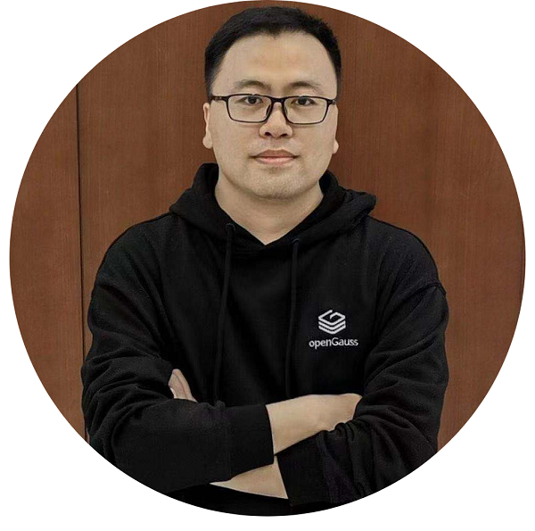

---
title: '共话开源数据库未来 【西安】openGauss Meetup'
time: '2021/06/25'
date: '2021-06-25'
category: 'events'
tags: '会议'
label: '线下'
location: '西安'
img: '/category/events/2021-06-25/banner.png'
img_mobile: '/category/events/2021-06-25/banner.png'
link: '/zh/events/2021-06-25/meetup.html'
author: 'openGauss'
summary: ''
---

### 活动介绍

随着开源开放的理念兴起，openGauss 在众多领域商业应用，众多机构积极拥抱开源，坚持开放共享。

由 openGauss 社区主办，陕西鲲鹏生态创新中心、云和恩墨（北京）信息技术有限公司、北京宝兰德软件股份有限公司、Gauss 松鼠会联合举办的 openGauss 西安 Meetup 将于 6 月 25 日（周五）在西安举办。本次活动邀请 openGauss 生态建设伙伴、商业实践伙伴、高校教授、技术专家、进行议题分享，共同探讨开源数据库领域的前瞻性思考，聚焦 openGauss 技术特性、社区进展、商业实践等热门话题，为社区发展注入创新活力，实现共建、共享、共治。

### 活动详情

主办方：openGauss 社区

合办方： 陕西鲲鹏生态创新中心、云和恩墨（北京）信息技术有限公司、北京宝兰德软件股份有限公司、Gauss 松鼠会

时间：2021 年 6 月 25 日（周五）13:30-17:20

主题：openGauss 西安 Meetup 共话开源数据库未来

合作媒体：墨天轮、计算魔方、西安 DevOps Meetup 社区

地点：亚丁湾羽安酒店一楼宴会厅（陕西省西安高新区锦业一路 16 号）

### 会议议程：

### 演讲嘉宾：

<strong>共建 openGauss 企业级开源数据库 openGauss 数据库领域总经理 胡正策 </strong>

<strong>数据库前沿技术分享| 清华大学教授 李国良</strong>

<strong>面向 AI 的数据管理 | 西北工业大学教授、博士生导师 陈群</strong>

议题简介：人工智能应用程序通常涉及对海量异构数据量的复杂处理，数据量前所未有，给现代数据管理系统造成了极大的压力。本次议题将讨论人工智能应用给数据管理带来的挑战，回顾解决这些挑战的现有解决方案，并就未来如何开发面向人工智能的数据管理系统提供一些思路。

<strong>openGauss 在鲲鹏创新中心的生态落地 | 陕西鲲鹏生态创新中心 CTO 谷羽新</strong>

议题简介：本次活动将详细介绍鲲鹏生态，openGauss 在陕西的生态落地以及鲲鹏创新大赛。

<strong>MogDB，持续打造极致易用的 openGauss 商业发行版 | 云和恩墨 2020 产品事业部总经理 张皖川</strong>

议题简介：作为社区的首批核心成员，云和恩墨积极投入社区贡献，依托 openGauss 内核发布了企业级数据库 MogDB，并已成功落地国有大型银行的核心交易系统，解决了金融核心系统面临的高并发条件下性能、稳定性、高可用保障及扩展能力的挑战。本次演讲将着重介绍刚刚发布的 MogDB 2.0 的特色功能，并分享成功案例的实践经验。

<strong>数据库中间件的基础技术 | 北京宝兰德软件股份有限公司售前总监 詹年科</strong>

议题简介：数据的高效使用需要业务应用的良好架构，本次主要从业务中间件角度简单介绍数据库中间件一些基础技术。

<strong>openGauss 社区商业发行版认证 |openGauss 项目总监 蔡亚杰</strong>

议题简介：介绍 openGauss 社区商业发行版的认证机制、流程和具体的评估标准。

### 报名链接

### 活动彩蛋

伴手礼：参与此次活动前 100 名即可获得 openGauss 或者 Gauss 松鼠会定制 T 恤一件

互动有礼：与讲师积极互动均还可获得《openGauss 数据库核心技术》书籍一本。

抽奖有礼：本次活动设有现场抽奖环节，一等奖华为运动手表*1，二等奖华为无线耳机*2 位，三等奖荣耀运动手环\*3 位。

<strong>希望本次活动能帮助你更加了解 openGauss，融入 openGauss 大家庭，期待能与你相遇！</strong>
