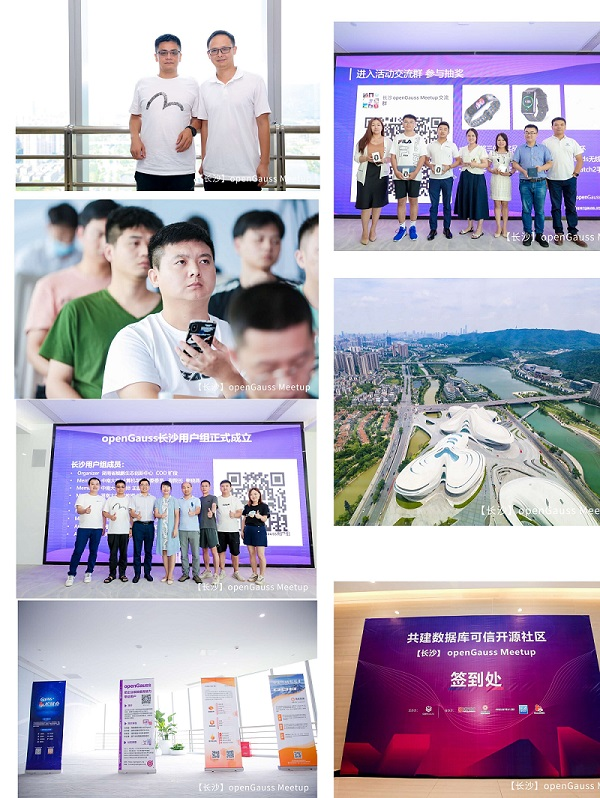
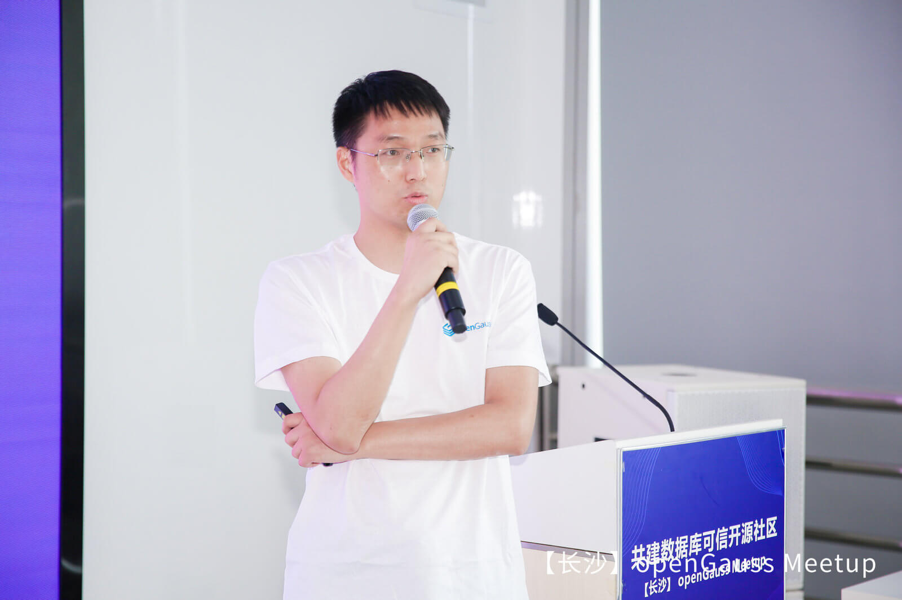
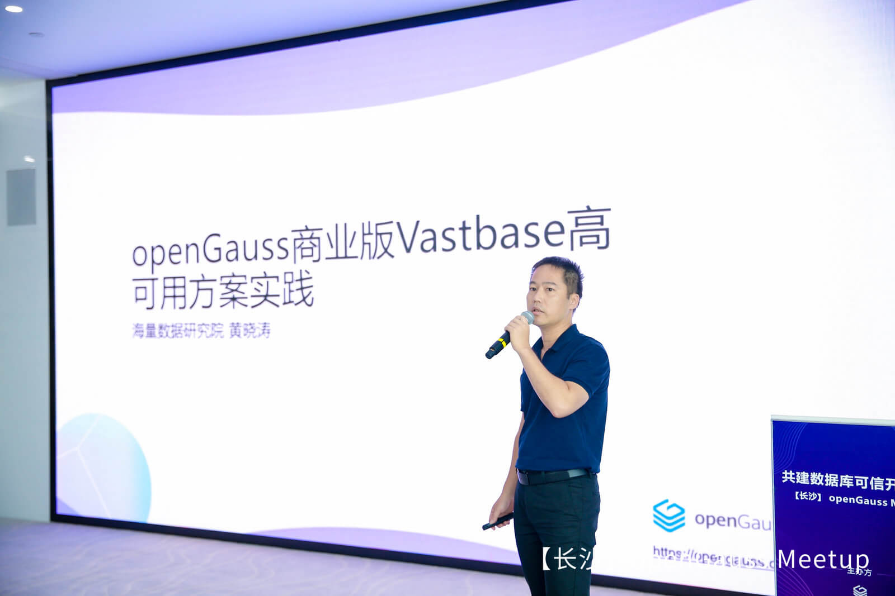

---
title: '共建数据库可信开源社区 | openGauss Meetup（长沙站）圆满结束'
time: '2021/07/20'
date: '2021-07-20'
category: 'events'
tags: '会议'
label: '线下'
location: '长沙'
img: '/category/events/2021-07-20/大合照.jpg'
img_mobile: '/category/events/2021-07-20/大合照.jpg'
link: '/zh/events/2021-07-20/meetup.html'
author: 'openGauss'
summary: ''
---

<video id="my-video" class="video-js" controls preload="auto" width="100%" >
    <source src="https://learningvideo.obs.myhuaweicloud.com:443/openGauss%E5%AE%A3%E4%BC%A0%E6%B4%BB%E5%8A%A8/7.15%E4%B8%8B%E5%8D%88%E5%BF%AB%E9%97%AA%E8%A7%86%E9%A2%91.mp4 ">您的浏览器不支持video标签。
</video>

7 月 15 日，由 openGauss 社区主办，湖南鲲鹏生态创新中心、北京海量数据技术股份有限公司、普元信息技术股份有限公司、Gauss 松鼠会联合举办的（长沙）openGauss Meetup 成功举办。此次活动邀约华为计算 openGauss 数据库产品总经理胡正策、中南大学计算机学院副院长奎晓燕、openGauss 内核技术研发团队经理朱金伟、湖南省鲲鹏生态创新中心 COO 旷俊、海量数据研究院副院长黄晓涛、普元信息方案研发部总监姚斌、openGauss 项目总监蔡亚杰等数据库领域技术专家发表教育教学、商业应用相关演讲，并分享了数据领域技术创新与行业实践的宝贵经验。

此次活动吸引了长沙地区各个行业的 35 家企业相关专家和开发者踊跃参与，在线观看超过 6000 人次，并邀请湖南大学、中南大学等数据库领域教研先锋、普元信息等企业成员加入长沙用户组，联合产学研力量，共同推进构筑融合多元化技术架构的企业级开源数据库社区。

活动开始，华为计算产品线 openGauss 数据库产品总经理胡正策发表了关于《openGauss：共建可信开源社区》 的主题演讲，他表示：开源正在改变着世界，中国已经从开源使用者向开源贡献者转变，成为全球开源第二大贡献主体；开源也是数据库产业创新的关键力量，2021 年 1 月 DB-Engine 统计开源数据库首次 50.06%的流行度超闭源商业数据库，成为数据库产业发展史上具有里程碑意义的事件；同时我们要清醒的认识到，实现科技高水平自立自强，要求我们从开源的使用者、参与者，向开源的主导者进阶。受开源协议遵循的司法解释、代码托管受出口管制条例约束、社区所在国的司法管辖等诸多因素的影响，依赖他国开源数据库社区无法真正做到自立自强，为了保障数字经济安全健康发展，要求我们必须建立真正可持续发展、可独立演进的可信根社区。

一个成熟的社区，需要同时具备四方面核心能力，即：社区治理、社区运营、社区开发以及基础设施，才能保障社区长期健康运转。openGauss 具备安全、健康、可持续性发展的可信社区核心能力，经过 OSCAR(云计算开源产业联盟)专家重重评审、测试 22 道评估环节，成为首批获得信通院《可信开源社区评估体系》认证的开源社区。通过持续开放社区治理架构，共建、共享、共治，openGauss 在 200+国内数据库流行度中上升至 TOP5，目前 DBV 合作伙伴已发布 10 个商业发行版，超过 40 家国计民生的头部企业签署 CLA 加入社区。最后，他呼吁更多力量加入社区，一起打造主流的开源数据库根社区。

**华为计算 openGauss 数据库产品总经理 胡正策**

随后，来自中南大学计算机学院副院长奎晓燕分享了《数据库教学中的应用与研究》。中南大学作为华为智能基座合作项目的重点院校，课程中引入 openGauss 数据库及其相关生态的教学设计，剖析了 openGauss 发展历史、开源的原因、功能和技术指标、技术特点、逻辑和物理结构，展示了其新颖的教学方式，层层渐进的教学逻辑，通过定向输出数据库领域人才，结合产学研模式，建设高校生态，共同挑战数据库难题，促进国内基础软件发展和教育问题。

**中南大学计算机学院副院长 奎晓燕**

随着信息化时代的到来，产生了大量的数据与信息的吞吐，由此引起的数据库安全威胁日益凸显。来自 openGauss 内核技术研发团队经理朱金伟向大家介绍了《数据库加密技术演进思路》，结合当前数据库安全问题，阐述传统加密技术与透明加密，分享 openGauss 全密态数据库技术，全密态数据处理(含数据密态插入、更新、表达式等值过滤），性能劣化不超过 5%；密态等值查询落地 openGauss，全面推进全密态技术标准行业落地，开放机密计算生态。

**openGauss 内核技术研发团队经理 朱金伟**

随后，来自湖南省鲲鹏生态创新中心 COO 旷俊现场为大家介绍了湖南省鲲鹏生态创新中心的基本情况，他表示：鲲鹏创新中心将会全面拥抱 open 系列的操作系统、数据库，通过 open 系操作系统、数据库与鲲鹏芯片的极致融合，发挥出鲲鹏的极致性能，计算产业作为基础性、战略性产业，未来也将基于鲲鹏（通用计算）和昇腾（AI 计算）重构计算产业。此外，他还现场为我们介绍了最近在火热进行中的鲲鹏应用创新大赛.openGauss 赛道-openGauss 开源数据库社区为开发者准备的大赛。开发者可以通过 Issue 和 PR 参加任务打榜赛赢得奖励，也可以和导师一起完成特性命题赛，解决 openGauss 社区中亟待解决的问题。无论你通过哪种方式参加 openGauss 赛道，你都可以获得丰富的物质奖励，你的 ID 也会永远留在 openGauss 社区。

参赛链接：https://opengauss.org/zh/events/hdc.2021.developer.html

**湖南省鲲鹏生态创新中心 COO 旷俊**

海量数据基于对 openGauss 核心架构的深刻理解和强大的源码能力，海量数据深度结合各行业应用场景特点和需求，历经多年匠心打磨,推出了企业级关系型数据库 Vastbase。来自海量数据研究院副院长黄晓涛，此次就重点介绍了《openGauss 商业版 Vastbase 高可用方案实践》，从架构原理、相关参数、故障处理等方面剖析了 Vastbase 如何实现高可用。

**海量数据研究院副院 黄晓涛**

普元信息方案研发部总监姚斌分享的主题为《普元低代码开发平台携手 openGauss 社区，共建科技普惠生态》，他表示：普元与华为的合作从 2004 年产品线开始逐步深度到生态，至今已获得数十项合作认证证书，2021 年 2 月普元信息签署 CLA ，正式加入 openGauss 社区，与华为等伙伴一起关注开源社区发展。目前普元与 openGauss 正携手在金融领域开展可信生态实践，已经在某省农信社、 某城市商业银行中开展紧密合作，未来将服务于更多的企业用户。他希望普元低代码开发平台 e-Coding 可以携手 openGauss 社区，帮助企业 IT 或业务部门快速定义软件，提升软件交付效率，从而加速和深化企业数字化转型。

**普元信息方案研发部总监 姚斌**

openGauss 项目总监蔡亚杰带来了《openGauss AI for DB 打造企业级高智能能力》的技术分享。重点介绍了 openGauss AI4DB 的通用架构，以及利用 openGauss AI4DB 能力提供的监控采集及异常检测、参数调优与诊断、慢 SQL 发现、索引推荐和虚拟索引等能力，通过机器学习、深度学习和优化算法使得数据库更加智能。

**openGauss 项目总监 蔡亚杰**

此后，各位技术大咖们还为我们带来了一场精彩的圆桌论坛，就“当前国内数据库产业的发展、如何培养适合数据库软件行业人才、如何打造一个可信的开源数据库社区、如何看待 openGauss 数据库未来的发展”等话题展开了积极的讨论，大家一致认为当前中国数据库市场欣欣向荣，机遇与风险并存，目前中国数据库的发展是碎片化、缺乏耐心，我们需要集中产学研力量，沉淀下来，一起进行原创性、引领性的技术攻关。从研发、基础设施到运营实现端到端，可追溯的可信社区和数据库根社区打造。同时，企业尽早切入到高校中来，一起为未来数据库人才的打造发挥自己的引领作用。

**圆桌论坛**

企业级数据库 openGauss 开源一年以来，社区迅速壮大，生态蓬勃发展，继深圳、南京、北京、西安用户组之后，此次活动上我们也进行了长沙用户组的成立仪式，之后本用户组将就 openGauss 技术特性、最佳实践、运营进展等方向进行持续的线上及线下自由交流及后续运营。

**openGauss 长沙用户组成员：**

. Organizer 湖南省鲲鹏生态创新中心 COO 旷俊

. Member 中南大学 计算机学院党委委员、副院长 奎晓燕

. Member 中南大学 教师 王磊

. Member 湖南大学 副教授 谭光华

. Member 湖南大学 杨超

. Member 巴马云创天地科技有限公司 项目经理 谢添

. Member 普元信息 市场经理 袁怡（上海）

. Ambassador 普元信息 方案研发部总监 姚斌（北京）

. Ambassador 天闻数媒科技有限公司 数据库架构师 贺晓群

**长沙用户组正式成立**

openGauss 将持续共建、共享、共治，走进企业，走进高校，让更多的开发者学习和使用 openGauss，并持续助力企业智能化升级，共赢产业新机遇。

更多精彩回顾，敬请欣赏：https://live.photoplus.cn/live/38685959?uniqCode=oelbyacmh7&accessFrom=qrcode#/live
