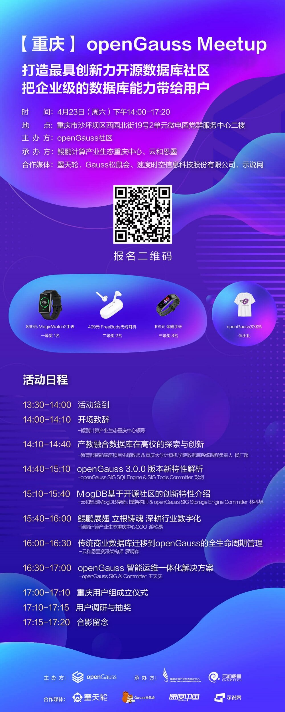

---
title: '【重庆】openGauss Meetup（4月23日）| 活动预告'
time: '2022/04/23'
date: '2022-04-23'
category: 'events'
tags: '会议'
label: '线下'
location: '重庆'
img: '/category/events/2022-04-23/banner1.jpg'
img_mobile: '/category/events/2022-04-23/banner1.jpg'
link: '/zh/events/2022-04-23/meetup.html'
author: 'openGauss'
summary: ''
---

### 活动信息

主题：打造最具创新力开源数据库社区 把企业级的数据库能力带给用户

时间：2022 年 4 月 23 日（周六）14:00-17:20

地点：重庆市沙坪坝区西园北街 19 号 2 单元微电园党群服务中心二楼

主办方：openGauss 社区

承办方：鲲鹏计算产业生态重庆中心、云和恩墨

合作媒体：墨天轮、Gauss 松鼠会、速度时空信息科技股份有限公司、示说网

### 关于 Meetup

openGauss 社区用开源的魅力吸引真正热爱技术并持续探索的用户和开发者，Meetup 通过打造一个自由、活跃的前沿技术交流空间，定期邀请业内专家分享与深度 å 探讨数据库领域的前瞻性技术思考与经验，共同构建一个能够融合多元化技术架构的企业级开源数据库社区。

### 活动议程

### 温馨提示

. 因为疫情防控需要，参会人员凭绿码入场，并请全程佩戴口罩；

. 请参会者确保 14 天之内未到过疫情中高风险地区或接触过疫情中高风险地区人员；

. 其他问题，请联系 openGauss 小助手:openGauss-bot

### 加入重庆用户组

### openGauss 用户组

openGauss User Group，简称 oGUG，是一个让 openGauss 用户就技术特性、最佳实践、运营进展等方向交流的开放性本地社区。oGUG 致力于构建一个开放、多元、包容的 openGauss 城市用户交流社区，鼓励当地任何企事业单位、社会组织、个人开发者在该社区内开展技术讨论、开拓新思路和实践新方案。

oGUG 由 Organizer、Ambassador、Member 三种角色构成 :

「Organizer」整体统筹和规划区域 openGauss 发展方向及计划，并跟进与把控整体进度。

「Ambassador」专注于帮助他人了解或使用 openGauss，并代表用户优化产品体验，增进其他用户对 openGauss 的了解。

「Member」根据运营计划，配合 oGUG 的日常运营，以用户身份积极参加活动，产出技术内容，积极推广 openGauss。
