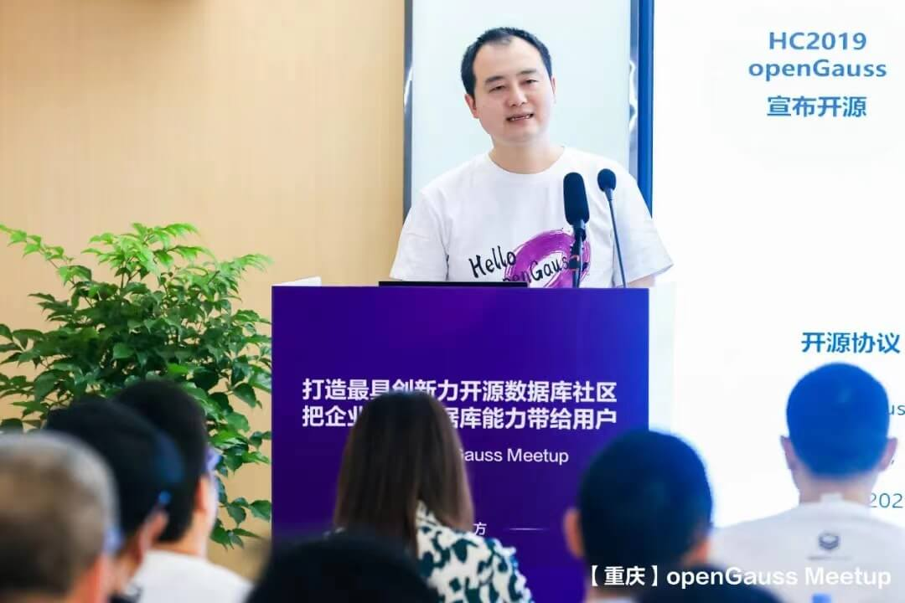
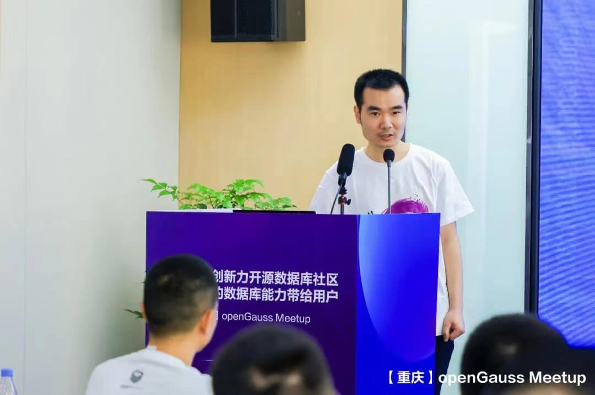
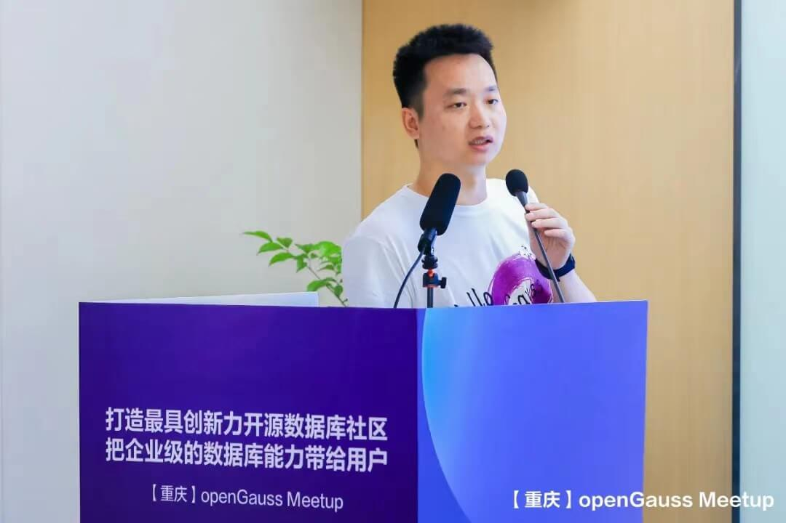
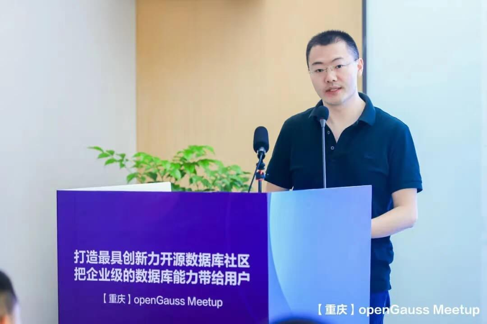
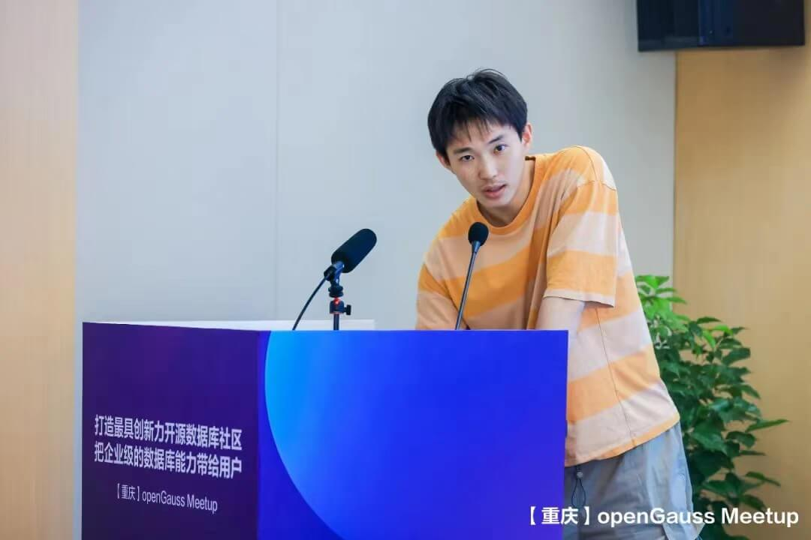

---
title: '打造最具创新力的开源数据库社区 | 【重庆】openGauss Meetup圆满结束'
time: '2022/04/24'
date: '2022-04-24'
category: 'events'
tags: '会议'
label: '线下'
location: '重庆'
img: '/category/events/2022-04-24/picture1.jpg'
img_mobile: '/category/events/2022-04-24/picture1.jpg'
link: '/zh/events/2022-04-24/meetup.html'
author: 'openGauss'
summary: ''
---

**4 月 23 日，由 openGauss 社区主办，重庆鲲鹏创新中心、云和恩墨承办的 openGauss Meetup 活动在重庆西永微电产业园成功举办。**此次活动是“openGauss 生态全国行”系列活动 2022 年第一站，吸引了来自重庆地区各个行业的 20+家企业的多个专家和开发者踊跃参与，是 openGauss 社区发展过程中的又一个重要历史节点。

此外，openGauss 重庆用户组也在此次活动中正式成立，来自重庆地区的数据库、互联网、银行、通信等多个领域的企业成员积极加入重庆用户组，成为 openGauss 建设的重要力量。在未来，该用户组将就 openGauss 技术特性、最佳实践、运营进展等方向进行持续的线上及线下自由交流及后续运营。

此次活动邀约到华为公司重庆代表处副总经理郑伟、openGauss 社区运营总监向新勇、重庆鲲鹏创新中心 COO 游欣易、云和恩墨 MogDB 存储引擎架构师& openGauss SIG Storage Engine Committer 林科旭、云和恩墨资深架构师罗炳森、openGauss SIG SQLEngine&SIG Tools Committer 彭炯、openGauss SIG AI Committer 等生态建设伙伴、商业实践伙伴、数据库领域技术专家发表产业政策、开源文化与社区运营、商业应用实践、数据领域技术创新与行业实践等精彩分享。

活动开始，**华为公司重庆代表处副总经理郑伟率先致辞，对 openGauss 系列活动来到重庆表示欢迎。**他表示：“openGauss 是鲲鹏计算产业生态发展中的重要基石，在大力发展数字经济时代中，鲲鹏生态的发展与 openGauss 不可分割。我们希望基于鲲鹏处理器，与合作伙伴一起打造自主创新、产业链完整的计算产业，把鲲鹏打造成数字中国的坚实算力底座，构建可持续创新的计算第二平面，为数字经济提供强大的算力保障。重庆鲲鹏创新中心将持续携手 openGauss，联合伙伴和客户构建丰富的解决方案，落地行业场景，夯实基础研究，加快人才培养，努力实现技术创新与市场应用的紧密结合。”

**华为公司重庆代表处副总经理 郑伟**

随后，openGauss 社区运营总监向新勇以“开源社区文化与数字化运营”为主题发表相关分享。首先，他为大家介绍了全球几大主流开源社区及开源文化及开源背后的逻辑；其次，他认为生态创新是数据库这种平台型软件的关键，要想汇聚一个数据库的产业生态，光靠商用数据库的自身发展是远远不够的，我们需要一种全新的生态构建模式，而开源正是给了我们这样的机会。最后，通过数字化运营，可以看到 openGauss 自 2020 年正式开源以来，社区生态不断蓬勃发展。社区不断开放治理架构，与高校、合作伙伴、用户共同构建社区生态。目前社区已经上线数字贡献看板，在社区官网可以通过相关数据实时看到最新社区发展动态。

**openGauss 社区运营总监 向新勇**

4 月 1 日，openGauss 发布了 3.0.0 版本，此次也特别邀请到 openGauss SIG SQLEngine&SIG Tools Committer 彭炯为大家简要分享 openGauss3.0 的部分新特性，在高性能、高可用、高安全、高智能等企业级特性分享之外，他还介绍了分布式解决方案、并行逻辑解码、集群管理等特性内容。

**openGauss SIG SQLEngine&SIG Tools Committer 彭炯**

MogDB 是云和恩墨基于开源数据库 openGauss 的内核进行研发，推出的一款极致易用的企业级关系型数据库。MogDB 具备金融级高可用和全密态计算的极致安全、面向多核处理器的极致性能、AI 自诊断调优的极致智能能力，能够满足从核心交易到复杂计算的企业级业务需求。云和恩墨 MogDB 存储引擎架构师& openGauss SIG Storage Engine Committer 林科旭在此次活动中也为大家详细介绍了 MogDB 基于 openGauss 的创新特性内容。

**云和恩墨 MogDB 存储引擎架构师& openGauss SIG Storage Engine Committer 林科旭**

算力已成为新生产力，驱动社会经济发展。重庆鲲鹏创新中心 COO 游欣易发表了基于“鲲鹏展翅 立根铸魂 深耕行业数字化”的主题演讲，详细介绍了鲲鹏计算产业和生态发展、重庆鲲鹏创新中心运营情况，表明中心以发展鲲鹏计算产业生态为首要任务，联合重庆市政府、华为公司与重庆本土企业、高校科研院所等打造全国领先的信息技术产业，助力重庆企业转型升级，打造重庆安全可靠的数字底座。

**重庆鲲鹏创新中心 COO 游欣易**

之后，云和恩墨资深架构师罗炳森为大家带来“传统数据库迁移到 openGauss 的全生命周期管理”的主题分享，对传统数据库迁移到 openGauss 的全生命周期全过程以及相关迁移工具做了详细介绍，同时还为大家分享了 MogDB 在金融行业迁移案例及商业落地实践。

**云和恩墨资深架构师 罗炳森**

openGauss 作为业内领先的开源数据库，在数据治理与维护领域积累了大量企业级经验，在数据库的自治运维领域也投入了大量研发工作。openGauss SIG AI Committer 王天庆发表“openGauss 智能运维一体化解决方案”主题演讲，为大家介绍了 openGauss 在自治运维领域的技术演进，同时介绍了 DBMind 数据库自治运维平台的技术细节。此外，他还现场演示了 openGauss DBMind 的使用、简单 DIY 了一个 Grafana 界面，近期相关功能也将上线 openGauss 社区，欢迎大家自己动手 DIY 自己的 Grafana 界面。

**openGauss SIG AI Committer 王天庆**

本次 Meetup 的最后环节是 openGauss 重庆用户组成立仪式。openGauss User Group，简称 oGUG，是一个让开发者就 openGauss 技术特性、最佳实践、运营进展等方向交流的公益性本地社区。oGUG 由 Organizer 、Member、Ambassador 三种角色构成:

Organizer：整体统筹和规划发展方向及计划，并跟进与把控整体进度。

Member：根据运营计划，配合 oGUG 的日常运营，以用户身份积极参加活动，产出技术内容，积极推广 openGauss。

Ambassador：通过布道的方式帮助他人了解或使用 openGauss，并代表用户优化产品体验，增进其他用户对 openGauss 的了解。

openGauss 重庆用户组首批成员分别是：

**openGauss 重庆用户组首批成员分别是：**

. Organizer 游欣易 重庆鲲鹏创新中心

. Ambassador 胡毅 云和恩墨

. Ambassador 罗炳森 云和恩墨

. Ambassador 李元鹏 云和恩墨

. Ambassador 郑全 重庆思庄科技有限公司

. Ambassador 姜明俊 PostgreSQL

. Ambassador 陈浩 海量数据

. Ambassador 刘辉 重庆石油天然气交易中心

. Member 王建新 重庆国家金融科技认证中心

. Member 徐文卓 速度时空重庆研究院

. Member 黄经洲 重通服数据工程师

. Member 师庆栋 云和恩墨

. Member 孟梁 烽火通信

. Member 杨红星 海量数据

. Member 彭向平 海量数据

. Member 何国亮 云和恩墨

. Member 李辉 重庆三峡银行

随着 openGauss 社区的蓬勃发展，openGauss 的生态构建也正在如火如荼进行中，openGauss 将持续全面友好开放，携手伙伴共同打造最具创新力的开源数据社区，把企业级的数据库能力带给用户。

更多现场精彩回顾，敬请欣赏（也可直接跳转文末阅读原文）：

https://live.photoplus.cn/live/pc/90011704/#/live
