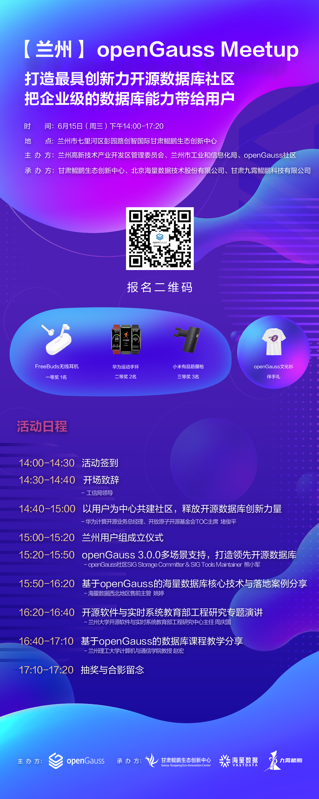

---
title: '【兰州】openGauss Meetup（6月15日）| 活动预告'
time: '2022/06/15'
date: '2022-06-15'
category: 'events'
tags: '会议'
label: '线下'
location: '兰州'
img: '/category/events/2022-06-15/banner1.png'
img_mobile: '/category/events/2022-06-15/banner1.png'
link: '/zh/events/2022-06-15/meetup.html'
author: 'openGauss'
summary: ''
---

### 活动信息

主题：打造最具创新力开源数据库社区 把企业级的数据库能力带给用户

时间：2022 年 6 月 15 日（周三）14:00-17:20

地点：兰州市七里河区彭园路创智国际甘肃鲲鹏生态创新中心

主办方：兰州高新技术产业开发区管理委员会、兰州市工业和信息化局、openGauss 社区

承办方：甘肃鲲鹏生态创新中心、海量数据、甘肃九霄鲲鹏科技有限公司

### 关于 Meetup

openGauss 社区用开源的魅力吸引真正热爱技术并持续探索的用户和开发者，Meetup 通过打造一个自由、活跃的前沿技术交流空间，定期邀请业内专家分享与深度 å 探讨数据库领域的前瞻性技术思考与经验，共同构建一个能够融合多元化技术架构的企业级开源数据库社区。

### 活动议程

### 温馨提示

. 因为疫情防控需要，参会人员凭绿码入场，并请全程佩戴口罩；

. 请参会者确保 14 天之内未到过疫情中高风险地区或接触过疫情中高风险地区人员；

. 其他问题，请联系微信 openGauss 小助手:openGauss-bot
