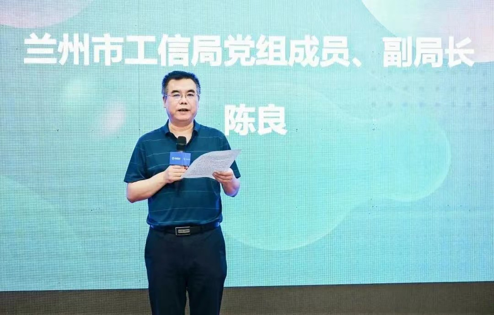
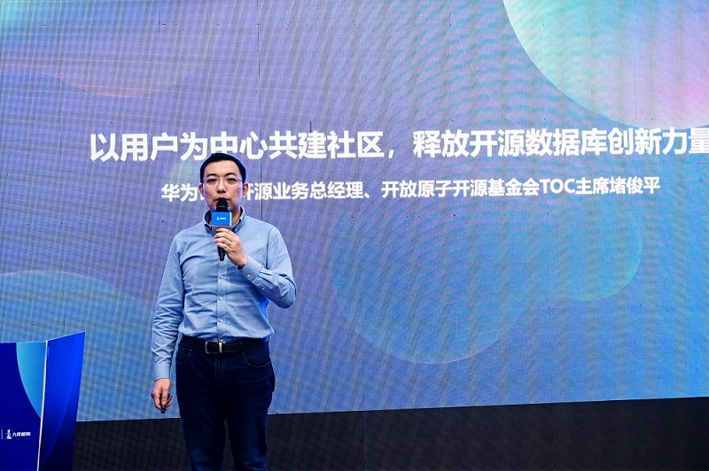
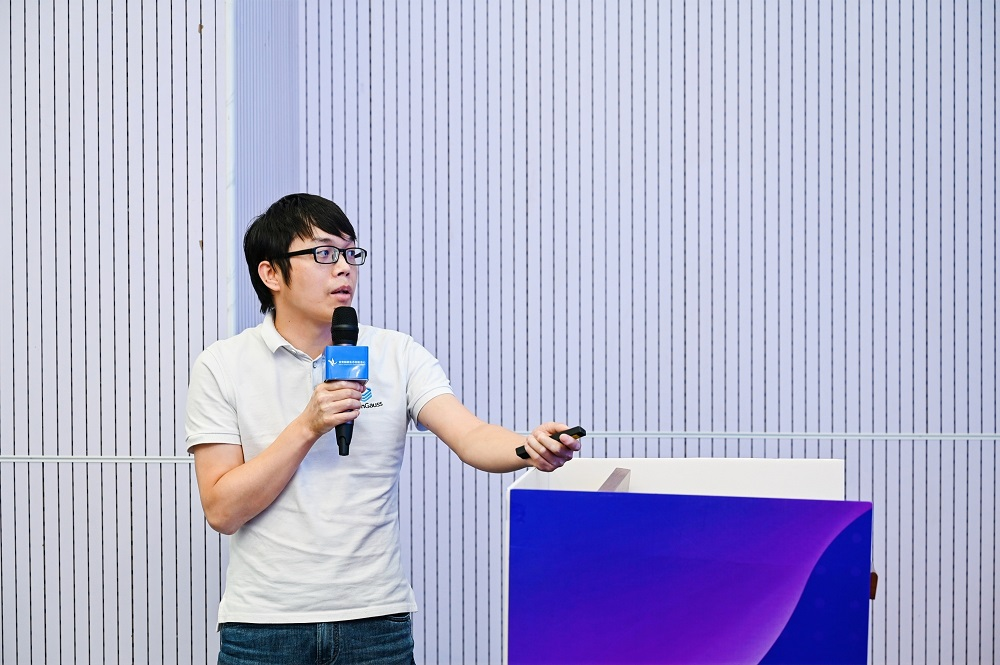

---
title: '释放开源数据库创新力量 | 【甘肃】openGauss Meetup圆满结束'
time: '2022/06/16'
date: '2022-06-16'
category: 'events'
tags: '会议'
label: '线下'
location: '兰州'
img: '/category/events/2022-06-16/banner.jpg'
img_mobile: '/category/events/2022-06-16/大合照.jpg'
link: '/zh/events/2022-06-16/meetup.html'
author: 'openGauss'
summary: ''
---

2022 年 6 月 15 日，甘肃 openGauss Meetup（生态全国行）在甘肃鲲鹏生态创新中心成功举办。此次活动由兰州市工业和信息化局、兰州高新技术产业开发区管理委员会指导，openGauss 社区主办，甘肃鲲鹏生态创新中心、甘肃九霄鲲鹏科技有限责任公司、北京海量数据技术股份有限公司承办。

此次活动以 openGauss 新版本功能讲解、商业应用实践、鲲鹏软件及数据领域技术创新与行业实践为核心展开，作为“openGauss 生态全国行”系列活动西北地区首站，吸引了甘肃省内 27 家企业的多名专家和开发者踊跃参加，围绕 openGauss 技术、生态、文化、研究进行深入的交流与探讨，形成创新和发展合力，助力甘肃鲲鹏生态产业链发展。

活动中，兰州市工信局指出“兰州市正处在乘势而上开启全面建设社会主义现代化新征程重要时期，作为“四强”战略的重要叠加一环，兰州市以大都市、大产业、大枢纽、大物流、大市场、大平台发展为引领，加快推进数字产业化、产业数字化与城市数字化协同发展，形成了发展新算力产业的良好生态。围绕现代化中心城市建设目标，加大算力、算法、算据关键要素布局，打造新算力产业、培育新算力产业生态，重塑兰州制造优势，以强科技催生不竭动能，以强工业促进转型升级，以强省会带动整体发展，有力推动甘肃高质量发展迈上新台阶。”

**兰州市工信局党组织成员、副局长 陈良**

华为计算开源业务总经理、开放原子开源基金会 TOC 主席堵俊平发表了“以用户为中心共建生态，释放开源数据库创新力量”的主题演讲，详细介绍了 openGauss 的开源历程及取得的成绩。他提到：用户是开源项目价值的最终体现，openGauss 进入发展快车道、被用户广泛使用与 openGauss 坚持以用户为中心共建社区是分不开的。为了解决开源安全，开源合规，开源软件生命周期，以及开源效率问题。华为在 2021 年发起了“开源雨林”计划，主要目的就是帮助企业用好开源、管好开源、贡献好开源。其中包括专业课程和共建开源能力中心，助力企业提升开源能力，孵化联创项目，帮助更多的企业解决开源问题。

**华为计算开源业务总经理、开放原子开源基金会 TOC 主席 堵俊平**

随后，openGauss 社区 SIG Storage Committer & SIG Tools Maintainer 熊小军发表了 “openGauss3.0.0 多场景支持，打造领先开源数据库”的主题分享，从 openGauss 的内核四高特性展开对并行逻辑解码、CM、global syscache、DB4AI 和全密态等特性的介绍，同时介绍了 openGauss 的轻量化版本，分布式解决方案。

**openGauss SIG Storage Committer & SIG Tools Maintainer 熊小军**

兰州大学开源软件与实时系统教育部工程研究中心主任周庆国带来“开源软件与实时系统教育部工程研究”的专题演讲，围绕开源技术、开源社区运营、开源技术国内发展现状做了详细介绍，同时还为大家分享了高校开源技术与教育的结合点以及兰州大学开源社区与实时系统教育部工程研究中心的研究方向。

**兰州大学开源软件与实时系统教育部工程研究中心主任 周庆国**

海量数据西北地区售前主管姚婷带来了基于 openGauss 的海量数据库核心技术与落地案例介绍，从海量数据库的高性能、高可用、高兼容、高安全、多模态、轻量级运维六大核心产品特性，以及在中华联合人寿团险核心系统、中芯国际数据库国产化演进等实际应用案例角度出发，现场分享了基于 openGauss 内核的海量数据库在各行业的部署经验，赋能各行业用户的应用升级。

**海量数据西北地区售前主管 姚婷**

最后，兰州理工大学计算机与通信学院教授赵宏围绕“基于 openGauss 的数据库课程教学”做出精彩演讲，对数据库安全性及数据库事务管理的基本原理，数据库新技术的发展做了详细介绍，利用数据库原理，针对设计中的实际问题进行了需求和功能分析。

**兰州理工大学计算机与通信学院教授 赵宏围**

此外，openGauss 兰州用户组也在此次活动中正式成立，来自甘肃地区的数据库、互联网、高校、通信等多个领域的企业成员积极加入兰州用户组，成为 openGauss 建设的重要力量。在未来，该用户组将就 openGauss 技术特性、最佳实践、运营进展等方向进行持续的线上及线下自由交流及后续运营。

**openGauss 兰州用户组成立仪式**

openGauss User Group，简称 oGUG，是一个让开发者就 openGauss 技术特性、最佳实践、运营进展等方向交流的公益性本地社区。oGUG 由 Organizer 、Member、Ambassador 三种角色构成:

.Organizer：整体统筹和规划发展方向及计划，并跟进与把控整体进度。

.Member：根据运营计划，配合 oGUG 的日常运营，以用户身份积极参加活动，产出技术内容，积极推广 openGauss。

.Ambassador：通过布道的方式帮助他人了解或使用 openGauss，并代表用户优化产品体验，增进其他用户对 openGauss 的了解。

**openGauss 兰州用户组首批成员分别是：**

. Organizer 李浩钧 甘肃鲲鹏生态创新中心

. Ambassador 周庆国 兰州大学

. Ambassador 沈玉琳 甘肃省计算中心

. Ambassador 赵 宏 兰州理工大学

. Member 姚 婷 北京海量数据技术有限公司

. Member 杨 涛 北京海量数据技术有限公司

. Member 郭 霄 甘肃环讯信息科技有限公司

. Member 安 定 甘肃鲲鹏生态创新中心

. Member 李龙杰 兰州大学

. Member 赵益寿 中电万维信息技术有限责任公司

. Member 苏胜军 中电万维信息技术有限责任公司

. Member 孙雯杰 云和恩墨(北京)信息技术有限公司

. Member 周瑞斌 云和恩墨(北京)信息技术有限公司

. Member 任小斌 甘肃紫光研究院

随着 openGauss 社区的蓬勃发展，openGauss 的生态构建也正在如火如荼进行中，openGauss 将持续全面友好开放，携手伙伴共同打造最具创新力的开源数据社区，把企业级的数据库能力带给用户。

