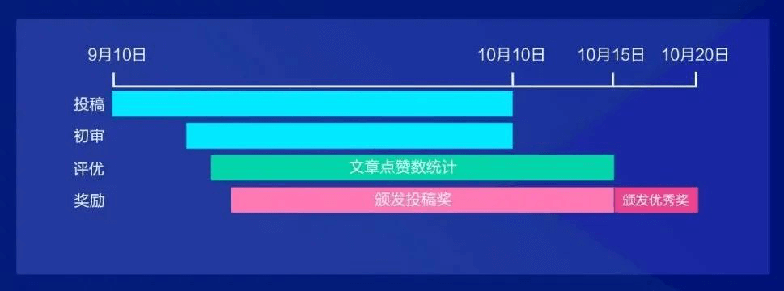
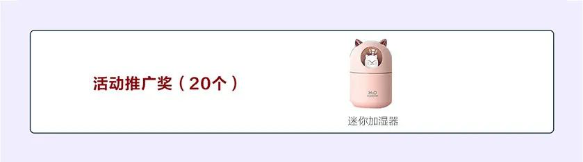

---
title: '【我和openGauss的故事】第四届openGauss技术文章征集活动来啦！'
time: '2022/09/10-2022/10/15'
category: 'events'
tags: '活动'
label: '线上'
location: '线上'
img: '/category/events/2022-09-13/Banner1.png'
img_mobile: '/category/events/2022-09-13/Banner-2.jpg'
link: '/zh/events/2022-09-13/meetup.html'
author: 'openGauss'
summary: '第四届openGauss技术文章征集活动，即可赢取华为平板、手表、手环等多重礼品。'
---

亲爱的伙伴们，Gauss 松鼠会联合 openGauss 社区、鲲鹏社区、墨天轮共同共同举办【我和 openGauss 的故事】第四届 openGauss 技术文章征集活动踏秋而来~各位爱技术、爱思考、爱总结的小伙伴，你们施展才华的舞台已经搭建好~期待你的投稿作品！

### 【参与方式】

#### 投稿

9 月 10 日至 10 月 15 日，完成下面 2 步即投稿完成。

1)在墨天轮社区或 openGauss 社区提交技术文章，并将链接发给 Gauss 松鼠会小助手(Gauss_Asst666)二维码：

- 墨天轮社区：（https://www.modb.pro/openGauss），提交时需带有**openGauss**的标签。

- openGauss 社区：https://opengauss.org

2）在墨天轮社区**“我和 openGauss 的故事”**有奖征文活动，将您发布的文章标题及链接复制黏贴到本活动宣传贴的评论区。

**参与评优：**

初审合格的文章将会同步发布在鲲鹏论坛-Database 专区，我们会根据墨天轮社区&鲲鹏论坛的总点赞量进行片名，请关注文章的点赞量。

**活动推广：**

您还可以推荐好友参与投稿，每邀请 2 位好友完成 openGauss 社区投稿，可以获得“活动推广奖”。

### 活动日程

### 活动规则

1、投稿：

- 内容要求为 openGauss 相关技术文章，包含但不限于以下内容：系统技术解析、案例分享、实践总结、开发心得、客户案例、故障调试、测试比对、使用技巧、学习笔记等。
- 文章要求原创且在墨天轮社区或 openGauss 社区首发，并且在墨天轮社区发布时需要加“openGauss”标签，在 openGauss 社区发布时需要加“openGauss 技术文章征集”标签。若投稿文章为复制或抄袭他人文章，均视为无效。
- 每篇文章要求不少于 500 字（可含代码），图文并茂，排版工整。

2、初审：
作者在投稿后，专家组将进行初审，通过初审的文章将参与评优活动；未通过初审的文章，专家组将给出修改建议，修改后可再次提交报名。

3、评优
通过初审的文章，将发布在鲲鹏论坛-DataBase 专区，按墨天轮社区、鲲鹏论坛社区点赞的总赞数进行排名并给予奖励。

### 奖品设置

**墨天轮投稿奖：**

根据文章价值和借鉴意义给与 50~100 元的激励。

**openGauss 社区投稿奖：**

凡是在 openGauss 社区 blog 仓投稿并成功合入的，可以获得京东购物卡 50/Gauss 松鼠会保温杯/筋膜枪。

**活动推广奖：（20 个）**
每邀请 2 位好友参与活动，完成 openGauss 社区投稿，即可获得一份“活动推广奖”，多邀多得，数量有限，先到先得。

**优秀奖：**

通过初审的文章，将发布在鲲鹏论坛-DataBase 专区，按墨天轮社区、鲲鹏论坛社区点赞的总赞数进行排名并给予奖励。

**其他奖项：**

在墨天轮社区发布的文章，同时还可以参加墨力计划，详细内容请参见：https://www.modb.pro/db/142952

注：

- 1.如参与者投稿多篇作品，仅按文章最好成绩参与优秀奖排名。
- 2.墨天轮投稿奖，openGauss 社区投稿奖，活动推广奖，优秀奖相互独立，每位参与活动者获奖可叠加。
- 3.openGauss 社区投稿奖、推广奖和优秀奖获奖者需在鲲鹏社区完成实名认证后方可领取奖品。
- 4.优秀奖得主需在 openGauss 社区同步发布获奖文章后方可领取奖品。
- 5.奖品种类数量有限，先到先得。

### 奖励发放

墨天轮投稿奖每满 20 篇，将在墨天轮编辑部账号上及时公布获奖名单，大家请多多关注！中奖用户可以联络墨天轮小助手（微信：modb666）领取墨天轮投稿奖。
openGauss 社区投稿奖、推广奖与优秀奖将于 10 月 16 日整理后发布，届时请联络 Gauss 松鼠会小助手领取。
