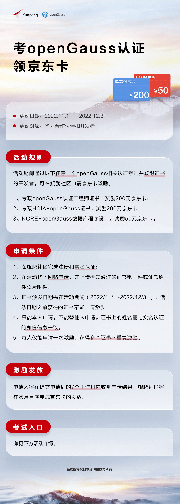

### 考试日期

11 月 6 日、11 月 13 日、11 月 20 日、11 月 27 日；
12 月 4 日、12 月 11 日、12 月 18 日、12 月 25 日。
详情可以扫描上方答疑交流二维码入群交流。

关于 OGCA, 点击下方链接：

<https://opengauss.org/zh/training.html>

### HCIA-openGauss 认证

HCIA-openGauss 认证：

Huawei Certified ICT Associate-openGauss
培训和认证具备华为 openGauss 数据库开发和管理能力的工程师

关于 HCIA-openGauss 认证, 点击下方链接：

<https://e.huawei.com/cn/talent/#/cert/product-details?certifiedProductId=503&authenticationLevel=CTYPE_CARE_HCIA&technicalField=PSC&version=1.0>

**NCRE-openGauss 数据库程序设计(全国计算机等级考试二级）**

NCRE-openGauss 认证，点击下方链接：

<https://ncre.neea.edu.cn/>

