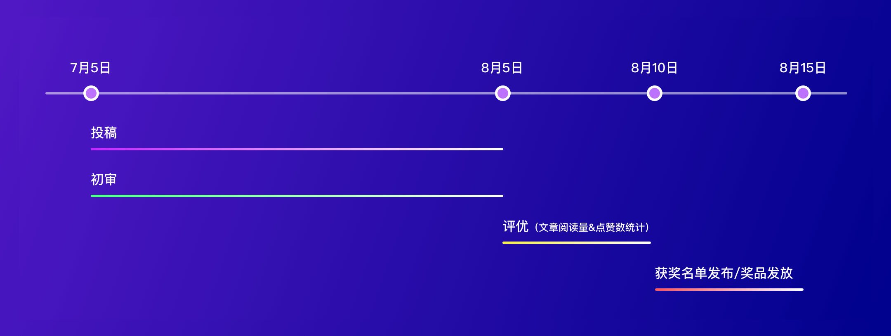
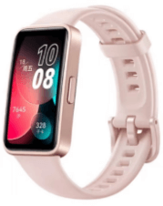

自 2020 年 6 月开源以来，openGauss 一直围绕高性能、高可用、高智能、高安全突破创新数据库核心技术，构筑数据库内核创新竞争力。3 月 31 日，openGauss 5.0 版本正式上线。该版本与之前的版本功能特性保持兼容，在内核能力、工具链、兼容性方面得到了全面增强。为持续推动 openGauss 生态繁荣发展，赋能开发者，openGauss 关注开发者体验特举办本次技术文章征集活动。

7 月 5 日-8 月 15 日，openGauss 社区联合 Gauss 松鼠会、墨天轮社区共同举办的【我和 openGauss 的故事】第六届 openGauss 技术文章征集活动~欢迎各位爱技术、爱思考、爱总结的伙伴，投稿畅谈 openGauss，舞台已经搭好，奖品已备好~期待你的作品！

## 参与方式

1、投稿：7 月 5 日至 8 月 15 日，完成下面 2 步即投稿完成

（1）在墨天轮社区或 openGauss 社区提交技术文章，并将链接发给 Gauss 松鼠会小助手(Gauss_Asst666)：

•[墨天轮社区](https://www.modb.pro/openGauss)：提交时需添加 opengauss 标签。

•[openGauss 社区](https://opengauss.org)：提交 PR 时需要添加“openGauss 技术文章征集”标签。

提交链接参考：[https://gitee.com/opengauss/blog](https://gitee.com/opengauss/blog) ，readme 中有介绍如何提交博客的方法

（2）在墨天轮社区“我和 openGauss 的故事”活动页（点击文末“阅读原文”跳转至活动页面），将您发布的文章标题及链接复制粘贴到本宣传贴的评论区。

2、参与评优：

初审合格的文章将会同步发布在 openGauss 公众号，根据微信公众号阅读量+墨天轮平台文章点赞量总数进行排名。

3、活动推广：

您还可以推荐好友参与投稿，每邀请 2 位好友投稿且通过初审，即可获得“活动推广奖”。

## 活动日程

投稿：7 月 5 号——8 月 5 日
初审：7 月 5 号——8 月 5 日
评优（文章阅读量&点赞数统计）：8 月 5 日——8 月 10 日
获奖名单发布/奖品发放：8 月 10 日——8 月 15 日

## 活动规则

1、投稿：

• 内容要求为 openGauss 相关技术文章，包含但不限于以下内容：系统技术解析、案例分享、实践总结、开发心得、客户案例、故障调试、测试比对、使用技巧、安装部署笔记、中间件使用实践等。

• 文章必须为【原创】【首发】，不得有广告、洗稿、抄袭、刷量等行为，一经发现，取消该文章参赛资格。在墨天轮社区发布时需添加“opengauss”标签，在 openGauss 社区发布时需要加“openGauss 技术文章征集”标签。

• 每篇文章要求不少于 500 字（可含代码），图文并茂，排版工整。

2、初审：

作者在投稿后，openGauss 与墨天轮评审组将进行初审，通过初审的文章将参与评优；未通过初审的文章，评审组将给出修改建议，修改后可再次提交报名。

评审依据：

• 内容具有正确性、完整性和可借鉴性

• 结构清晰、排版工整，具有可读性

技术文章征集活动期间，每投稿满 20 篇，将在墨天轮编辑部账号上及时公布初审通过名单，大家请多多关注！

3、评优

通过初审的文章，将发布在 openGauss 微信公众号，按公众号文章阅读量＋墨天轮社区点赞数总数进行排名并给予奖励。

## 奖品设置

投稿奖、推广奖、优秀奖可叠加

• 投稿奖：

根据文章价值和借鉴意义，通过初审的文章，将给予文章作者 50 元京东购物卡一张

• 活动推广奖：

每邀请2位好友投稿且通过初审，即可获得 “活动推广奖”，价值50元京东购物卡一张；好友同步文章至openGauss社区博客，可再获得50元京东购物卡。数量有限，先到先得。

    
    
    
    

•优秀奖：

| 奖品设置 | 名称                                   | 数量 | 价格/个 |
| -------- | -------------------------------------- | ---- | ------- |
| 一等奖   | HUAWEI MatePad 悦动版（6GB+128GB）平板 | 1    | 2300    |
| 二等奖   | HUAWEI WATCH GT3 华为智能手表          | 2    | 1300    |
| 三等奖   | HUAWEI FreeBuds 4i 无线耳机            | 5    | 499     |
| 四等奖   | 华为 HUAWEI 手环 8 标准版              | 10   | 250     |

注：

1.投稿奖、活动推广奖，优秀奖相互独立，每位参与活动者获奖可叠加。

2.每位参赛者可投稿多篇文章，且最多可获 2 个优秀奖。

3.奖品种类数量有限，先到先得。

## 奖励发放

投稿奖、推广奖与优秀奖将于活动结束后三个工作日内发布，届时请联络 Gauss 松鼠会小助手领取。
