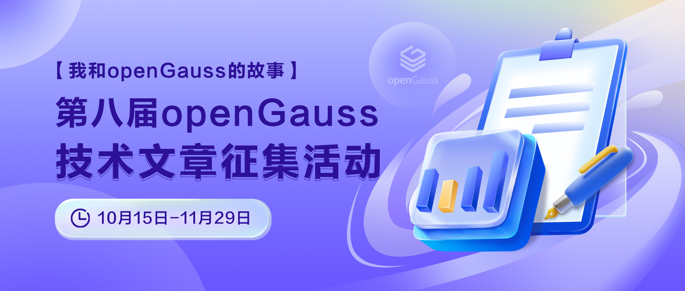

自2020年6月开源以来，openGauss 一直围绕高性能、高可用、高智能、高安全突破创新数据库核心技术，构筑数据库内核创新竞争力。9月30日，openGauss 6.0 LTS 版本正式上线。该版本与之前的版本功能特性保持兼容，同时在内核能力、DataPod 资源池化架构、DataKit 数据全生命周期管理工具能力、生态兼容性等方面有着显著的提升。[（openGauss 6.0 新版本发布新闻稿链接）](https://opengauss.org/zh/news/2024-09-30/)

为持续推动 openGauss 生态繁荣发展，赋能开发者，openGauss 关注开发者体验，10月15日-11月29日，openGauss 社区联合 Gauss 松鼠会、墨天轮社区共同举办【我和 openGauss 的故事】第八届 openGauss 技术文章征集活动～欢迎各位爱技术、爱思考、爱总结的伙伴，投稿畅谈 openGauss，舞台已经搭好，奖品已备好，期待你的作品！

# 参与方式

## 投稿

**10月15号—11月20日**，完成下面 2 步即投稿完成

1.在墨天轮社区或 openGauss 社区提交技术文章，并将链接发给 openGauss 小助手(openGauss-bot) 

- 墨天轮平台：提交提交时添加标签：“opengauss” 标签； 

- openGauss社区：提交PR时需要添加 “openGauss技术文章征集” 标签。openGauss 官网：<https://opengauss.org>，提交链接参考：<https://opengauss.org/zh/blogs/guidance/> 有介绍如何提交博客的方法。

2.在墨天轮社区“我和openGauss的故事”活动页（点击文末“阅读原文”跳转至活动页面），将您发布的文章标题及链接复制粘贴到本宣传贴的评论区。链接：<https://www.modb.pro/db/1845719658898485248>

## 参与评优

初审合格的文章将会发布在 openGauss 公众号，根据**微信公众号阅读量+墨天轮平台文章阅读量**总数进行排名。

## 活动日程

- 投稿：10月15号—11月20日

- 初审：10月15号—11月20日

- 评优（文章阅读量总数）：11月20日——11月25日

- 获奖名单发布/奖品发放：11月25日——11月29日

## 活动规则

### 投稿：

- 内容要求为 openGauss 相关技术文章，包含但不限于以下内容：系统技术解析、案例分享、实践总结、开发心得、客户案例、故障调试、测试比对、使用技巧、安装部署笔记、中间件使用实践等。

- 文章必须为【原创】【首发】，不得有广告、洗稿、抄袭、刷量等行为，一经发现，取消该文章参赛资格。在墨天轮社区发布时需添加 “opengauss” 标签，在 openGauss 社区发布时需要加 “openGauss技术文章征集” 标签。

- 每篇文章要求不少于 500 字（可含代码），图文并茂，排版工整。

### 初审：

作者在投稿后，openGauss 评审组将进行初审，通过初审的文章将参与评优；未通过初审的文章，评审组将给出修改建议，修改后可再次提交报名。

#### 评审依据：

- 内容具有正确性、完整性和可借鉴性

- 结构清晰、排版工整，具有可读性

### 评优:

通过初审的文章，将发布在 openGauss 微信公众号，按公众号文章阅读量＋墨天轮社区阅读量总数进行排名并给予奖励。

## 奖品设置

**投稿奖、推广奖、优秀奖可叠加**

### 投稿奖

根据文章价值和借鉴意义，通过初审的文章，将给予文章作者50元京东购物卡一张。

### 活动推广奖（10个）

每邀请2位好友投稿且通过初审，即可获得 “活动推广奖”，价值50元京东购物卡一张；

### 优秀奖

通过初审的文章，专家组将按评优标准进行评优并给予奖励：

  
  

| 奖品设置 | 名称 |
|---|---|
|一等奖（1名）| HUAWEI WATCH FIT 2活力款华为智能手表|
|二等奖（2名）| HUAWEI FreeBuds 5i 无线耳机 |
|三等奖（3名）| HUAWEI 手环8标准版 |
|四等奖（10名）| 京东购物卡100元面值 |

注：

1.投稿奖、活动推广奖，优秀奖相互独立，每位参与活动者获奖可叠加。

2.每位参赛者可投稿多篇文章，且最多可获2个优秀奖。

3.奖品种类数量有限，先到先得。

## 奖品发放

- 将于活动结束后5个工作日内通过微信公众号公示征文获奖名单。

- 活动结束后获奖者者联络openGauss小助手领取。