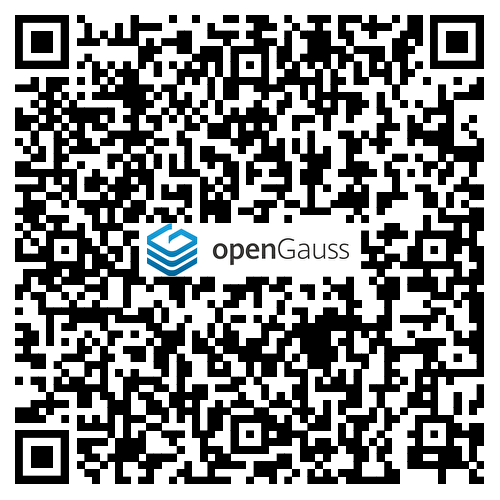
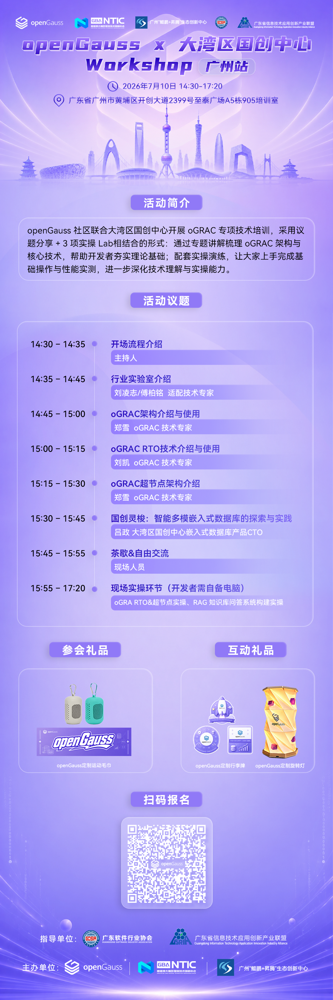

活动主题：【7月10日】openGauss x 大湾区国创中心 Workshop 广州站，欢迎报名！

由openGauss社区及大湾区国创中心主办的" openGauss x 大湾区国创中心 Workshop 广州站"活动将于7月10日在广东省广州市黄埔区开创大道2399号至泰广场A5栋905培训室 举办，诚邀数据库开发者、用户、合作伙伴们的莅临！

活动信息

本次 Workshop 由 openGauss 社区与大湾区国创中心联合主办，采用「理论精讲 + 现场实操」双轨模式，围绕 oGRAC 架构实战、RTO 容灾演练、IntarkDB+RAG 落地三大核心方向展开，帮助开发者夯实理论根基，深化技术认知，提升动手实践能力。

主题：openGauss x 大湾区国创中心 Workshop 广州站

时间：2026 年 7 月 10 日 14:30-17:20

地点：广东省广州市黄埔区开创大道2399号至泰广场A5栋905培训室

扫码报名：

会议议程：

