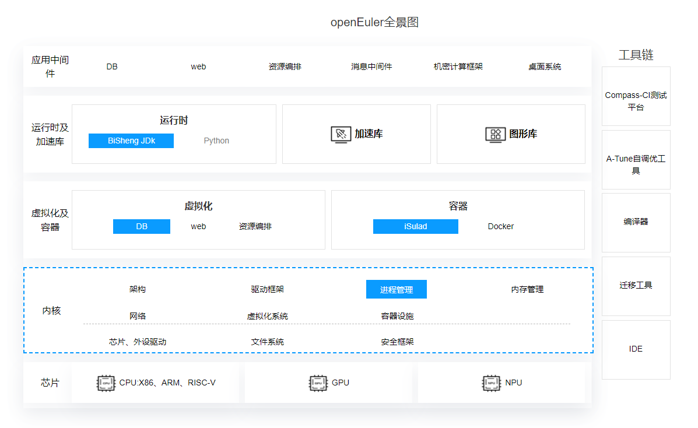

<h2 id='背景' style="margin-top:0;">背景</h2>

当操作系统生命周期即将 EOM，但是应用软件或者产品的生命周期还未结束时，为了保障业务的连续性、安全性，急需将原操作系统迁移到新操作系统上。同时随着数字化转型深入，操作系统正在向支持多样性计算、支持全场景的方向发展，促使操作系统进行架构创新，企业面临迁移操作系统的刚性需求。企业一方面需要做好操作系统选型（如持续演进、全场景支持、可靠、稳定等），支撑企业持续发展、产品创新、数字化转型；另一方面需要有系统性的迁移方案及工具，保障迁移无忧。针对企业迁移操作系统的需求，openEuler 助力企业简单、平稳、高效进行操作系统迁移。

## openEuler 简介

### openEuler 面向数字基础设施的开源操作系统

openEuler 开源操作系统是面向数字基础设施的开源操作系统，支持服务器、云计算、边缘计算、嵌入式等应用场景，支持多样性计算，致力于提供安全、稳定、易用的操作系统。

### openEuler 聚焦内核能力，释放多样性算力，引领操作系统创新

openEuler 原生开源，独立演进，从三个层次实现持续发展，助力企业数字化转型。内核创新：在多核调度、多样性算力，以内存为中心新架构的支持等方面进行创新，自 2012 年以来向 Linux Kernel 社区持续贡献，在 Linux Kernel 5.10/5.14 版本中，内核代码贡献排名第一。

### openEuler 产品架构介绍

openEuler 创新架构，全栈优化，释放多样性算力，打造全场景协同的数字基础设施操作系统，包括基础加速库、虚拟化、内核、驱动、编译器、OS 工具、OpenJDK 等组件。

