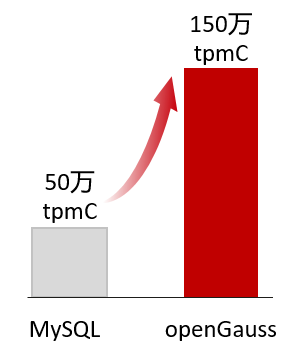
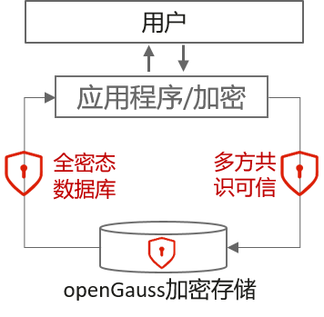
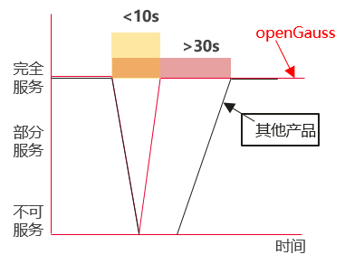
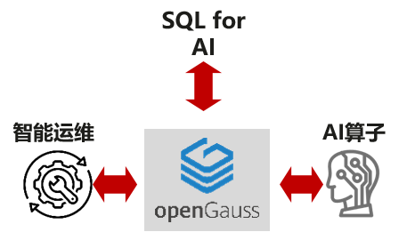
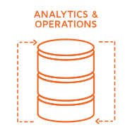

## openGauss 优势

openGauss 在高性能、高安全、高可用、高智能、企业级能力等多方面领先。

    

        

            
高性能

            
高性能、大并发、业务稳

        

        

        

            
• 2路鲲鹏150w tpmC，3倍于MySQL性能

            
• 分布式16节点1000万tpmC

        

    

    

        

            
高安全

            
数据全生命周期安全可信

        

        

        

            
• 支持国密算法、全密态，实现数据生命周期保护，多方共识，数据防篡改

            
• 数据可用不可见， 可见不可改

        

    

    

        

            
高可用

            
金融级可用，数据时刻可用

        

        

        

            
• 日志并行回放，AZ內RTO&lt;10s，单域最佳。跨AZRTO&lt;30s，优于MySQL（>30s）

            
• Paxos自治共识高可用架构，CM实现故障自动切换，全域高可用

        

    

    

        

            
高智能

            
AI赋能 数据智能

        

        

        

            
• 智能索引推荐，慢SQL诊断，性能提升10倍，提升运维效率

            
• 20+原生AI库内算子，覆盖主流场景，会SQL就能用AI

        

    

    

        

            
企业级能力

            
多存储引擎 混合负载

        

        

        

            
• 支持行存、列存混合存储，同时行存表TPCH性能优于MySQL

            
• 支持多种算子的并行查询

        

    

<table>
    <thead>
        <tr>
            <th>维度</th>
            <th>特性</th>
            <th>MySQL</th>
            <th>openGauss</th>
        </tr>
    </thead>
    <tbody>
        <tr>
            <td>高性能</td>
            <td class="text-center">TPCC</td>
            <td>2P鲲鹏 54w tpmC, 4P鲲鹏 72w tpmC</td>
            <td>2P鲲鹏 150w tpmC，4P鲲鹏 230w tpmC</td>
        </tr>
        <tr>
            <td rowspan='3'>高可用</td>
            <td class="text-center">主备同步</td>
            <td>基于binlog的逻辑复制（异步/半同步），灵活但容易延迟和出现数据不一致</td>
            <td>基于同一份WAL日志实现物理复制和逻辑复制</td>
        </tr>
        <tr>
            <td>主备倒换RTO</td>
            <td>RPO>0</td>
            <td>RPO=0</td>
        </tr>
        <tr>
            <td>主备倒换RTO</td>
            <td>跨AZ RTO>30s</td>
            <td>AZ内RTO&lt;10s，跨AZ RTO&lt;30s</td>
        </tr>
        <tr>
            <td rowspan='4'>企业级能力</td>
            <td class="text-center">SQL标准</td>
            <td>很多语法不满足SQL标准，行为不统一，如单引号处理，update带表达式处理等</td>
            <td>支持标准的SQL92/SQL99/SQL2003/SQL2011规范</td>
        </tr>
        <tr>
            <td>并行查询</td>
            <td>8.0以下版本不支持并行查询；8.0版本只支持并行聚集索引读取(比如count(*))和并行分区扫描</td>
            <td>支持并行查询（顺序扫描、nestloop、hash join、hash agg、append等）</td>
        </tr>
        <tr>
            <td>多存储引擎</td>
            <td>灵活支持多种存储引擎，一个MySQL进程可支持建多种引擎的表，5.5版本后InnoDB为默认引擎。索引组织表，表内数据按索引有序组织，按主键查询数据较快，单表容量有限，全表扫描慢</td>
            <td>支持多种存储引擎共存，heap表存储，单表容量无限制。</td>
        </tr>
        <tr>
            <td>OLAP</td>
            <td>heatwave，高性能实时分析计算架构，Oracle云上服务</td>
            <td>支持列存，同时行存表TPCH性能优于MySQL</td>
        </tr>
        <tr>
            <td rowspan='2'>高安全</td>
            <td class="text-center">国密算法</td>
            <td>不支持 ，使用caching_sha2_password认证，支持通用加解密算法</td>
            <td>支持国密sm3认证和sm4加解密算法，支持md5和sha256认证，支持md5、aes128加解密</td>
        </tr>
        <tr>
            <td>全密态</td>
            <td>不支持，只支持指定字段通过加密函数AES_ENCRYPT加密传入数据库</td>
            <td>支持全密态，数据以加密形态存储在数据库服务器中，支持对密文数据的检索与计算</td>
        </tr>
        <tr>
            <td rowspan='3'>生态迁移</td>
            <td class="text-center">工具生态</td>
            <td>有丰富的生态支持，图形化管理工具、多语言连接驱动、高可用组件、中间件、备份&恢复组件</td>
            <td>ODBC、JDBC、Python驱动；原生高可用组件CM、备份恢复工具</td>
        </tr>
        <tr>
            <td>MySQL兼容性</td>
            <td>数据类型、操作符、函数、DDL、DML等 1192个语法</td>
            <td>openGauss 总体兼容度68%，其中常用语法100%兼容</td>
        </tr>
        <tr>
            <td>迁移工具套件</td>
            <td>-</td>
            <td>支持完备的全量、增量、反向数据迁移工具，支持数据实时比对</td>
        </tr>
    </tbody>
</table>
