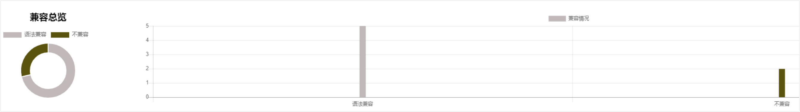
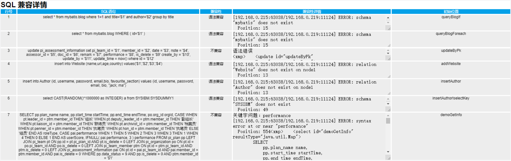
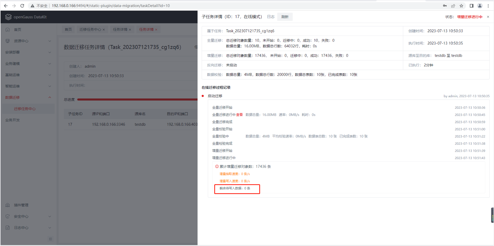

# 迁移实践案例

## 一.迁移评估 {#migration-evaluate}

对现有业务系统进行调研，主要包括服务器硬件信息、操作系统信息、业务部署形态、业务特征、数据量、全量的待评估 SQL 语句等。

1.对于机器资源受限(4C8G)场景，提供一套数据库参数列表，以最大限度地提升数据库和迁移性能。

（1）全量迁移阶段，建议关闭的参数，这些参数都可以直接修改生效：

```
ssl=off
fsync=off
audit_enabled=off
autovacuum = off
track_activities = off
track_counts = off
track_sql_count = off
enable_instr_track_wait = off
enable_instr_rt_percentile=off
enable_instance_metric_persistent=off
enable_logical_io_statistics=off
enable_user_metric_persistent=off
enable_instr_cpu_timer = off
enable_resource_track = off
enable_asp=off
enable_stmt_track=false
enable_cachedplan_mgr = off
enable_global_syscache = off
light_comm = on
instr_unique_sql_count=0
```

（2）提升数据库性能，建议修改的值：

| 参数名                  | 参数类型   | reload 生效 | 参数描述                                                                      |
| ----------------------- | ---------- | ----------- | ----------------------------------------------------------------------------- |
| max_process_memory      | POSTMASTER | 否          | 一个数据库节点可用的最大物理内存                                              |
| shared_buffers          | POSTMASTER | 否          | openGauss 使用的共享内存大小                                                  |
| cstore_buffers          | POSTMASTER | 否          | 列存所使用的共享缓冲区的大小                                                  |
| wal_buffers             | POSTMASTER | 否          | 用于存放 WAL 数据的共享内存空间的 XLOG_BLCKSZ 数                              |
| advance_xlog_file_num   | POSTMASTER | 否          | 在后台周期性地提前初始化 xlog 文件的数目                                      |
| log_checkpoints         | SIGHUP     | 是          | 在服务器日志中记录检查点和重启点的信息                                        |
| enable_codegen          | USERSET    | 是          | 开启代码生成优化，目前代码生成使用的是 LLVM 优化                              |
| wal_receiver_timeout    | SIGHUP     | 是          | 从主机接收数据的最大等待时间                                                  |
| enable_pbe_optimization | USERSET    | 是          | 对以 PBE（Parse Bind Execute）形式执行的语句进行查询计划的优化                |
| max_files_per_process   | POSTMASTER | 否          | 设置每个服务器进程允许同时打开的最大文件数目                                  |
| pagewriter_sleep        | SIGHUP     | 是          | 脏页数量不足 pagewriter_threshold 时，后台刷页线程将 sleep 设置的时间继续刷页 |
| enable_slot_log         | USERSET    | 是          | 是否开启逻辑复制槽主备同步特性                                                |

2.针对全量业务 SQL，利用 Datakit 兼容性评估工具进行分析，评估语法的兼容度，包括完全兼容，部分兼容，不兼容三种场景，评估结果示例如下：





## 二.应用适配 {#app-adaptation}

根据迁移评估的结果，针对不兼容的部分，业务侧进行修改并验证。比如：语法错误的，重新修改 SQL 的写法，直到能正确运行。

## 三.数据迁移 {#migration-data}

利用 DataKit 一站式迁移平台进行业务迁移，实时展示迁移进度，迁移全流程可视化，并集成监控、运维等能力，实现全场景简单、高效、完整的迁移。

针对无增量数据的业务，采用离线迁移模式，主要包括全量迁移和全量校验两个阶段；

针对有增量数据的业务，采用在线迁移模式，主要包括全量迁移、全量校验、增量迁移、增量校验、反向迁移五个阶段。全量迁移和全量校验完成后，会自动进入增量迁移和增量校验阶段。

具体操作：

1）点击进入 DataKit 服务“数据迁移 -> 迁移任务中心”目录下

2）点击“创建数据迁移任务”按钮

3） 开始“选择迁移源库和目的库”步骤。选择源端数据库（MySQL 端），选择目的端数据库（openGauss 端），并点击“添加子任务”按钮，支持添加多条子任务。成功添加子任务后，在页面下方选择对应子任务的“迁移过程模式”，支持选择“在线模式”和“离线模式”。 “选择迁移源库和目的库”配置成功，点击下一步。

4） 开始“配置迁移过程参数”步骤。直接使用默认参数即可，点击“下一步”。

5） 开始“分配执行机资源”步骤。页面会展示所有的执行机列表信息，页面左侧复选框，勾选一台已安装迁移套件（portal）的执行机，点击完成，创建迁移任务成功。

6）点击迁移任务记录右侧的“启动”，开始迁移，在详情中可以观测具体的迁移过程和进度。

## 四.试运行 {#test-running}

所有业务迁移完毕后，通过原有业务测试用例和方法对业务进行单元测试和集成测试，测试通过后，方可正式上线。

## 五.生产割接 {#produce}

针对有增量数据的业务，等增量数据将要追平后，可进行业务割接。

图示中增量迁移——剩余待写入数据：0 条，即标志增量数据已追平。



业务割接可总结为如下三个步骤：

（1）设置应用所在的源端 MySQL 备机为只读(set global read_only=1)，此时除具有超级管理员的用户（如迁移用户）具有写入权限，普通用户（如业务用户）无写入权限;

（2）等增量数据全部迁移完成后，停止增量迁移，并启动反向迁移;

（3）修改应用的配置文件，将应用由 MySQL 切换至 openGauss 数据库，并启动应用程序。

至此已实现应用无缝切换至 openGauss 数据库。

<script setup>
import { onMounted } from 'vue';
import { ElMessage } from 'element-plus';
import Clipboard from 'clipboard';

const copyText = `ssl=off
fsync=off
audit_enabled=off
autovacuum = off
track_activities = off
track_counts = off
track_sql_count = off
enable_instr_track_wait = off
enable_instr_rt_percentile=off
enable_instance_metric_persistent=off
enable_logical_io_statistics=off
enable_user_metric_persistent=off
enable_instr_cpu_timer = off
enable_resource_track = off
enable_asp=off
enable_stmt_track=false
enable_cachedplan_mgr = off
enable_global_syscache = off
light_comm = on
instr_unique_sql_count=0`;

function createCopySvg() {
  const svg = document.createElementNS('http://www.w3.org/2000/svg','svg');
  svg.classList.add('copy-icon')
  svg.setAttribute('version','1.1');
  svg.setAttribute('width','32');
  svg.setAttribute('height','32');
  svg.setAttribute('viewBox','0 0 32 32');
  svg.innerHTML = '<path fill="currentColor" d="M13.738 8.142c0.256 0 0.501 0.105 0.677 0.291l4.927 5.188c0.107 0.112 0.183 0.248 0.223 0.395 0.041 0.106 0.064 0.222 0.064 0.342 0 0.081-0.010 0.16-0.030 0.235l-0 10.456c0 1.473-1.194 2.667-2.667 2.667h-9.972c-1.473 0-2.667-1.194-2.667-2.667v-14.24c0-1.473 1.194-2.667 2.667-2.667zM12.646 10.009l-5.687 0.001c-0.442 0-0.8 0.358-0.8 0.8v14.24c0 0.442 0.358 0.8 0.8 0.8h9.972c0.442 0 0.8-0.358 0.8-0.8l-0.001-9.759-2.362 0.001c-1.451 0-2.636-1.161-2.666-2.611l-0.056-2.671zM11.333 22.74c0.368 0 0.667 0.298 0.667 0.667s-0.298 0.667-0.667 0.667h-3.324c-0.368 0-0.667-0.298-0.667-0.667s0.298-0.667 0.667-0.667h3.324zM23.692 4.202c1.473 0 2.667 1.194 2.667 2.667v13.509c0 1.473-1.194 2.667-2.667 2.667h-1.94c-0.515 0-0.933-0.418-0.933-0.933s0.418-0.933 0.933-0.933h1.94c0.442 0 0.8-0.358 0.8-0.8v-13.509c0-0.442-0.358-0.8-0.8-0.8h-9.952c-0.372 0-0.684 0.253-0.774 0.597l-1.885 0.001c0.103-1.379 1.254-2.465 2.659-2.465h9.952zM13.084 20.074c0.368 0 0.667 0.298 0.667 0.667s-0.298 0.667-0.667 0.667h-5.057c-0.368 0-0.667-0.298-0.667-0.667s0.298-0.667 0.667-0.667h5.057zM14.676 17.407c0.368 0 0.667 0.298 0.667 0.667s-0.298 0.667-0.667 0.667h-6.64c-0.368 0-0.667-0.298-0.667-0.667s0.298-0.667 0.667-0.667h6.64zM14.539 11.275l0.029 1.366c0.009 0.435 0.364 0.783 0.8 0.783l1.212-0.001-2.041-2.148z"></path>';
  return svg;
}

onMounted(() => {
  const el = document.querySelector('.language-');
  el.style.position = 'relative';
  const svg = createCopySvg();
  el.appendChild(svg);
  svg.addEventListener('click', () => {
    const clipboard = new Clipboard('.copy-icon', {
      text: () => copyText,
    });
    clipboard.on('success', (e) => {
      ElMessage({
        message: '复制成功',
        type: 'success'
      });
      clipboard.destroy();
    });
    clipboard.on('error', (e) => {
      ElMessage({
        message: '复制失败',
        type: 'error'
      });
      clipboard.destroy();
    });
  });
});
</script>
