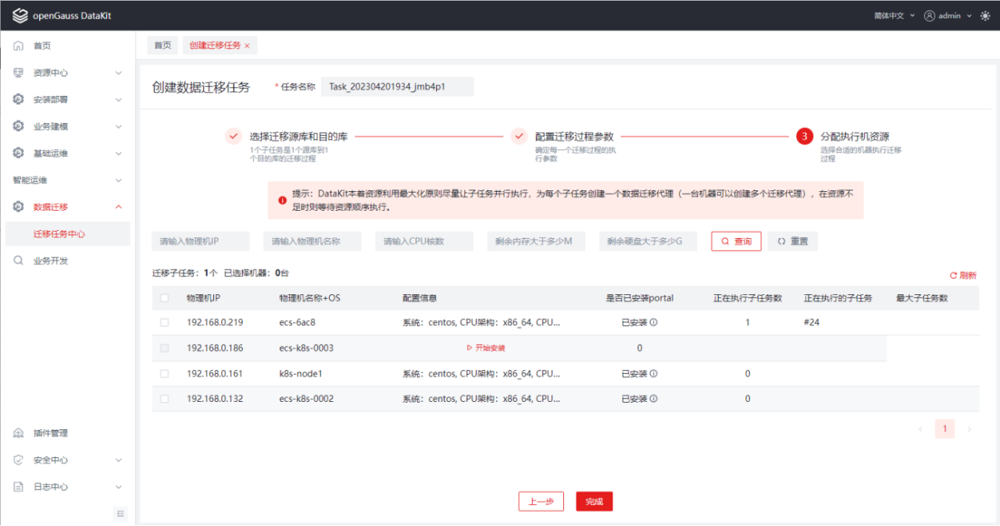

# 迁移方案说明

## 迁移概述

## 迁移流程

## 迁移评估

## 应用适配

迁移评估生成兼容评估结果，对于迁移源端和目的端不兼容之处，进行改造适配。通过适配工具，扫描评估结果中不兼容的SQL，快速发现需要进行改造适配的位置，并使用程序进行自动化改造。对于可以自动替换的SQL进行自动文件改造，对于无法自动替换的SQL提示改造信息。

- 自动捕捉目的端不符合目的端数据库语法的SQL，并自动改造成正确的SQL。
- 若SQL无法自动改造，则提示改造信息，再通过手动配置的方式进行SQL转换。

完成适配后，再使用迁移工具进行数据迁移，对于适配工具无法修正的SQL需人工介入进行修正。

## 数据迁移

### 迁移模式

- 全量迁移

将MySQL端已有数据和对象迁移至openGauss端。

- 全量校验

对源端和目的端全量迁移的数据进行校验。

- 增量迁移

将MySQL端产生的增量数据迁移至openGauss端。

- 增量校验

对源端和目的端增量迁移的数据进行校验。

- 反向迁移

将openGauss端产生的增量数据迁移至MySQL端。

- 离线模式

迁移工具集会执行包括全量迁移和全量校验的迁移计划。

- 在线模式

迁移工具集会执行包括全量迁移、全量校验、增量迁移、增量校验和反向迁移在内的迁移计划。迁移工具集在全量迁移执行结束后会持续处于增量迁移状态，如果用户选择停止增量并启动反向，那么迁移工具集将结束增量迁移状态，进入反向迁移状态。

### 前置要求

- 执行迁移任务的服务器应具备一定的性能和配置，以保证迁移过程的顺利执行。

- 为保证数据的顺利迁移，添加MySQL数据源时，请添加具备数据库读写权限的用户；添加openGauss数据源时，请添加具备SYSADMIN权限和逻辑复制权限的用户。

- 迁移过程中，请勿关闭源数据库或目标数据库。

### 约束限制

#### MySQL相关约束

- MySQL需要5.7及以上的版本。

- MySQL参数设置要求为：

  ```
  log_bin=ON, binlog_format=ROW, binlog_row_image=FULL, gtid_mode = ON。
  若gtid_mode=off，会降低在线迁移的性能。
  ```

-  Kafka中以AVRO格式存储数据，AVRO字段名称[命名规则](https://gitee.com/link?target=https%3A%2F%2Favro.apache.org%2Fdocs%2F1.11.1%2Fspecification%2F%23names)为：以[A-Za-z_]开头；随后仅包含[A-Za-z0-9_]。因此，对于MySQL中的标识符命名，包括表名、列名等，需满足上述命名规范，否则增量迁移会报错。

#### openGauss相关约束

- openGauss需要3.0.0及以上版本。

- openGauss参数设置要求为：

  ```
  wal_level = logical
  ```

- 反向迁移依赖于openGauss的逻辑复制，仅限能进行逻辑复制的用户进行操作。

- 需要调整pg_hba.conf以允许复制（这里的值取决于实际的网络配置以及用于连接的用户）：

  ```
  host   replication   repuser   0.0.0.0/0   sha256
  ```

#### 其他约束

- JDK 版本要求JDK11+。

- 增量迁移支持DDL和DML操作，对于不兼容的DDL，迁移时会报错处理（openGauss在完善对DDL的兼容性）。

- 反向迁移支持DML操作，不支持DDL操作。

### 迁移实施

在准生产环境验证数据迁移的正确性、可靠性。

- 添加数据库实例和迁移工具部署机器

用户需要在“资源中心—实例管理”界面添加MySQL实例和openGauss实例，在“资源中心—设备管理”界面添加迁移工具部署机器。

- 创建迁移任务

在“数据迁移—迁移任务中心”界面创建迁移任务，指定迁移源端和目的端数据库、迁移模式（离线/在线）、配置自定义迁移参数，分配迁移工具部署机器并安装迁移工具集。

- 启动迁移任务

在迁移任务中心启动迁移任务，开始数据迁移。



### 使用指南

详细流程请参见迁移[使用指南](https://gitee.com/opengauss/openGauss-workbench/blob/master/data-migration/doc/DataKit%20Product%20Manual%20-%20Data%20Migration%20.md)

## 试运行

在业务系统迁移完毕后，可以通过原有的业务系统测试用例和方法对业务进行单元测试和集成测试，也可以抽取核心功能模块进行快速测试。测试后方可上线。同时，对迁移后的系统进行性能看护，并使用监控工具持续监测数据库各项指标是否正常，确保业务系统平稳过渡，运行良好。

## 生产割接

在准生产环境确定以上前置条件和相关约束已全部满足。

- 在线模式下，停止增量迁移。

  在任务详情页面点击“停止增量”按钮，迁移工具集发送增量迁移结束时的lsn给反向迁移工具。

- 在线模式下，启动反向迁移。

  在任务详情页面点击“启动反向”按钮，反向迁移工具接收lsn，从该lsn开始开始监控业务运行状态，同步增量数据的增、删、改操作到旧生产环境，实现不重复、不遗漏的数据备份。

## 运维

