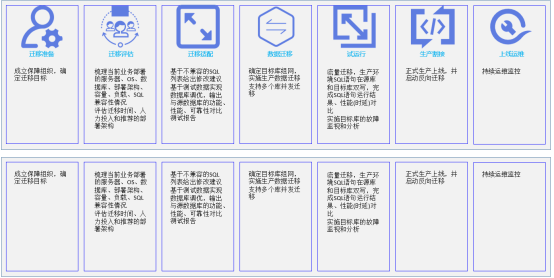

# 迁移方案说明

|迁移步骤|工具支持|DataKit是否包含|备注|
|:---|:---|:---|:---|
|迁移评估|[assessment_database](https://docs.opengauss.org/zh/docs/latest/docs/DataMigrationGuide/MySQL%E8%AF%AD%E6%B3%95%E5%85%BC%E5%AE%B9%E6%80%A7%E8%AF%84%E4%BC%B0%E5%B7%A5%E5%85%B7.html)|是|用户导入SQL文件，工具可输出报告，展示SQL兼容情况|
|应用适配|[DataKit](https://docs.opengauss.org/zh/docs/latest/docs/ToolandCommandReference/DataKit.html)|是|集成web datastudio，方便用户实时调测SQL，观察结果|
|数据迁移|[全量迁移-gs_mysync](https://docs.opengauss.org/zh/docs/latest/docs/DataMigrationGuide/%E5%85%A8%E9%87%8F%E8%BF%81%E7%A7%BB.html) [增量迁移-gs_replicate](https://docs.opengauss.org/zh/docs/latest/docs/DataMigrationGuide/%E5%A2%9E%E9%87%8F%E8%BF%81%E7%A7%BB.html) [数据校验-gs_datacheck](https://docs.opengauss.org/zh/docs/latest/docs/DataMigrationGuide/%E6%95%B0%E6%8D%AE%E6%A0%A1%E9%AA%8C.html)|是|提供全量、增量、数据校验功能|
|试运行|X|X||
|生产割接|[反向迁移](https://docs.opengauss.org/zh/docs/latest/docs/DataMigrationGuide/%E5%8F%8D%E5%90%91%E8%BF%81%E7%A7%BB.html)|是|提供反向迁移工具，将openGauss端产生的增量数据迁移至MySQL端。|
|运维|[DataKit](https://docs.opengauss.org/zh/docs/latest/docs/ToolandCommandReference/DataKit.html)|是|提供数据库监控功能|

## 迁移概述

openGauss提供端到端的迁移方案，包括迁移准备、迁移评估、迁移适配、数据迁移、试运行、生产割接、上线运维7个阶段，同时通过DataKit工具实现迁移全流程可视化，实现全场景“简单、完整、高效”的迁移。

## 迁移流程



## 迁移准备

在进行数据库迁移前，客户业务部门、IT部门、维护部分，以及OSV、ISV需要联合成立保障组织，为数据库迁移提供技术支撑和组织保障。

## 迁移评估

成立保障组织后，公司内部收集需要迁移的业务名称、迁移诉求、应用栈、业务部署形态、服务器硬件信息、操作系统信息、全量的待评估SQL语句，形成项目的《迁移活动计划表》。本阶段计划提供兼容性评估工具，此工具可以自动评估哪些SQL语句可以在openGauss上直接使用，哪些需要修改后使用并给出修改建议，哪些完全不支持。后续此工具将进一步增强，敬请期待。

## 迁移适配

### 源代码修改

迁移评估生成兼容评估结果做为本阶段的输入。根据《迁移活动计划表》逐一开展和排查项目迁移适配项，查找源代码并修改所有的不兼容SQL，完成源代码适配。

通过适配工具，扫描评估结果中不兼容的SQL，快速发现需要进行改造适配的位置，并使用程序进行自动化改造。对于可以自动替换的SQL进行自动文件改造，对于无法自动替换的SQL提示改造信息。

- 自动捕捉目的端不符合目的端数据库语法的SQL，并自动改造成正确的SQL。
- 若SQL无法自动改造，则提示改造信息，再通过手动配置的方式进行SQL转换。

完成适配后，再使用迁移工具进行数据迁移，对于适配工具无法修正的SQL需人工介入进行修正。

### 开发自验证

修改完成的兼容SQL，每一处的功能都需要开发人员添加手动或自动化测试用例，以保证功能正常。

### 集成测试

可以通过数据迁移工具完成生产数据迁移到测试环境(无条件可以手动构建足够的数据)，然后完成集成功能自测试。

重复abc步骤，以完成项目的数据库适配。

## 数据迁移

现在已经提供DataKit迁移服务实现Web平台一站式迁移。详情参考：[链接](https://gitee.com/opengauss/openGauss-workbench/blob/master/data-migration/doc/DataKit Product Manual - Data Migration .md)。

也可以单独使用迁移工具，参考本章节迁移模式、前置要求、约束限制。

### 迁移模式

- 全量迁移

将MySQL端已有数据和对象迁移至openGauss端。

- 全量校验

对源端和目的端全量迁移的数据进行校验。

- 增量迁移

将MySQL端产生的增量数据迁移至openGauss端。

- 增量校验

对源端和目的端增量迁移的数据进行校验。

- 反向迁移

将openGauss端产生的增量数据迁移至MySQL端。

- 离线模式

迁移工具集会执行包括全量迁移和全量校验的迁移计划。

- 在线模式

迁移工具集会执行包括全量迁移、全量校验、增量迁移、增量校验和反向迁移在内的迁移计划。迁移工具集在全量迁移执行结束后会持续处于增量迁移状态，如果用户选择停止增量并启动反向，那么迁移工具集将结束增量迁移状态，进入反向迁移状态。

### 前置要求

- 执行迁移任务的服务器应具备一定的性能和配置，以保证迁移过程的顺利执行。

- 为保证数据的顺利迁移，添加MySQL数据源时，请添加具备数据库读写权限的用户；添加openGauss数据源时，请添加具备SYSADMIN权限和逻辑复制权限的用户。

- 迁移过程中，请勿关闭源数据库或目标数据库。

### 约束限制

#### MySQL相关约束

- MySQL需要5.7及以上的版本。

- MySQL参数设置要求为：

  ```
  log_bin=ON, binlog_format=ROW, binlog_row_image=FULL, gtid_mode = ON。
  若gtid_mode=off，会降低在线迁移的性能。
  ```

-  Kafka中以AVRO格式存储数据，AVRO字段名称[命名规则](https://gitee.com/link?target=https%3A%2F%2Favro.apache.org%2Fdocs%2F1.11.1%2Fspecification%2F%23names)为：以[A-Za-z_]开头；随后仅包含[A-Za-z0-9_]。因此，对于MySQL中的标识符命名，包括表名、列名等，需满足上述命名规范，否则增量迁移会报错。

#### openGauss相关约束

- openGauss需要3.0.0及以上版本。

- openGauss参数设置要求为：

  ```
  wal_level = logical
  ```

- 反向迁移依赖于openGauss的逻辑复制，仅限能进行逻辑复制的用户进行操作。

- 需要调整pg_hba.conf以允许复制（这里的值取决于实际的网络配置以及用于连接的用户）：

  ```
  host   replication   repuser   0.0.0.0/0   sha256
  ```

#### 其他约束

- JDK 版本要求JDK11+。

- 增量迁移支持DDL和DML操作，对于不兼容的DDL，迁移时会报错处理（openGauss在完善对DDL的兼容性）。

- 反向迁移支持DML操作，不支持DDL操作。

### 迁移实施

在准生产环境验证数据迁移的正确性、可靠性。

- 添加数据库实例和迁移工具部署机器

用户需要在“资源中心—实例管理”界面添加MySQL实例和openGauss实例，在“资源中心—设备管理”界面添加迁移工具部署机器。

- 创建迁移任务

在“数据迁移—迁移任务中心”界面创建迁移任务，指定迁移源端和目的端数据库、迁移模式（离线/在线）、配置自定义迁移参数，分配迁移工具部署机器并安装迁移工具集。

- 启动迁移任务

在迁移任务中心启动迁移任务，开始数据迁移。


### 使用指南

详细流程请参见迁移[使用指南](https://gitee.com/opengauss/openGauss-workbench/blob/master/data-migration/doc/DataKit%20Product%20Manual%20-%20Data%20Migration%20.md)

## 试运行

在业务系统迁移完毕后，可以通过原有的业务系统测试用例和方法对业务进行单元测试和集成测试，也可以抽取核心功能模块进行快速测试。测试后方可上线。同时，对迁移后的系统进行性能看护，并使用监控工具持续监测数据库各项指标是否正常，确保业务系统平稳过渡，运行良好。

## 生产割接

在准生产环境确定以上前置条件和相关约束已全部满足。

- 在线模式下，停止增量迁移。

  在任务详情页面点击“停止增量”按钮，迁移工具集发送增量迁移结束时的lsn给反向迁移工具。

- 在线模式下，启动反向迁移。

  在任务详情页面点击“启动反向”按钮，反向迁移工具接收lsn，从该lsn开始开始监控业务运行状态，同步增量数据的增、删、改操作到旧生产环境，实现不重复、不遗漏的数据备份。

## 上线运维

应用割接到openGauss 1~8周内，需要持续关注应用切换后的功能、性能、稳定性、资源使用情况。同时也要关注反向迁移工具是否有报错、异常等信息，确保业务平稳过度，良好运行。

DataKit也提供了监控运维插件，详情参考:[链接](https://gitee.com/opengauss/openGauss-workbench/blob/master/plugins/observability-instance/README.md)