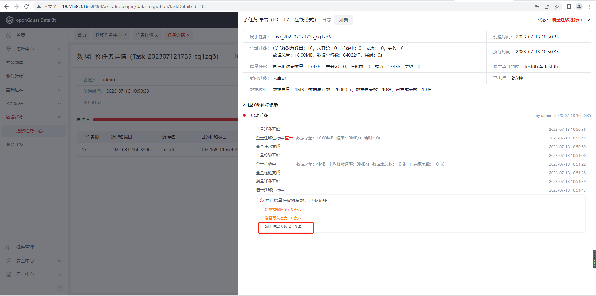

## 最佳实践

## 搬家啦！中移在线20个应用悄悄搬迁至openGauss数据库！

## 迁移背景

中国移动在线营销服务中心是中国移动连接亿万客户的桥梁，拥有全球最大的融合智能泛呼叫中心。作为中国移动客户服务的主窗口，中移在线生产系统数据库在过去的应用中，发现了诸多痛点：包含MySQL+第三方组件的高可用架构存在网络分区导致的脑裂问题，MySQL无实时强同步机制导致的数据不一致风险等。为了更好地服务于亿万用户，中移在线坚定地踏上了改革新征程之路。通过多方面对比，中移在线的工程师们将目光聚焦在openGauss数据库上。中移在线20个应用开启了一场悄悄地数据搬迁活动。

## 迁移准备

接收到中移在线数据搬迁的诉求，openGauss快速成立搬迁保障组，包括管理、专家、研发和测试人员等，为中移在线业务高效平稳搬迁提供技术支持和人力保障。

## 迁移评估

迁移实施前对客户的20个现有业务系统进行调研，主要包括服务器硬件信息、操作系统信息、业务部署形态、业务特征、数据量、全量的待评估SQL语句等。

- 通过调研，发现客户部署openGauss的机器资源受限，部署方式主要为一主两备集群，因此结合客户的实际场景，提供了一套数据库参数列表，以最大限度地提升数据库和迁移性能；

  （1）全量迁移阶段，建议关闭的参数，这些参数都可以直接修改生效。

  ```
  ssl=off
  fsync=off
  audit_enabled=off
  autovacuum = off
  track_activities = off
  track_counts = off
  track_sql_count = off
  enable_instr_track_wait = off
  enable_instr_rt_percentile=off
  enable_instance_metric_persistent=off
  enable_logical_io_statistics=off
  enable_user_metric_persistent=off
  enable_instr_cpu_timer = off
  enable_resource_track = off
  enable_asp=off
  enable_stmt_track=false
  enable_cachedplan_mgr = off
  enable_global_syscache = off
  light_comm = on
  instr_unique_sql_count=0
  ```

  （2）提升数据库性能，建议修改的值。

  | 参数名                  | 参数类型   | reload生效 | 参数描述                                                     | 原始值 | 建议修改值 |
  | ----------------------- | ---------- | ---------- | ------------------------------------------------------------ | ------ | ---------- |
  | max_process_memory      | POSTMASTER | 否         | 一个数据库节点可用的最大物理内存                             | 12GB   | 21GB       |
  | shared_buffers          | POSTMASTER | 否         | openGauss使用的共享内存大小                                  | 5GB    | 12GB       |
  | cstore_buffers          | POSTMASTER | 否         | 列存所使用的共享缓冲区的大小                                 | 1GB    | 16MB       |
  | wal_buffers             | POSTMASTER | 否         | 用于存放WAL数据的共享内存空间的XLOG_BLCKSZ数                 | 16MB   | 128MB      |
  | advance_xlog_file_num   | POSTMASTER | 否         | 在后台周期性地提前初始化xlog文件的数目                       | 0      | 10         |
  | log_checkpoints         | SIGHUP     | 是         | 在服务器日志中记录检查点和重启点的信息                       | off    | on         |
  | enable_codegen          | USERSET    | 是         | 开启代码生成优化，目前代码生成使用的是LLVM优化               | on     | off        |
  | wal_receiver_timeout    | SIGHUP     | 是         | 从主机接收数据的最大等待时间                                 | 6s     | 30s        |
  | enable_pbe_optimization | USERSET    | 是         | 对以PBE（Parse Bind Execute）形式执行的语句进行查询计划的优化 | on     | off        |
  | max_files_per_process   | POSTMASTER | 否         | 设置每个服务器进程允许同时打开的最大文件数目                 | 1000   | 100000     |
  | pagewriter_sleep        | SIGHUP     | 是         | 脏页数量不足pagewriter_threshold时，后台刷页线程将sleep设置的时间继续刷页 | 2s     | 1s         |
  | enable_slot_log         | USERSET    | 是         | 是否开启逻辑复制槽主备同步特性                               | off    | on         |

- 同时识别到迁移工具在资源充足的场景下可发挥高性能优势，在资源受限场景下性能受限，因此针对客户实际场景，对工具配置及资源占用进行优化，以最大限度地提升迁移性能；

- 针对全量业务SQL，利用兼容性评估工具对其进行分析，评估语法的兼容度，包括完全兼容，部分兼容，不兼容三种场景；

- 以业务系统为单元，结合业务的实际场景、影响范围及技术复杂度，制定业务迁移的优先级及业务迁移计划。

## 迁移适配

对识别到的不兼容语法，在业务侧进行修改，并进行业务侧验证。

针对识别的不兼容点，举例如下：

（1）查询列别名使用number执行失败；

（2）查询表别名使用user执行失败；

（3）tid作为列名，创建表失败。

## 数据迁移

利用DataKit一站式迁移平台进行业务迁移，实时展示迁移进度，迁移全流程可视化，并集成监控、运维等能力，实现全场景简单、高效、完整的迁移。

针对无增量数据的业务，采用离线迁移模式，主要包括全量迁移和全量校验两个阶段；

针对有增量数据的业务，采用在线迁移模式，主要包括全量迁移、全量校验、增量迁移、增量校验、反向迁移五个阶段。全量迁移和全量校验完成后，会自动进入增量迁移和增量校验阶段。

### 迁移实施

- 迁移开始前，检查MySQL及openGauss相关参数设置符合要求；

- 在datakit平台上添加源端和目的端数据库实例和迁移工具部署机器;

  由于迁移数据来源于MySQL集群中的备机，因此源端添加MySQL集群中的备机信息；同时设置迁移的用户具有超级管理员的权限；

- 部署迁移工具；

- 创建并启动迁移任务。

## 试运行

业务迁移完毕后，通过原有业务测试用例和方法对业务进行单元测试和集成测试，测试通过后，方可正式上线。

## 生产割接

针对有增量数据的业务，等增量数据将要追平后，可进行业务割接。

图示中增量迁移——剩余待写入数据：0条，即标志增量数据已追平。



业务割接可总结为如下三个步骤：

（1）设置应用所在的源端MySQL备机为只读(set global read_only=1)，此时除具有超级管理员的用户（如迁移用户）具有写入权限，普通用户（如业务用户）无写入权限;

（2）等增量数据全部迁移完成后，停止增量迁移，并启动反向迁移;

（3）修改应用的配置文件，将应用由MySQL切换至openGauss数据库，并启动应用程序。

至此已实现应用无缝切换至openGauss数据库。

整体迁移割接流程总结如下：


## 上线运维

在迁移和割接过程中，中移在线和openGauss保障团队精诚合作，至此，已完成新电商平台、智能短信平台等20个应用，包含TB级数据量，搬迁至openGauss数据库，于此同时，前期会持续关注应用的功能及稳定性，并通过datakit平台监控数据库的资源使用、性能、慢SQL等信息。同时还会关注反向迁移工具是否有报错、异常等信息，确保业务平稳过度、良好运行。 


## 迁移亮点

- 首次引入DataKit平台迁移插件提供的MySQL一键式迁移服务，使得迁移流程可视化、简单化；
- openGauss性能优异，试点业务核心SQL平均响应时间下降约40%。

## 总结&反思

中移在线20个应用的迁移是DataKit平台首次接受实战考验，夯实了DataKit在资源受限的虚拟环境中、对较大规模数据量迁移的架构韧性。

同时，我们也识别到工具的一些优化点，并在后续版本中进行了优化，总结如下：

- 迁移插件支持批量安装和卸载
- 迁移任务支持重置操作，支持任务复用

未来，DataKit平台将持续优化演进，助力更多的用户快速实现应用平稳高效搬迁。

