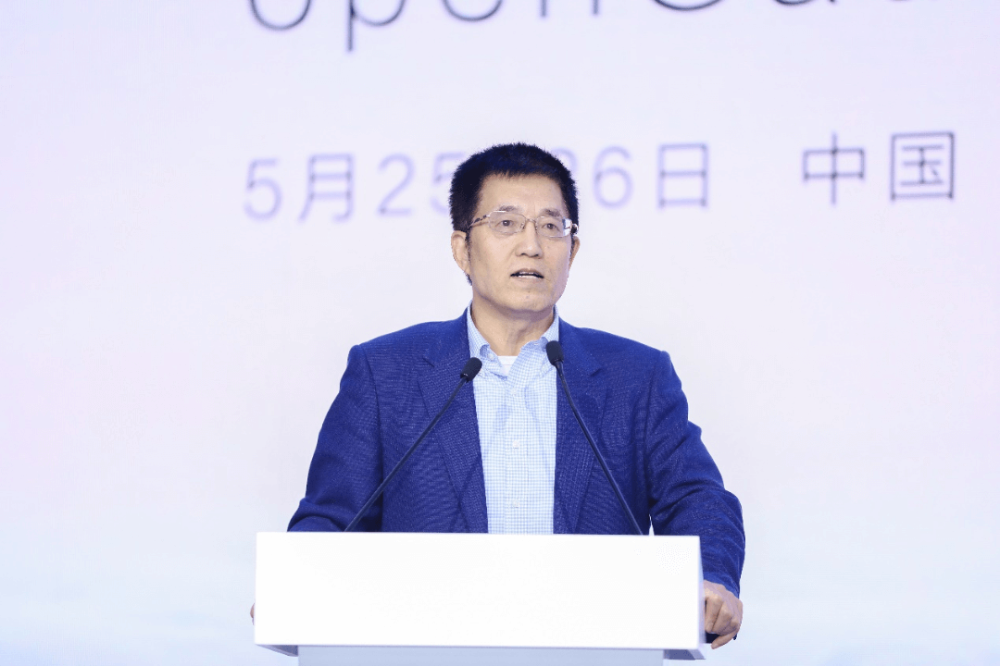
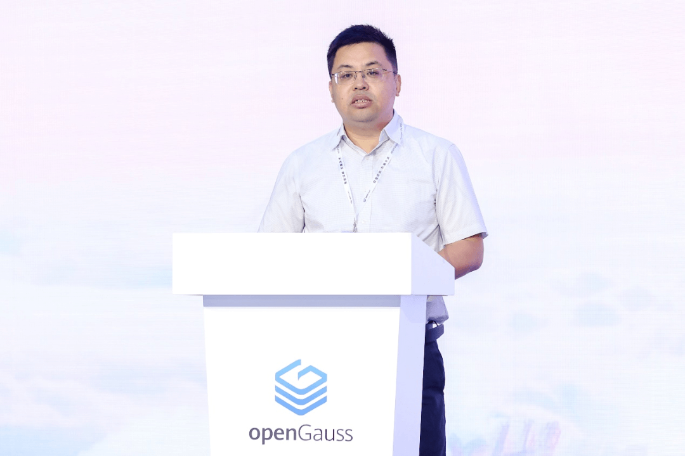
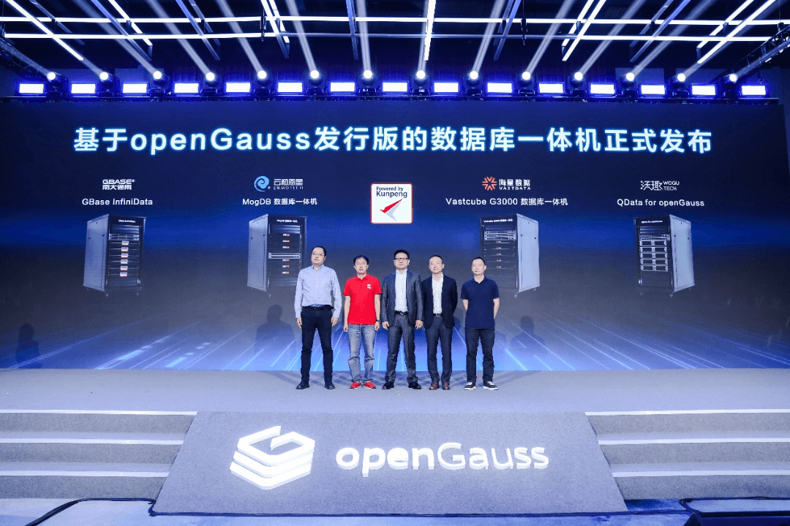
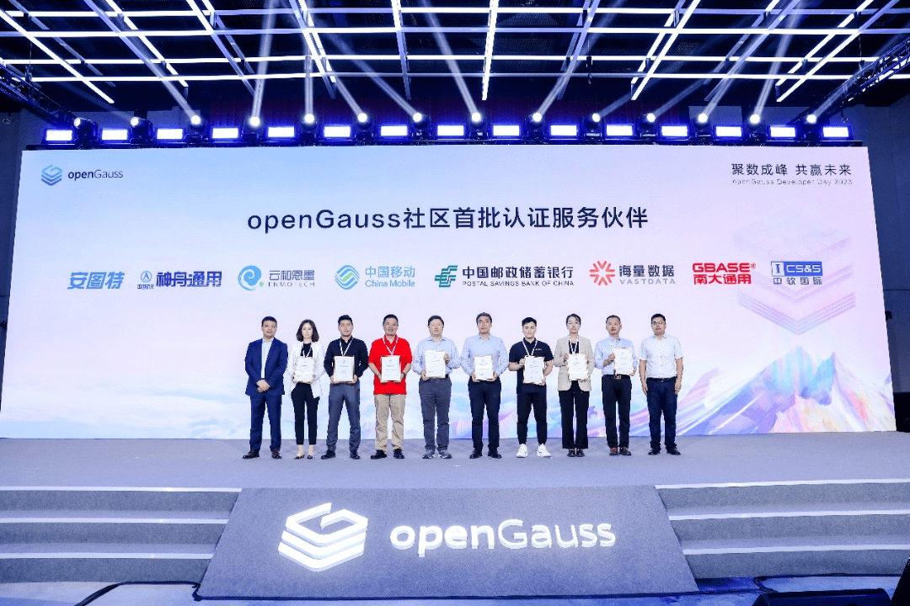

---
title: '聚数成峰，共赢未来，openGauss Developer Day 2023在京举行'
date: '2023-05-26'
tags: ['theme']
banner: '/category/news/2023-05-26/banner.png'
author: 'openGauss'
category: 'news'
summary: '聚数成峰，共赢未来，openGauss Developer Day 2023在京举行'
---

[2023年5月26日 中国 北京]5月25日-26日，以“聚数成峰，共赢未来”为主题的 openGauss Developer Day 2023（openGauss开发者大会2023）在北京举办。本届大会在中国计算机学会、国家工业信息安全发展研究中心指导下，由openGauss开源社区主办，联合海量数据、云和恩墨、南大通用共同举办。

会上，openGauss持续聚焦内核与架构创新，推出DataPod+DataKit组合和第三代智能优化器ABO，打造全新的数据底座；海量数据、云和恩墨、南大通用、沃趣科技正式发布首批基于openGauss发行版的数据库一体机产品；openGauss社区正式发布openGauss伙伴专业保障服务，首批8家优秀伙伴通过认证成为社区服务伙伴 （oGSP：openGauss Service Partner）。

**西北工业大学教授、博士生导师，工业和信息化部大数据存储与管理重点实验室主任，中国计算机学会数据库专委会主任委员李战怀教授**为大会致辞，他表示，数据库作为数字化转型与建设战略的核心基础软件之一，在国家政策牵引，国内数据库产业领军企业、行业客户、合作伙伴、开发者的持续创新、共同努力下，一定能够突破壁垒，开拓出中国数据库产业的自主、发展与繁荣之路。

西北工业大学教授、博士生导师

工业和信息化部大数据存储与管理重点实验室主任

中国计算机学会数据库专委会主任委员 李战怀教授

**国家工业信息安全发展研究中心软件所副所长李卫**为大会致辞，他表示， 从行业客户需求和中国数字化产业政策角度来讲，自主开源的数据库产业和生态，是受客户欢迎的。研究中心也将持续支持中国数据库产业的自主创新、可持续发展，支持以openGauss为代表的国内开源数据库根社区的自主创新、行业应用、生态繁荣。

国家工业信息安全发展研究中心软件所副所长 李卫

**openGauss社区理事会理事长江大勇**发表题为《聚数成峰，共赢未来》的主题演讲，他表示， 在openGauss开源三周年之际，社区高速发展，即将迎来生态拐点。截止目前，已有将近260家企业加入社区，近5000名开发者参与社区贡献，社区代码总行数已超过1500万行。社区坚持技术创新，如期发布了7个社区版本，多家社区伙伴基于openGauss推出的数据库商业发行版，广泛应用于政府、金融、运营商、电力、制造、医疗等十大重点行业的核心场景，2023年openGauss在非云集中式场景的市场份额更是有望突破20%，跨越生态拐点。

openGauss社区理事会理事长 江大勇

## 内核和架构成为推动数据库创新双引擎

在今年3月上线的openGauss 5.0版本中，openGauss针对架构、内核进行了重大升级：

### 01在架构创新方面

openGauss坚持用户场景驱动，持续进行架构创新，围绕多模多态、智能运维等用户需求、痛点，推出了 DataPod+DataKit组合，打造全新的数据底座。

● DataPod分为计算池化、内存池化、存储池化三层，软硬协同，全栈优化，最终实现全栈可观测、可跟踪、开箱性能即最佳的资源池化架构；

● DataKit以插件化架构为主体，定义插件间的标准化交互接口，通过社区协同开发，覆盖部署、开发、运维等6大场景，打造数据全生命周期管理一体化平台。

### 02在内核创新方面

openGauss坚持围绕高性能、高可靠、高安全和高智能四个方面提升技术竞争力：

● 性能方面，关键基础算子性能大幅提升，可用性方面支持虚拟IP部署；

● 安全方面，细粒度用户级审计，防护等级更高；

● 可用方面，实现毫秒级故障自动重连；

● 智能方面，多指标关联分析实现运行态风险及时发现。

同时，持续投入数据库智能化建设，推出智能自治服务DBMind以及第三代智能优化器ABO，实现优化器技术升级，解决传统CBO/RBO在基数估算以及计划选择方面的痛点难题，复杂查询计划更优，性能提升30%以上。

未来，openGauss希望通过内核和架构的双引擎驱动，实现数据库技术突破，为全球数据库发展贡献智慧。

## 完整丰富应用场景，夯实数字基础设施开源数据库

作为面向数据基础设施的开源数据库，openGauss北向支持数据库主流应用，南向支持多样性算力，南北向丰富的生态加速了openGauss落地千行百业，进入核心业务场景。开源3年以来，openGauss已上线7个社区版本，DBV伙伴基于社区发行版发布商业发行版，用户基于社区发行版深度定制的用户自用版，这些版本已覆盖数字基础设施丰富的场景，包括面向关系型的集中式、KV数据库，地理空间数据库，时序数据库等。

## 首批基于openGauss发行版数据库一体机发布

为了更好地满足行业细分场景的需求，充分发挥openGauss数据库和鲲鹏硬件软硬协同的优势，openGauss社区将联合伙伴推出“全栈可信”、“全栈安全”、“开箱即用”、“极简运维”的数据库一体机解决方案。

会上，华为鲲鹏计算业务副总裁邱磊、海量数据总裁、openGauss社区用户委员会主席肖枫、云和恩墨创始人兼总经理、鲲鹏MVP盖国强、南大通用产品总经理张益以及沃趣科技副总裁、公司联合创始人罗春共同见证了首批基于openGauss发行版的数据库一体机产品发布。本次发布的数据库一体机产品均采用了完全开放的架构设计，基于开放的鲲鹏服务器硬件和openGauss开源数据库，为客户提供开放、安全、自主创新、长期演进的企业级数据库解决方案新选择。

## openGauss伙伴专业保障服务正式发布

为了提升openGauss社区专业服务能力，openGauss伙伴专业保障服务正式发布。openGauss服务伙伴（oGSP：openGauss Service Partner）具备专业的openGauss实战经验和技术能力，对openGauss生态系统有深入的理解和贡献，在openGauss运维、迁移、优化、培训以及bug修复/补丁版本发布等方面提供个性化的服务，为用户量身定制最佳的解决方案。未来，通过社区三年+伙伴三年的版本生命周期服务模式，可以为社区版用户提供最少六年的专业保障服务。

本次大会，共有八家伙伴成为openGauss社区首批认证服务伙伴，他们将是openGauss生态服务能力构建的有力保障，为用户提供高质量、高可靠和稳定的专业服务。

聚数成峰，共赢未来。openGauss三年来的快速发展，离不开每一位全产业链伙伴的支持和贡献，未来，openGauss希望和全行业伙伴、用户、高校研究机构、开发者一起，共建、共享、共治，打造繁荣的数字基础设施数据库生态，共建最具创新力的数据库开源根社区。

汇聚创新力量，共攀数据库高峰，共赢数智未来！
