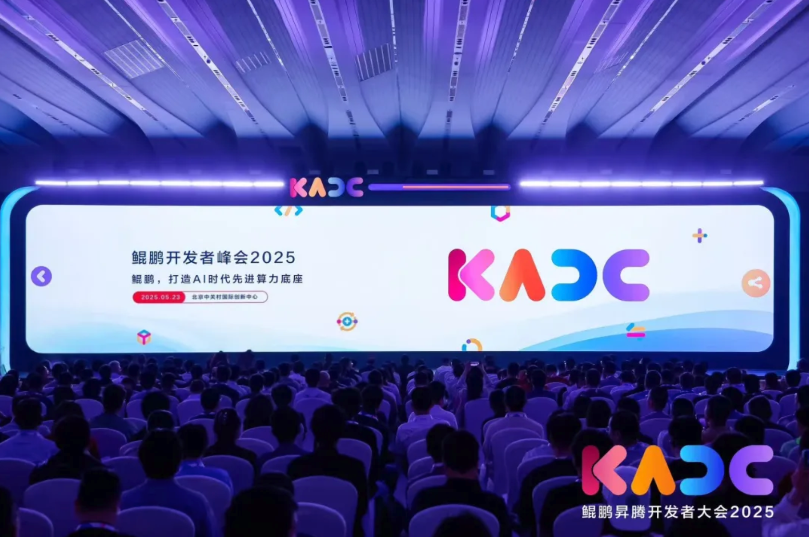
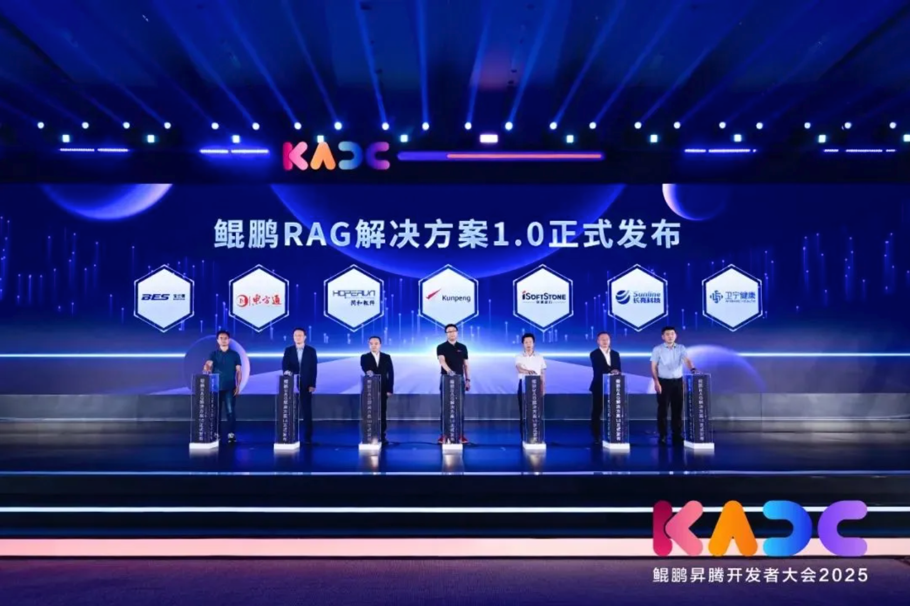
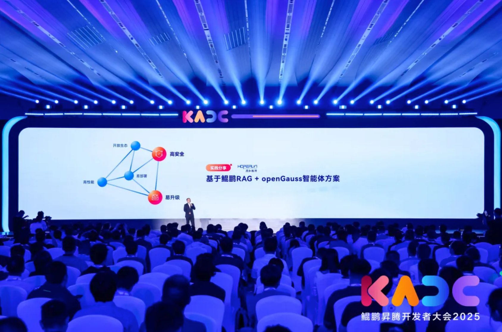
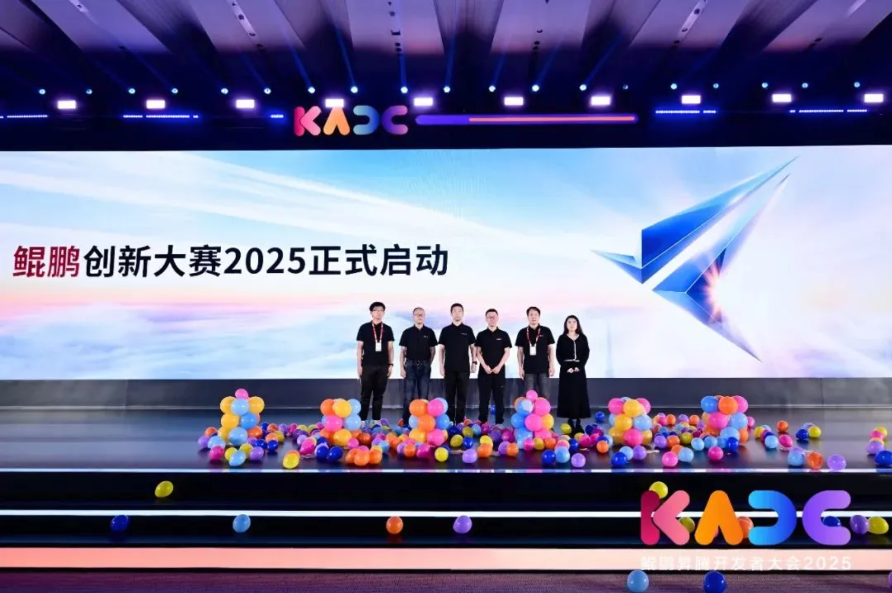
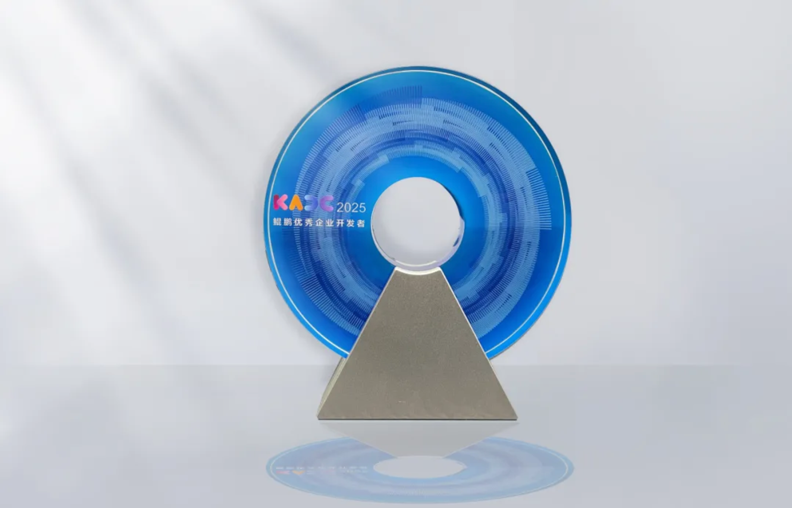
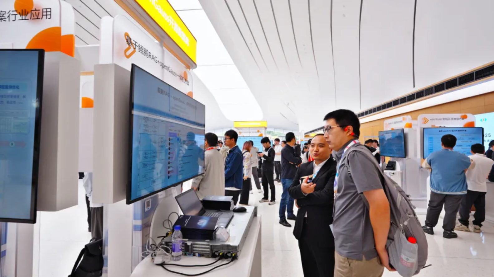

近日，以 “ 心怀挚爱，共绽光芒 ” 为主题的鲲鹏昇腾开发者大会 2025  在北京中关村国际创新中心成功举办。作为鲲鹏生态的紧密合作伙伴，江苏润和软件股份有限公司（以下简称“润和软件”）携手鲲鹏发布“鲲鹏 RAG  解决方案”、深度解读“基于鲲鹏 RAG+openGauss  智能体方案”，并展示润和软件 AI  创新成果矩阵、企业级 AI  升级路径。

鲲鹏昇腾开发者大会2025现场

**行业共建  昂首同行**

会议期间，润和软件携手鲲鹏共同发布 “  以鲲鹏算力为基座、深度协同 openGauss  开源数据库 ”  的鲲鹏 RAG  解决方案，助力企业打造场景驱动的智能业务引擎，重塑数字化运营范式。

鲲鹏 RAG  解决方案采用算力超融合架构，实现了多核异构资源的“定制化组合”；依托智能负载感知算法达成毫秒级任务调度，算力利用率提升约 40%  ；在文本、图像、音视频等多维度数据处理层，支持基于行业特性的定制化 Embedding  建模与多维联合索引架构，典型场景检索准确率突破 85%  。该方案通过端到端技术重构，驱动模型推理效率与精度双提升，为金融风控、医疗影像、政务热线等高价值场景提供智能化升级路径。

润和软件携手鲲鹏发布鲲鹏RAG解决方案

**精彩分享  畅聊AI**

在分享环节，润和软件人工智能研究院AI总工朱凯深度解读了“基于鲲鹏RAG+openGauss智能体方案”。

该解决方案深度融合鲲鹏高性能算力集群、openGauss数据库核心能力，结合润和软件自主研发的AI Agent智能体框架，实现了跨场景的高并发处理、高稳定运行与高精准检索性能，具备智能问答、撰写、审核、问数等功能，全面满足全办公场景的智慧化转型需求。

润和软件人工智能研究院AI总工朱凯现场分享

**智算驱动  共赢未来**

面向开发者培养计划，鲲鹏计划启动鲲鹏创新大赛2025，鼓励广大开发者基于鲲鹏全栈根技术，围绕产业真实难题，共同打造基础软/硬件解决方案。会议期间，润和软件与鲲鹏伙伴、企业、高校代表共同启动鲲鹏应用创新大赛2025。未来，润和软件将从技术交流、案例分享等角度帮助开发者更快成长。

鲲鹏应用创新大赛2025启动仪式

**星光交汇  载誉启航**

在开发者之夜颁奖盛典中，润和软件人工智能研究院AI总工朱凯凭借以鲲鹏生态建设中的突出贡献，荣获“鲲鹏优秀企业开发者”奖项。开发者是数智时代技术进步和应用创新的核心力量，开发者的智慧与贡献就是数智创新的源头。

润和软件人工智能研究院AI总工朱凯荣获“鲲鹏优秀企业开发者”奖项

**软硬一体  全栈AI**

在大会展区，润和软件展示了鲲鹏RAG+openGauss的智能体方案、AIRUNS模型工艺平台、RunMind视觉引擎平台等最新成果，引发与会者关注。

- 鲲鹏RAG一体机：内置业务场景、开箱即用的解决方案一体机，降低企业技术门槛，加速企业智能化转型。
- AIRUNS模型工艺平台：AI模型全生命周期管理平台，可实现数据接入、多模态数据开发、模型管理、模型训练、算力调度等功能，助力企业加速AI工程化落地和规模化应用。
- AgentRUNS智能体平台：内置鲲鹏RAG+openGauss解决方案，可实现多智能体的统一管理、调度和协作，帮助企业重构办公生态，提升企业运营能效。
- RunMind视觉引擎平台：一站式视频管理平台，具备可视化逻辑编排、流程式模型优化、多样化规则及场景规则复用，助力企业有效利用视觉资产，降低业务操作风险。

润和软件展区

作为鲲鹏与昇腾生态的紧密合作伙伴，润和软件依托openEuler技术基座优势，构建了从操作系统、中间件到AI大模型的全栈能力。通过自主研发昇腾AI解决方案、鲲鹏智能体解决方案、DeepSeek全场景云-边-端智能生态体系等，润和软件在金融、电网、能源、工业等重点领域确立了技术领先地位，获“最佳昇腾原生开发伙伴”等殊荣。

向下扎根，向上生长。润和软件持续深耕AI技术，开拓产业赋能的共生新格局。未来，润和软件将携手鲲鹏、openGauss构建开放生态体系，打造"技术共生-场景融合-生态共赢"的价值闭环，推动智能算力深度赋能千行百业，与行业伙伴共探数智时代的无限可能。