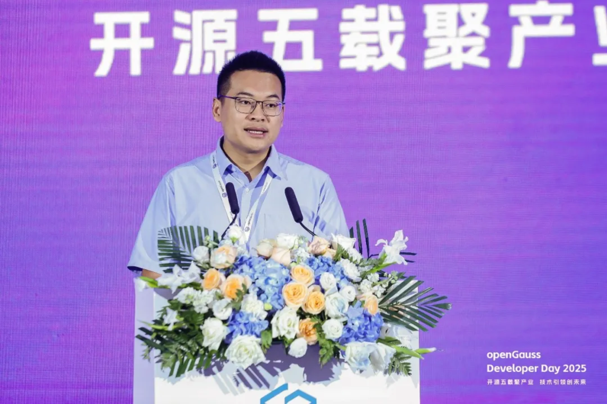
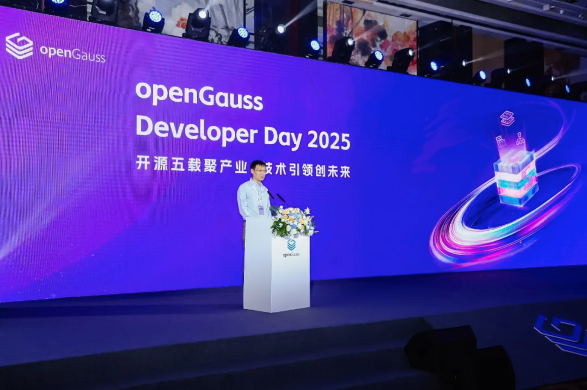
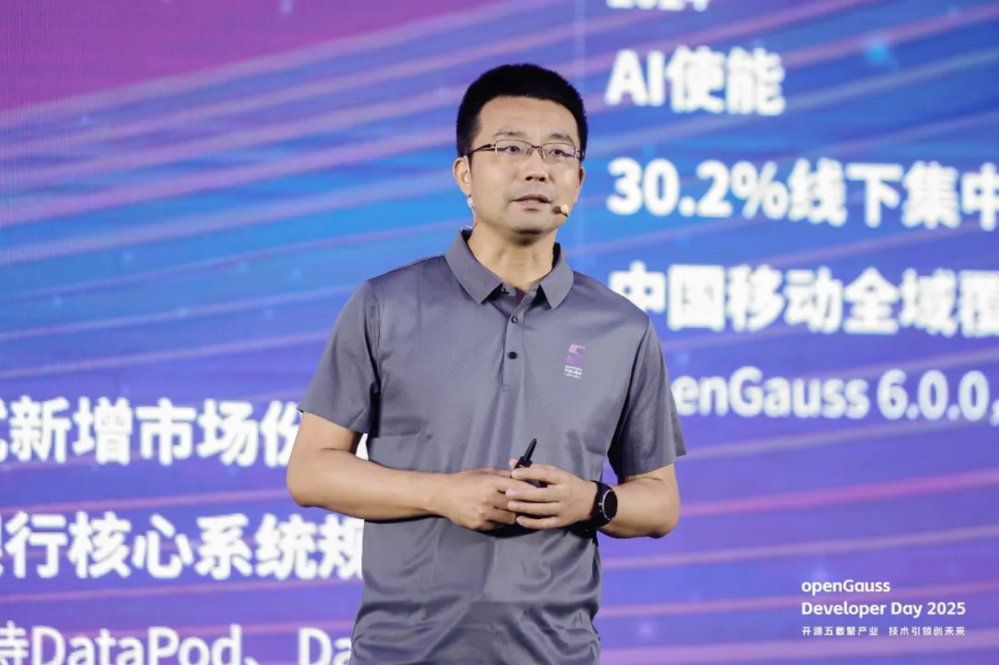
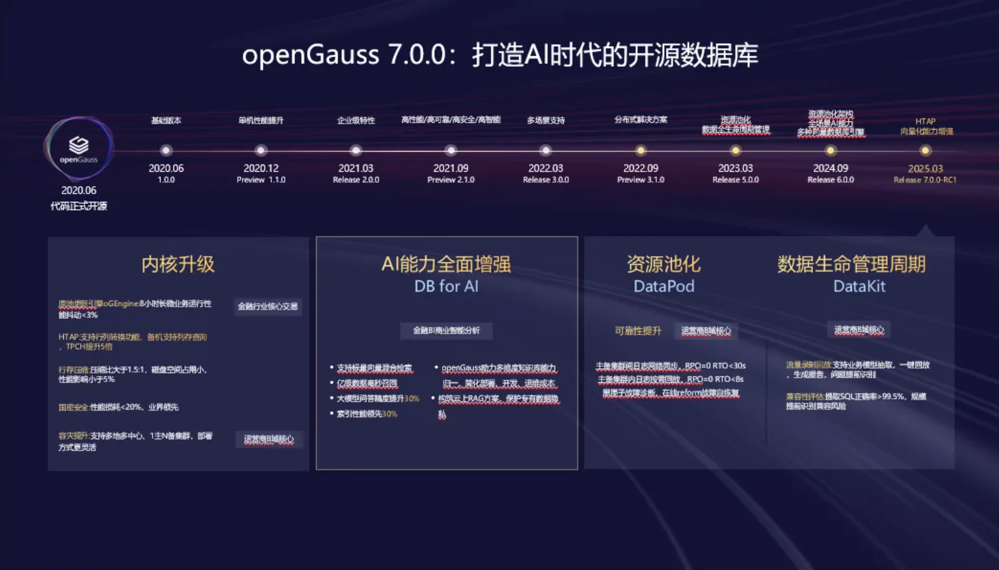
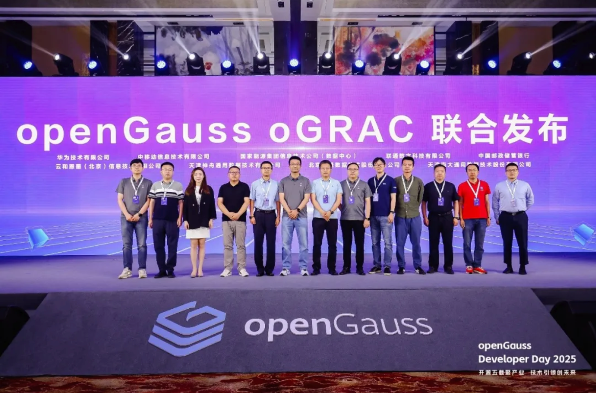
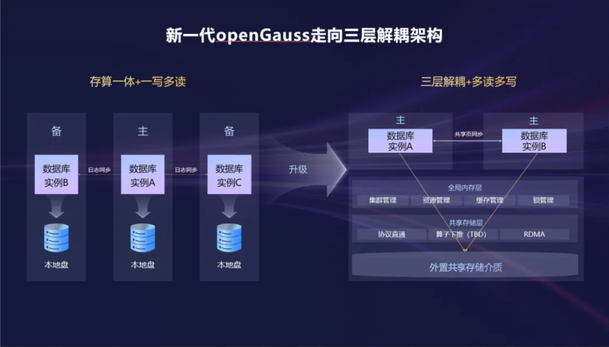
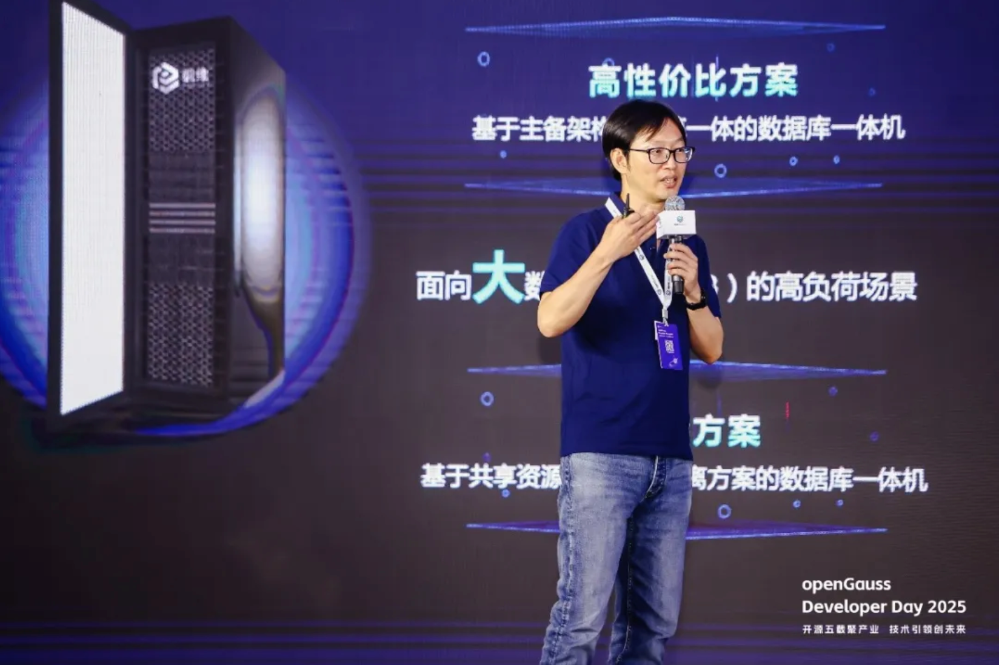
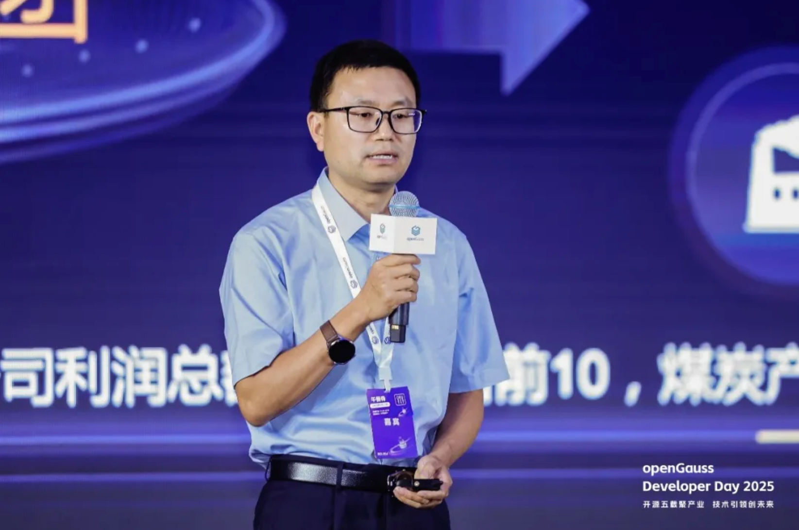

2025 年 6 月 27 日，openGauss Developer Day 在北京香格里拉饭店顺利举办，大会邀请到了产、学、研、用的众多行业专家，以及行业开发者参与。大会通过主题发言、SIG Gathering 等方式，共同探讨了数据库技术的当下发展及未来趋势，充分展现了 openGauss7.0.0 创新版的技术特性。主论坛上，国家工业信息安全发展研究中心软件所副所长辛晓华、开放原子开源基金会业务发展部部长付海巍做开场致词，产、学、研、用等各个领域的代表相继进行了发言。 国家工业信息安全发展研究中心软件所副所长辛晓华在致辞中表示，在 AI 与数据库深度融合的浪潮下，向量检索、多模态处理与一体化架构正重塑数据价值，未来数据底座将更高效、更智能、更开放。他表示基于数据库底座的行业解决方案和人才培养也将会是未来产业工作重点发力方向。通过行业真实落地，完成解决方案与数据库产品之间的磨合迭代，呼吁各行业解决方案厂商群策群力，共同投入到根社区的发展中来。

国家工业信息安全发展研究中心软件所副所长辛晓华

开放原子开源基金会业务发展部部长付海巍在致辞中表示，近年来包括数据库、操作系统在内的开源基础软件取得了令人欣喜的进展，openGauss在技术先进性、生态建设、商业实践等方面都取得了优异的成绩。面向未来，期待openGauss继续秉持开放、共享、协作的开源精神，与开放原子开源基金会在内的更多全球优秀开源组织和项目加深生态合作，为全球数字化发展贡献更多中国智慧。

开放原子开源基金会业务发展部部长付海巍

大会上，openGauss 社区理事长熊伟进行了主题发言，他首先回顾了 openGauss 社区开源五年来的发展历程，并感谢这五年来社区开发者和伙伴们的持续贡献。社区从 2020 年正式开源以来，以技术为根基，相继推出了内核四高特性，迭代出全场景支持能力，再到近年来的 AI 使能不断丰富数据库技术特性。同时，openGauss 也通过丰富的商业模式，携手伙伴实现了商业领域的全面突破，比如中移动的全域核心替换，民生银行和兴业银行的核心系统规模上线。今年，社区版本下载量从 24 年底的 360 万增长到 450 万，涨幅超过 25%。随着 openGauss 7.0.0-RC1 创新版的推出，DataVec 向量数据库能力支持 RAG 解决方案，在 AI 时代浪潮下迎来了新的突破。

openGauss 社区理事长熊伟

openGauss 社区理事长熊伟在发言中表示，当前数据基础设施技术逐渐成熟，原来的存算一体架构方式无法满足应用需求，存算分离技术已经成为数据库发展的必然趋势，这一架构趋势推动数据库向着多写架构创新的方向持续发展。针对当前这一技术趋势，openGauss7.0.0 重磅发布 oGRAC 多写架构能力，将多个数据库实例，部署在多个节点上，能同时访问同一个共享的库表，实现计算、存储资源利用率大幅提升，同时实现业务秒级快速接管，全面提升数据库性能、可靠性和管理能力。

大会上，国家工业信息安全发展研究中心软件所开源生态总监王岩广、openGauss 社区理事长熊伟、中移动信息技术有限公司数据库研发首席架构师魏可伟，国家能源网络安全中心云平台运营部经理王志民等各领域代表一起上台，联合发布了 openGauss7.0.0 版本的下一代 oGRAC 多写架构新特性。

openGauss oGRAC 多写架构联合发布

openGauss 技术委员会委员、2012 实验室高斯部首席架构师王磊，openGauss 技术委员会委员阙鸣健，openGauss 社区 Maintainer 曹宇做了题为《向量驱动新智能，RAC 多写破局，内核升级再启航》的主题发言，全面展示了 openGauss7.0.0 创新版的技术特性、openGauss 在内核、AI 和四高（高性能、高可用、高智能、高安全）能力上的最新技术成果，以及下一个版本的技术演进方向。

中移动信息技术公司数据库研发首席架构师魏可伟发表题为《汇聚创新动能，构筑运营商核心数据底座》的主题发言。他表示，中国移动磐维数据库基于 openGauss 开发，通过技术同盟协同创新，共推企业级数据库高质量发展，实现系统迁移，事务处理效率提升，以及超复杂业务的高效平稳替代。

中移动信息技术公司数据库研发首席架构师魏可伟

国家能源网络安全中心云平台运营部经理王志民发表题为《CERDB 助力国能集团数字化转型实践》的主题发言。王志民表示，国能基于 openGauss 开发出 CERDB 数据库，加速了集团云平台、国能云脉、国能 e 商等系统的自主创新建设，在数据运维管理、用户数据处理、系统升级上均发挥了重要的作用，未来也希望可以和社区一起共建 openGauss 生态繁荣。

国家能源网络安全中心云平台运营部经理王志民

海量数据解决方案总监白玥发表题为《三重护航：Vastbase 驱动“稳定、高效、智能”的医疗核心系统新实践》的主题发言，她表示 Vastbase 基于 openGauss 开发，在医疗领域实现核心应用突破，驱动系统运行更加稳定高效。此外，云和恩墨资深数据库内核架构师张皖川发表题为《“智”造先“基”：MogDB 数据库与鼎捷 ERP 软件的深度融合实践》的主题发言，中科通达 AI 技术架构师杜冬军发表题为《中科通达基于 openGauss 的 RAG 创新实践》的主题发言。大会上，众多伙伴的积极参与展现了 openGauss 社区生态繁荣的新景象。

本次 openGauss 开发者大会旨在持续推动数据库领域的创新和突破，展望未来五年，openGauss 社区希望在内核、AI 和四高等技术特性上，携手行业伙伴和开发者共同成长，期待广大的数据库厂商、客户及开发者们持续加强在开源根社区的投入，共创数据库生态繁荣。