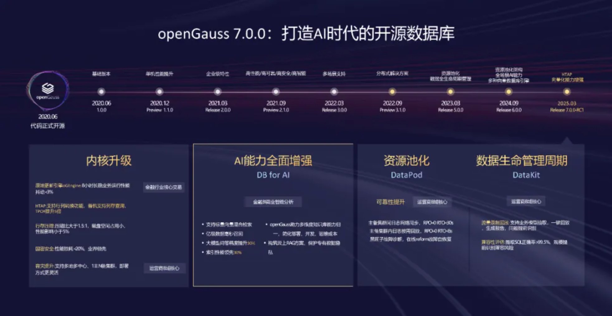
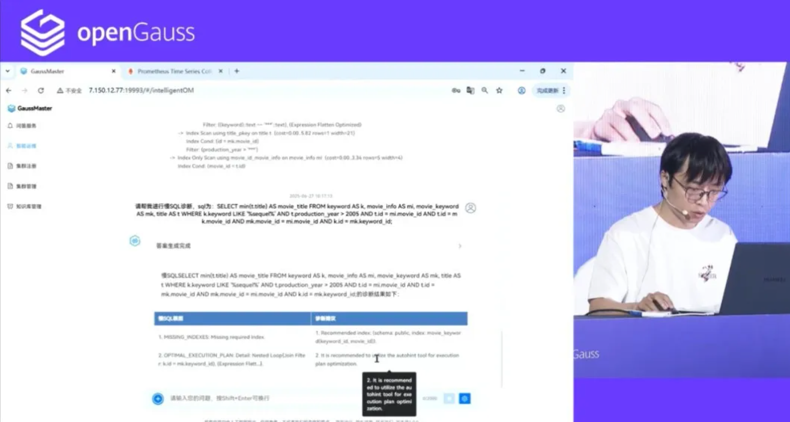

2025 年 6 月 27 日，openGauss Developer Day 在北京香格里拉饭店顺利举办，大会邀请到了产、学、研、用的众多行业专家，以及行业开发者参与。大会通过主题发言、SIG Gathering 等方式，共同探讨了数据库技术的当下发展及未来趋势，充分展现了 openGauss7.0.0 创新版的技术特性。主论坛上，openGauss 技术委员会委员、2012 实验室高斯部首席架构师王磊，openGauss 技术委员会委员阙鸣健，openGauss 社区 Maintainer 曹宇做了题为《向量驱动新智能，RAC 多写破局，内核升级再启航》的主题发言，全面展示了 openGauss7.0.0 创新版的技术特性、openGauss 在内核、AI 和四高（高性能、高可用、高智能、高安全）能力上的最新技术成果，以及下一个版本的技术演进方向。

主论坛上，openGauss 技术委员会委员、2012 实验室高斯部首席架构师王磊，详细讲解了混合交易的应用诉求，介绍了 AI 技术发展正在加速驱动数据库演进的新趋势，讲解了 openGauss 7.0.0 创新版在高性能方面的技术优势，介绍了 HTAP 架构一体化升级的技术进展，以及鲲鹏多核扩展能力持续增强的新特性。

大会上，阙鸣健介绍了 openGauss DataVec 与业界主流开源向量数据库的性能对比数据，充分论证了 openGauss 向量检索性能领先 30%。

2012实验室研发专家王天元进行了 GaussMaster 智能运维相关的技术演示，在第一个慢 SQL 场景中，GaussMaster 实现了从发现、诊断到优化的全流程慢 SQL 调优能力，显著提升慢 SQL 性能。

openGauss 社区研发专家王天元现场演示

在第二个 CPU 飙高场景中，GaussMaster 可以在后端实时监控业务数据库状态，发现告警，提供一键式的故障诊断能力，输出根因分析报告，帮助 DBA 快速定位解决问题。

### DataVec 向量化能力增强，助力 AI 智能应用

openGauss DataVec 向量数据库结合鲲鹏 RAG 一体机解决方案，通过量化加速、向标融合等技术，解决大模型“知识幻觉”问题，提升 LLM 大语言模型在回答问题的实时性和准确性。

- openGauss 向量检索，检索性能领先 30%
- RAG 独立部署，量化加速、向标融合减少对推理资源占用，高并发下减少 40%-80%推理时延影响，提升吐字效率
- 通过指令集对热点距离计算函数进行 SIMD 加速，充分利用算力，同时减少指令数量，降低访存次数，速度提升 20%
- 结合 SQL 语义、全文检索、知识图谱、向量检索提供四库合一能力，实现数据库部署归一、开发接口归一、运维归一
- MCP 协议接入：实现 LLM 标准化接口对接及数据库安全交互，提供数据库运维、监控、管理等服务

openGauss 技术委员会委员阙鸣健

2012实验室研发专家王天元进行了 GaussMaster 智能运维相关的技术演示，在第一个慢 SQL 场景中，GaussMaster 实现了从发现、诊断到优化的全流程慢 SQL 调优能力，显著提升慢 SQL 性能；在第二个 CPU 飙高场景中，GaussMaster 可以在后端实时监控业务数据库状态，发现告警，提供一键式的故障诊断能力，输出根因分析报告，帮助 DBA 快速定位解决问题。

曹宇对新发布的 openGauss oGRAC 多写架构进行了详细解读，他表示多写技术是当前数据库行业的技术高峰，介绍了 openGauss 要走向多主的原因，未来的多读多写架构将极大提高业务可靠性、性能以及资源利用率。

openGauss 社区 Maintainer 曹宇

### oGRAC 多写架构，全面提升性能和可靠性

以 oGEngine 为基础，构建资源池化可插拔多写架构，实现基于 CBO 的物理优化、逻辑优化等，支持多读多写落地，具备 POC 能力，满足架构演进诉求和客户运维管理需求，多写 TPCC 性能领先 5%。

- oGEngine 增强：堆表/索引支持 PCR，减少跨节点交互，索引空间节省 20%
- 段页式优化：段页式管理页面，扩表 0 等待，性能提升超过 10%
- 事务机制优化：csn 简化事务可见性判断，csn 推进去除单一节点瓶颈，全局事务表管理事务状态，性能提升超过 30%
- 可靠性增强：全局日志管理，环形按需回放，RTO<8s

### 内核升级，企业级特性增强

openGauss7.0.0-RC1 创新版全面升级内核四高能力，传统主备部署模式下支持行列转换功能，备机支持列存查询，整体性能对比原始行存方式平均提升 5 倍，支持智能慢 SQL 查询诊断，快速定位慢 SQL 根因，运维效率倍数提升。

- 行存压缩功能增强：对行存表的数据和索引页面，openGauss 提供基于通用压缩算法的透明页压缩功能，降低磁盘空间占用的同时保持 OLTP 场景下的高性能；支持页式存储和段页式存储两种模式
- SQL 功能增强：支持 CROSS/OUTER APPLY JOIN 语法，用于返回左侧表达式的每一行和右侧表达式的匹配行。CUME_DIST、DENSE_RANK、PERCENT_RANK、RANK 函数支持任意类型的任意多个入参，在函数内的入参数据类型和 ORDER BY 的数据类型不一致时也支持执行。支持 JSON_EXISTS、 JSON_TEXTCONTAINS 表达式。支持修改/删除视图引用的对象（如表、列、函数、视图等）后，将视图置为无效状态
- 存储过程功能增强：支持自定义 subtype 语法；支持 EXCEPTION FOR 自定义异常；支持在函数或者过程中创建过程
- 其他增强：支持多个会话并发插入 interval 分区时，如果多个会话都涉及分区自动扩展动作，不会发生卡死问题。新增用于词法语法分析的 openGauss SQL 审计工具 libog_query，支持离线审计分析 SQL 语句在 openGauss 中的语法合法性。CM/OM/DATAKIT 工具中用到的 SSH SCP 等相关通信工具支持用户自定义端口，避免部分环境无法使用默认 22 端口的问题，OM 工具支持记录升级历史记录

openGauss 作为国内极具创新力的开源数据库社区，未来将在内核能力、DataVec 向量化能力、Datapod 三层资源池化架构、DataKit 数据全生命周期管理平台、生态兼容性等方面持续进行技术创新。希望携手各位伙伴、开源与标准化组织、以及广大开发者一起，共同推动数据库技术的高质量发展。