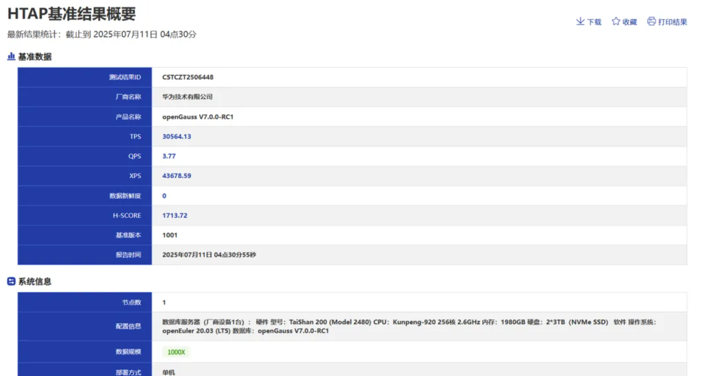

近日，openGauss 在 HyBench HTAP 基准测试中获得 1713.72 分，位居 HyBench 榜第一名。HyBench 是一款由中国软件评测中心、清华大学联合牵头，国内主流数据库公司同研发的 HTAP 数据库基准测试工具，引导 HTAP 数据库的技术研究方向，帮助用户进行 HTAP 数据库选型。参与本次基准测试的是 openGauss 7.0.0 创新版，该版本发布的众多技术特性与鲲鹏实现深度协同 ，openGauss 在 HyBench 测试中取得第一名，不仅是对 openGauss 在 HTAP 领域众多技术创新的认可，还为更多企业的数字化转型提供了可靠依据。

## HyBench HTAP 基准测试概要

#### openGauss 7.0.0 创新版全新升级，持续构筑高性能数据库

openGauss 7.0.0 创新版在 3 月 30 日正式发布，为国内数据库生态带来众多技术创新。

- HTAP 架构一体化升级： 通过行列转换技术，在一套数据库集群中同时支持 TP 交易 AP 查询，实现 HTAP 一体化，方便对接用户不同负载，TPCH 提升 5 倍。
- DataVec 向量化能力增强，助力 AI 智能应用：  openGauss DataVec 向量数据库结合鲲鹏 RAG 一体机解决方案，通过量化加速、向标融合等技术，解决大模型“知识幻觉”问题，提升 LLM 大语言模型在回答问题的实时性和准确性。
- 内核升级，企业级特性增强：  openGauss7.0.0-RC1 创新版全面升级内核四高能力，传统主备部署模式下支持行列转换功能，备机支持列存查询，整体性能对比原始行存方式平均提升 5 倍，支持智能慢 SQL 查询诊断，快速定位慢 SQL 根因，运维效率倍数提升。

点击[这里](https://opengauss.org/zh/news/2025-06-30/) 了解更多 openGauss 7.0.0 创新版技术特性。

#### openGauss+鲲鹏深度协同，极致释放系统性能

本次打榜使用的是 openGauss 7.0.0 创新版 + 鲲鹏的组合，软硬深度协同让系统性能得到了极致的释放。

通过openGauss 线程池和鲲鹏 NUMA 的深度绑定 ，openGauss 在高并发性能场景下表现优秀，在 HyBench 复杂的 AP、TP、XP 场景中，并发总数差别不大的情况下，取得了最优的 H-score 分数。

内存上 ，openGauss 基于鲲鹏芯片提供的更宽的 L3 缓存 cacheline，针对热点数据访问进行优化，有效提高缓存访问命中率，降低 Cache 缓存一致性维护开销，大幅提升系统整体的数据访问性能。同时 openGauss 根据鲲鹏处理器的多核 NUMA 架构特点，进行 NUMA 架构相关优化，一方面尽量减少跨核内存访问的时延问题，另一方面充分发挥鲲鹏多核算力优势，所提供的关键技术包括重做日志批插，热点数据 NUMA 分布，CLog 分区等，大幅提升 TP 系统的处理性能。

存储上 ，openGauss 独有的 oGEngine 存储引擎，HyBench 测试发挥其在长期 DML 过程中，运行平稳，性能抖动小的优势。运行过程中，openGauss 自动估算当前资源占用率，动态调节并行度，充分利用索引检索、行列混合、分区表等特性，保证其运行的稳定性。IO 层面采用多盘策略，openGauss 采用大页技术充分利用 NUMA 的性能，能把不同的类型文件映射到多个 NVME 盘中，避免单个磁盘的 IO 瓶颈。

#### 关于 HyBench

HyBench 是一款由中国软件评测中心、清华大学联合牵头，北京奥星贝斯科技有限公司、武汉达梦数据库股份有限公司、华为技术有限公司、腾讯云计算有限公司、阿里云计算有限公司共同研发的 HTAP 数据库基准测试工具。HyBench 针对 HTAP 数据库技术特点，参考实际典型应用场景进行设计，数据模型采用在线金融交易分析场景，提供 OLTP、OLAP、OLXP 三类典型 HTAP 负载，支持不同规模的数据集，可以计算出 TPS、QPS、XPS、新鲜度等不同维度的评价指标，最终给出统一评价指标 H-Score。HyBench 基准测试为数据库厂商和第三方评测机构提供 HTAP 数据库基准性能的评价方法及工具，引导 HTAP 数据库的技术研究方向，帮助用户进行 HTAP 数据库选型。