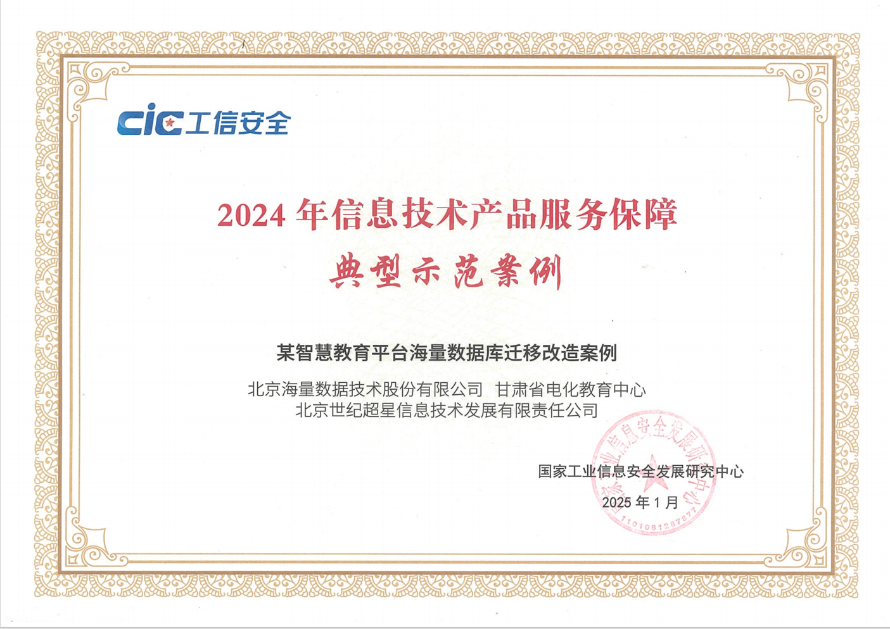
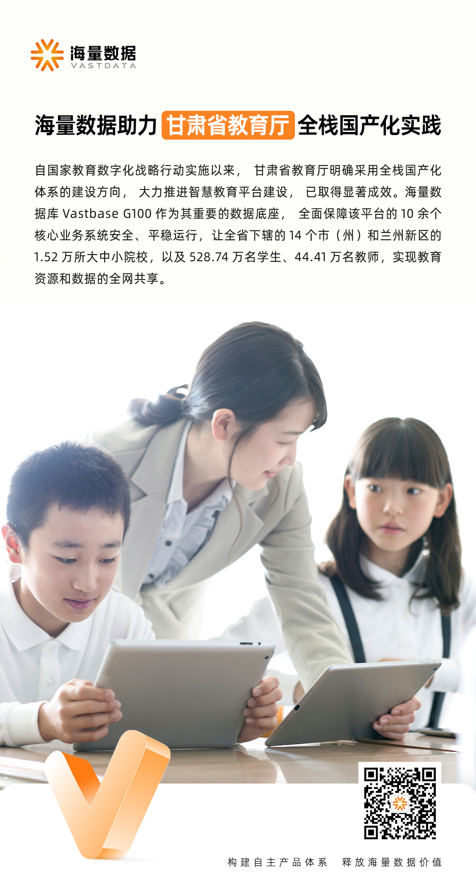
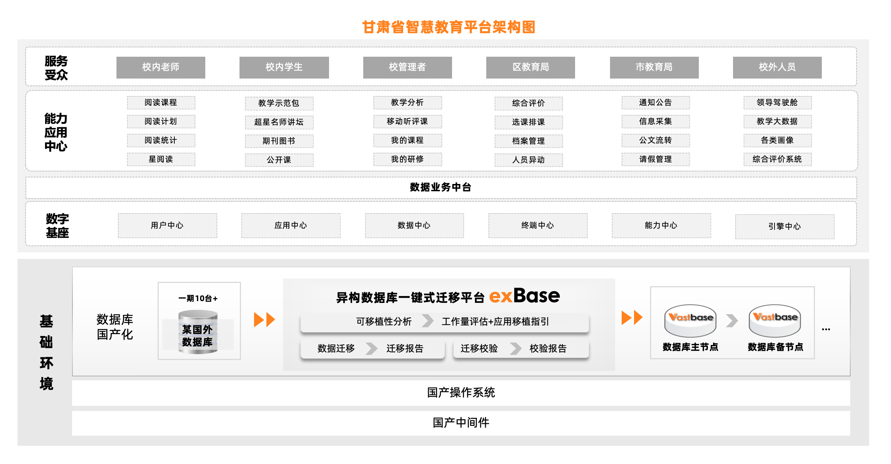

自国家教育数字化战略行动实施以来，甘肃省教育厅明确采用全栈国产化体系的发展方向，大力推进 **智慧教育平台** 建设，为甘肃省教育数字化转型奠定坚实基础。2025年，平台应用建设已取得显著成效，形成了推广范式。

**海量数据库Vastbase G100是基于openGauss开发的数据库商业发行版。**  其作为智慧教育平台重要的数据底座，  全面保障该平台的  **10余个** 核心业务系统安全、平稳运行，让全省下辖的  **14个** 市（州）和兰州新区的  **1.52万** 所大中小院校，以及  **528.74万** 名学生、  **44.41万** 名教师，实现教育资源和数据的全网共享。该项目成功入选  **“工信部2024年信息技术产品服务保障典型示范案例”。**

甘肃省智慧教育平台是甘肃省教育厅为推动教育数字化转型而打造的综合性教育服务平台，与国家智慧教育平台实现用户双向认证、资源共建共享、应用场景灵活切换、数据上下通联，旨在构建专业、精品、体系化的数字资源供给体系，全面拓展平台应用功能，升级网络学习空间，推动课程、作业、考试的智能化应用。

# 聚焦三大选型需求

在数据库选型时，甘肃省教育厅主要聚焦于三大核心需求：高并发处理能力、高可用、高安全。

1. **高并发处理能力**：平台并发量可达 **2万** ，要能充分保障查询响应时间和事务处理速度，避免系统拥堵和延迟。
2. **高可用**：在集中入学、报考等平台使用高峰时段，要确保核心业务系统的连续性和稳定性，同时具备故障转移和灾难恢复能力。
3. **高安全**：平台涉及个人信息、考试成绩等大量敏感数据，要为数据安全和个人隐私提供安全保障。

# Vastbase G100破解选型困局

海量数据针对智慧教育平台多样化的应用场景，打造了全栈国产化适配的数据库解决方案。

1. **业务平滑迁移**：系统高度兼容原国外某数据库，兼容性达 **99%** 。依托配套的 **异构数据库迁移工具exBase** ，可轻松实现数据平滑、安全、完整地迁移至Vastbase，并针对课程平台进行优化，支持同名索引功能，让检索更高效。

2. **高可用集群架构**：项目部署多套高可用集群，以实现故障转移和数据冗余，支持自动和手动的主备切换，实现 **RPO=0** 和 **RTO≤10秒** ，保障业务连续性，平台服务不中断。

3. **高效管理软件线程**：Vastbase充分利用硬件资源，提升内存访问效率，在平台访问高峰时段，能够支撑超过 **1万以上** 的并发会话，确保系统的流畅运行和数据的快速交互。
4. **EAL4+级安全防护**：Vastbase全面覆盖了身份鉴别、自主访问控制、强制访问控制、数据加密和安全审计等多个维度，有效降低甘肃省教育厅的数据滥用风险，确保核心业务系统的数据安全无虞。

# 夯实数智化转型之基

目前，智慧教育平台整体运行平稳高效，已为师生们提供了流畅、安全的教育教学体验，展示了数字教育在教学、管理和评估等领域的创新应用。

甘肃省教育厅通过智慧教育平台的全栈国产化改造，走出了一条具有甘肃特色、西部领先的教育高质量发展新路径，为教育信创的深度变革树立了可复制、可推广的示范样板。

海量数据作为 **教育部教育信创实验室首批通过测试验证** 的数据库厂商，已服务 **数百**  **家** 教育主管单位、高校、中小学，拥有覆盖管理、教务、教学、科研、智慧校园等各类应用伙伴超过 **100家** ，已成为教育行业高质量发展的首选数据库品牌之一。

未来，海量数据将积极推进教育数字化建设，让流畅的学习体验、智慧化的教育模式惠及更多师生，为行业的数智化转型与教育信创的提质增效，释放澎湃动能。
