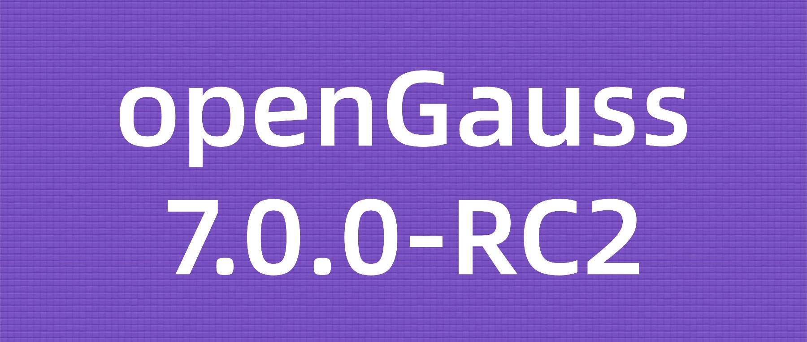

openGauss 7.0.0-RC2 是社区最新发布的创新版本，版本生命周期为 6 个月。本次发布包含 3 个数据库服务端安装版本：企业版、极简版、轻量版，用户可根据使用场景需要下载不同版本，并基于此进行场景化验证，提前发现问题并反馈社区，社区将在下个版本发布前进行问题修复。

**发行说明**

[https://docs.opengauss.org/zh/docs/7.0.0-RC2/docs/ReleaseNotes/Releasenotes.html](https://docs.opengauss.org/zh/docs/7.0.0-RC2/docs/ReleaseNotes/Releasenotes.html)

**立即体验**

[https://opengauss.org/zh/download/](https://opengauss.org/zh/download/)

openGauss 作为国内最具创新力的开源数据库社区，持续进行技术创新。openGauss 7.0.0-RC2 自 2025 年 3 月 31 日启动版本开发，历时 6 个月开发周期，累计合入 PR 4268 个，与之前版本特性功能保持兼容，在内核能力、DataVec 向量化能力、DataPod 资源池化架构、DataKit 数据全生命周期管理平台、生态兼容性等方面全面增强。

# PART.01 企业级内核

- **主备可靠性增强**：支持备机数据损坏时，从主机远程加载正确数据进行修复。
- **集群可靠性增强**：支持资源池化 + OceanStore Pacific 分布式存储双中心容灾。
- **慢 SQL 诊断**：支持对慢 SQL 全链路跟踪，包括 SQL 执行链路的上下游关系以及各个步骤、算子的耗时，提升慢 SQL 定位能力；同时支持实现根据关键字和 SQL ID 的限流机制，限制异常 SQL 的并发数，提升系统韧性；支持对接 Datakit，按照规则保存历史慢 SQL 信息。
- **故障告警监控**：支持监控进程故障信息、硬件故障信息（CPU、磁盘、内存、IO、网络等）、数据库状态异常等信息。
- **升级预校验**：OM 支持升级前对 CPU、内存、网络、资源池化各进程状态进行预检测，避免升级过程中因环境、进程异常报错失败。
- **主备 build 能力增强**：支持基于 commit 的 LSN 直接进行增量 build，gs_ctl 工具通过 --verify-commit 选项对备机已提交事务进行校验，如果备机与主机存在共同的 checkpoint 日志，但之后存在不同的提交数据，则为保证这部分数据不丢失，增量 build 失败，且不会转为全量 build。
- **压缩功能增强**：压缩场景通过 KAE 硬件加速，实现压缩比 1.5:1, 性能损耗 <2%；gs_probackup 工具适配段页式压缩表，支持备份恢复能力。
- **oGEngine 增强**：Ubtree 索引支持 undo 管理，支持页面级可见性的 CR 页面构建；Pagehack 工具支持解析 Ubtree 页面。

# PART.02 DataVec 向量数据库

- **性能增强**：通过内存亲和、bypass 优化、向量梳理计算，QPS 提升 30%。
- **四库合一**：支持标量查询、向量查询、BM25 全文检索、Age 知识图谱、多向量召回，实现混合检索能力。
- **DiskANN 索引**：支持 DiskANN 磁盘索引算法，在处理大规模数据同时保持高召回率、低查询延迟和低内存占用。
- **周边生态对接**：支持 openEuler Intelligence、Dify、Langchain，Agent 组件如 MCP、Mem0 等 11 个生态组件对接。
- **多语言支持**：支持 python、java、go、c++、c#、node.js 主流 API 对接。

# PART.03 DataKit 迁移工具增强

- **PG 迁移增强**：PostgreSQL 到 openGauss 的迁移能力集成至 DataKit。
- **SQL Server 迁移增强**：支持 SQL Server 到 openGauss 的全量数据迁移、常用对象迁移。
- **资源中心优化**：采用 Agent 统一采集和上报，对数据实时采集和历史统计。
- **最小化打包**：支持 DataKit 最小化打包，插件按需下载。

# PART.04 感谢

我们衷心地感谢参与和协助 openGauss 7.0.0-RC2 版本发布的所有开发者和伙伴，包括华为技术有限公司、北京海量数据技术股份有限公司、中移信息技术有限公司、粤港澳大湾区（广东）国创中心、软通动力信息技术（集团）股份有限公司、天津南大通用数据技术股份有限公司、云和恩墨（北京）信息技术有限公司、天津神舟通用数据技术有限公司、万宝盛华大中华有限公司、中科院软件所、邮储银行、天津凡泰、易宝软件有限公司、民生银行、国能信息、海康威视、浙江大华、兴业银行、中软国际等组织单位。openGauss 持续以用户真实需求为动力，致力于产品竞争力提升。我们特别感谢每一位用户对 openGauss 的支持，openGauss 7.0.0-RC2 作为下一个长周期版本的先行体验版，也期待聆听每一位用户的反馈意见。

社区邮件列表：community@opengauss.org
