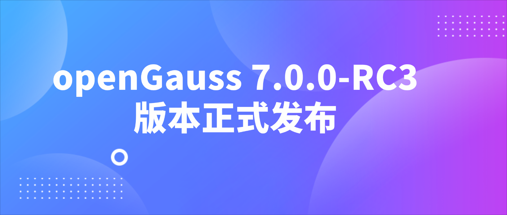
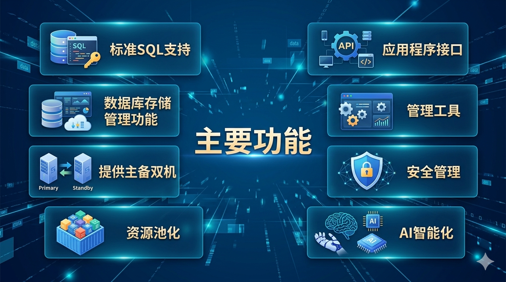
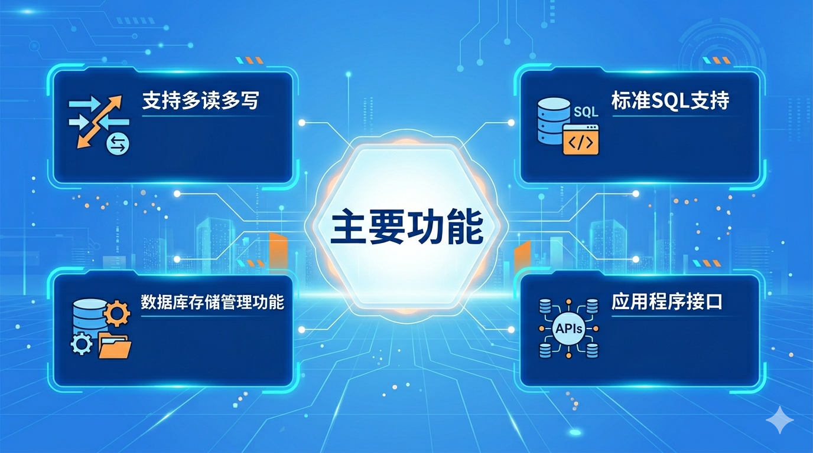

3月31日，openGauss 社区正式发布 openGauss 7.0.0-RC3 创新版本，本版本生命周期为6个月。

openGauss 作为国内创新力强的开源数据库社区，持续进行技术创新。openGauss 7.0.0-RC3 自 2025 年 10 月 9 日启动版本开发，历时 6 个月开发周期，累计合入 PR 1543个，与之前版本特性功能保持兼容，在内核能力、多模数据库等方面全面增强，同时推出业界首个开源多写数据库oGRAC，欢迎大家试用体验。

**发行说明：**

- openGauss数据库：
<https://docs.opengauss.org/zh/docs/7.0.0-RC3/release_notes/release_notes.html>

- oGRAC数据库：
<https://docs.opengauss.org/zh/docs/7.0.0-RC3/ograc/release_notes/release_notes.html>

**立即体验 :**

<https://opengauss.org/zh/download/?version=rc>

## 主要功能介绍

**openGauss 7.0.0-RC3 版本与之前的版本特性功能保持兼容，主要功能如下：**

*本图由AI生成，仅供示意

- **标准SQL支持**

支持标准的SQL92/SQL99/SQL2003/SQL2011规范，支持GBK、UTF-8和GB18030字符集，支持SQL标准函数与分析函数，支持存储过程。

- **数据库存储管理功能**

支持表空间，可以把不同表规划到不同的存储位置；企业版支持Ustore、Astore、MOT等多种存储引擎。

- **提供主备双机**

事务支持ACID特性、单节点故障恢复、双机数据同步、双机故障切换等；企业版还提供了CM工具，支持数据库实例状态查询、主备切换、日志管理、VIP管理、集群状态查询和推送等。

- **资源池化**

支持基于共享存储、共享内存的资源池化架构，实现备机读实时一致性。

- **应用程序接口**

支持标准JDBC 4.0特性、ODBC 3.5特性，支持Python、Go连接驱动，支持MySQL协议兼容。

- **管理工具**

提供安装部署工具、实例启停工具、备份恢复工具、扩缩容工具、升级工具，支持数据全生命周期生产工具DataKit，支持MySQL和Oracle全量/增量/反向迁移工具和数据校验工具。

- **安全管理**

支持SSL安全网络连接、用户权限管理、密码管理、安全审计、细粒度ANY权限控制、TLCP协议等功能，保证数据库在管理层、应用层、系统层和网络层的安全性。

- **AI智能化**

企业版支持参数自调优、慢SQL发现、单query索引推荐、虚拟索引、workload索引推荐、数据库指标采集、预测与异常监控等功能；库内AI原生引擎支持10+高性能机器学习算法。

**oGRAC 7.0.0-RC3 版本作为 oGRAC 数据库开源后的首个正式版本，主要功能如下：**

*本图由AI生成，仅供示意

- **支持多读多写**

提供便于扩展成多主架构的内核，数据库实例间通过共享内存服务实现跨节点的事务、页面缓存一致性，各数据库实例共享一份数据存储，以实现各节点同时读写操作、各节点共享存储。

- **标准SQL支持**

支持标准的SQL92/SQL99/SQL2003规范，支持GBK、UTF-8字符集，支持SQL标准函数与分析函数，支持存储过程。

- **数据库存储管理功能**

支持表空间，可以把不同表规划到不同的存储位置。

- **应用程序接口**

支持标准JDBC、ODBC驱动。

## 新增特性

**openGauss 7.0.0-RC3 版本，在 7.0.0-RC2 版本功能的基础上，新增如下特性：**

**高性能：** 数化路径功能支持简单SELECT语句，并将相关内存统一到plan cache，支持global plan cache。

- 支持GPC（Global Plan Cache全局计划缓存），开启GPC后使用参数化功能的情况下，被参数化的语句也会被缓存到GPC（执行计划使用Generic Plan的情形下）。可以通过视图DBE_PERF.GLOBAL_PLANCACHE_STATUS查询。

**高性能：** 支持ADIO。 

- 行存表的文件访问支持通过直接IO，不经过操作系统页面缓存的方式进行读取。对于页面刷盘以及VACUUM FULL操作，将采用异步IO的方式进行。

**高性能：** 支持DPA哈希聚合加速，提升哈希算子性能。  

- DPA（Data Processing Accelerator）哈希聚合加速是openGauss基于UADK框架实现的硬件加速特性，将向量化哈希聚合操作卸载到硬件加速器上执行，显著提升聚合查询的执行效率。

**高可用：** 支持在线DDL，使得DDL过程中持有高级别锁的时间大为减少，减少对并发DML的阻塞时间。

- 在线DDL特性涉及传统主备中Astore、段页式支持修改列数据类型、修改压缩属性、添加约束(包括范围约束和非空约束)、VACUUM FULL、CLUSTER、分区表分裂合并分区，并新增关键字CONCURRENTLY用于触发在线DDL功能。

**高安全：** 黑匣子特性增强。

- 支持黑匣子主备进程间的参数同步。支持证书/密钥的加密生成与节点间同步，实现多节点共享统一证书体系，提升证书管理的一致性与安全性。提供基于REST API的远程管理能力，支持查询数据保险柜集群信息并执行集群状态控制操作。支持在线滚动升级及离线升级。

**高智能：** 支持一站式的 AI 能力集成方案 oGAI。

- OGAI（openGauss AI）是 openGauss 数据库的智能向量化框架插件，提供了一站式的 AI 能力集成方案。通过 OGAI，用户可以在数据库内部直接调用AI模型进行文本向量化、文本生成、文档重排序等操作，无需依赖外部应用层实现，大幅简化了 RAG（检索增强生成）应用的开发流程。

**高智能：** 支持RabitQ量化索引算法。

- RabitQ是一种具有理论保证的最先进的二进制量化方法，与HNSW、IVFFLAT结合使用时，可以确保向量数据在高度压缩的表示下仍能保持搜索的可靠性。

**高智能：** MCP适配openGauss。

- MCP是为LLM和Agent系统设计的标准化交互框架，使LLM可以与外部数据库、API和工具进行高效交互。MCP适配openGauss数据库让AI智能体能够通过标准化协议安全、高效地直接操作企业级国产数据库，将结构化数据无缝融入AI工作流，大幅降低AI应用与复杂数据系统集成的开发门槛。

**内核工具：** 支持主备数据校验工具。

- 以可视化HTML报表展示各备节点数据文件md5值与主节点不一致的文件，方便直观对比MD5值不一致的数据文件。

**企业级能力：**

- 支持XMLTABLE。用于将 XML 文档按指定行路径展开为关系表结果，并通过 COLUMNS 子句将节点、属性或表达式映射为输出列。该语法在 FROM 子句中作为表函数使用。

- JSONB功能增强，支持jsonb_path_exists函数，检查指定JSONB值的指定JSON路径下是否有任何项。支持jsonb_path_query_first函数，通过JSONPATH在JSON数据中提取特定数据的表达式。

- 段页式表支持空间回收。在DELETE和UPDATE段页式表后，通过系统函数回收空间，使表文件占用的存储资源更有效地释放，不影响用户业务的正常运行。 

- 支持wal2json插件。用于将WAL（Write-Ahead Log）中的数据变更转换为JSON格式输出。 

**DataKit：** 迁移工具增强

- Elasticsearch和Milvus到openGauss的迁移能力集成至DataKit。 

## 已知问题
- openGauss没有文件权限，慢盘监控功能。在文件权限异常时，数据库会退出，日志中会有相应打印信息。在慢盘时，数据库操作会变慢。

- MOT（Memory Optimized Tables）与增量检查点特性不兼容，如果使用MOT，需要关闭增量检查点功能。

- LLVM对ARM架构支持不友好，在导入MOT的TPCC时候报LLVM相关错误。可以通过不启用JIT规避，使用enable_mot_codegen开关控制。对于不启用JIT对TPCC测试产生的性能影响，可以通过force_mot_pseudo_codegen= true配置来降低性能影响。

## 致谢

衷心感谢参与和协助 openGauss 7.0.0-RC3 版本发布的项目的所有开发者和伙伴，包括华为技术有限公司、北京海量数据技术股份有限公司、天津神舟通用数据技术有限公司、天津南大通用数据技术股份有限公司、粤港澳大湾区（广东）国创中心、中移信息技术有限公司、邮储银行、广东跃昉科技有限公司、云和恩墨（北京）信息技术有限公司、中科院软件所、西北工业大学、民生银行、国能信息、海康威视、浙江大华等组织单位。是你们的辛勤付出使得版本顺利发布，也为 openGauss 更好地发展提供可能。

openGauss 持续以用户需求为动力，致力于产品竞争力提升。我们特别感谢每一位用户对 openGauss 的支持，openGauss 7.0.0-RC3 作为下一个长周期的创新版本，也期待聆听每一位用户的反馈意见。

社区反馈邮箱：common@public.opengauss.org

