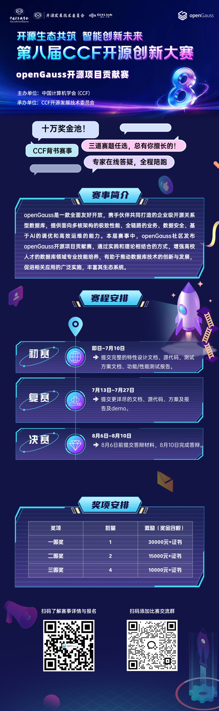

## 赛事介绍

立足数字经济深度发展与国家开源战略布局，面向人工智能、泛在操作系统领域的技术创新、成果转化与专业人才供给需求，第八届 CCF 开源创新大赛由中国计算机学会（CCF）主办，CCF开源发展技术委员会承办。大赛以赋能开源生态高质量发展为核心导向，通过体系化赛道设置、精准化资源对接、全流程专业化运营、打造集开源成果展示、技术交流碰撞、产学研用协同于一体的权威赛事平台。

## openGauss开源项目贡献赛

openGauss是一款全面友好开放，携手伙伴共同打造的企业级开源关系型数据库，提供面向多核架构的极致性能、全链路的业务、数据安全、基于AI的调优和高效运维的能力。

本届赛事中，openGauss社区发布赛道 ——openGauss开源项目贡献赛，通过实践和理论相结合的方式，增强高校人才的数据库领域专业技能培养，有助于推动数据库技术的创新与发展，促进相关应用的广泛实施，丰富其生态系统。

## 核心赛题（任选其一参赛）

**赛题1**

支持对查询语句限制执行时间，一旦超过设定阈值则中止执行,从而保护数据库的整体性能。支持全局、会话级别设置阈值；支持通过hint设置。

**赛题2**

支持归一化SQL在explain时显示执行计划。支持通过?或$n(n>0)的方式指代绑定参数，从而支持对归一化的SQL执行explain时获取和打印generic plan执行计划。

**赛题3**

支持通过事务ID反查事务提交的时间，相关功能通过GUC开关控制，可新增文件用于记录事务ID和事务提交时间的映射关系。

## 赛程安排

**初赛：** 即日起-7月10日

**交付作品：** 提交完整的特性设计文档、源代码、测试方案文档、功能/性能测试报告。

**复赛：** 7月13-7月27日

**交付作品：** 提交更详尽的特性设计文档、最终版源代码、完善的测试方案及测试报告及演示demo。

**决赛：** 8月3-8月10日

**交付作品：** 8月6日前提交答辩材料（如作品介绍、技术难点、创新点、demo等），8月9-10日完成答辩。

## 投递方式

通过Gitlink-openGauss仓库 <https://www.gitlink.org.cn/opengaussexamples/examples > 提交作品issue，提交时命名为 **【第八届CCF开源创新大赛-openGauss初赛/复赛/决赛+团队名】** 确保投递信息准确可追溯

