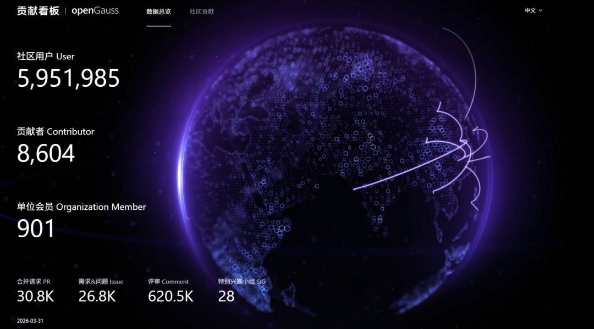
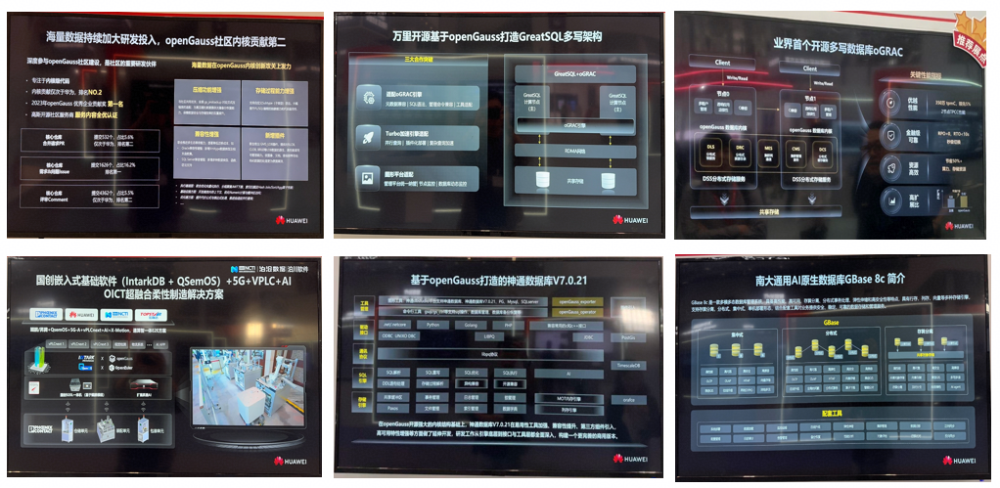
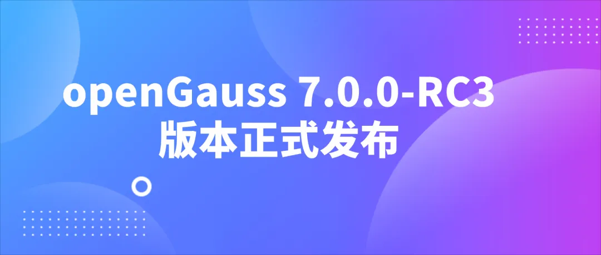

## 一、概述

2026年3月，openGauss社区在技术创新、生态建设与社区运营等多个维度持续稳步推进，整体发展态势良好。在AI与数据库深度融合的趋势下，社区围绕“AI原生数据库”持续演进，推动oGMemory向量记忆引擎、AI Pipeline、MCP Server等关键能力落地，加速数据库向智能化、服务化方向升级。同时，openGauss 7.0.0-RC3版本正式发布，在内核能力、多模数据处理及架构创新方面实现进一步增强。

生态层面，社区携手产业伙伴深化合作，典型实践不断涌现，以磐维数据库为代表的行业应用持续验证openGauss在关键业务场景中的高性能与高可靠能力。社区规模方面保持稳健增长，开发者活跃度持续提升，软硬件兼容性测评不断完善。此外，社区持续强化安全治理与用户反馈机制，通过漏洞修复与满意度调研双轮驱动，进一步提升社区质量与用户体验。

（本月报阅读时长约8分钟）

## 二、社区规模

截至2026年3月31日，openGauss 社区用户累计超过595万。超过8千名开发者在社区持续贡献。社区累计产生30.8k个PRs、26.8K条Issues、620.5K条Comment，单位会员达901家。

社区贡献看板（截至2026/03/31）

## 三、社区事件

**➣基于openGauss自主研发的磐维数据库，成为企业级核心系统自主创新的典范**

中国移动基于openGauss自主研发的磐维数据库，成为企业级核心系统自主创新的典范。自2021年加入openGauss社区并成为创始理事会成员以来，中国移动磐维数据库持续迭代升级，2022年1.0版本获中国计算机学会科技进步特等奖，2024年3.0版本升级为AI驱动的可服务型数据库，实现“通用数据库+向量检索”融合架构。

技术深耕中，磐维数据库持续突破：通过全生命周期密态保护与国密算法满足安全规范，融合AI技术实现自诊断、自调优，推出多模式部署方案。截至2025年，磐维数据库已覆盖全国31个省份，部署超4000套实例，依托鲲鹏算力底座在多领域稳定运行，充分验证了高性能、高可靠与高兼容性。openGauss社区则为其提供坚实内核与创新动力，赋能其打造适配复杂生产场景的企业级产品。

相关阅读：

经济参考报：<https://mp.weixin.qq.com/s/tIsDZWFb8ZcUeHCOOgafJw>

第一财经：<https://m.toutiao.com/is/BWAwXi3-FTg/>

**➣openGauss携生态伙伴亮相华为中国合作伙伴大会2026**

3月19日至20日，以“因聚而升，融智有为”为主题的华为中国合作伙伴大会2026于深圳盛大启幕。openGauss携手海量数据、南大通用、神舟通用、国创中心万里开源共同参会，与各界合作伙伴面对面交流，共话技术与生态的深度融合，携手推动产业智能化高质量发展。

原文阅读：

[泊沧数据亮相华为中国合作伙伴大会2026](https://mp.weixin.qq.com/s/x_EKiMyykrid9RJmDUAeCA)

**➣开展openGauss社区满意度调查**

3月20日，为持续提升开发者/用户的使用体验，推出了社区满意度调查推文，邀请开发者/用户参与本次满意度调查，并从中选取具有建设性的意见或建议给予奖品感谢。

原文阅读：

[有奖调研开启！说出您的建议，赢openGauss专属好礼](https://mp.weixin.qq.com/s/NBk3Cc__erQFrNamnDJX0Q)

## 四、技术进展

**➣oGMemory原生向量记忆引擎，已成功适配Claude Code与OpenClaw主流框架，完成深度集成**

在AI智能体记忆能力构建方向，自研的oG-Memory原生向量记忆引擎，已成功适配Claude Code与OpenClaw主流框架，完成深度集成。作为基于openGauss构建的外部独立组件，oG-Memory填补了主流AI Agent框架原生记忆系统的短板，以国产化、自主可控的优势，为AI智能体提供稳定、高效、低延迟的记忆存储与检索能力，助力Agentic AI实现认知持续进化，推动复杂任务自动化落地。

原文阅读：

[告别“健忘”AI！oGMemory 为 Claude Code 与 OpenClaw 打造“第二大脑”](https://mp.weixin.qq.com/s/rYi4tnNhmFJnrSpFaypuxw)

**➣AI pipeline 特性将于3月底发布**

当大模型从实验室走向生产，RAG（检索增强生成） 已成为企业落地AI应用、打通“技术-业务”壁垒的核心路径。然而，传统 RAG 架构中 “业务库 + 向量库 + ETL + 外部模型” 的割裂式复杂链路，让看似简单的问答应用沦为“冰山一角”——水面之上是简洁的交互界面，水面之下则潜藏着架构臃肿、数据不一致、隐私合规隐患与运维高成本等多重痛点，严重制约企业 AI 应用的落地效率与规模化复制。

openGauss 7.0.0-RC3 版本将于2026年3月底正式发布 AI pipeline 特性。它以“AI 原生数据库”为核心理念，实现“库内向量化，数据免导出”的核心能力，将 AI 计算深度嵌入数据库内核，让数据在存储源头直接释放智能价值，打破传统 RAG 的“复杂性深谷”，为企业智能应用构建更高效、更安全、更易用的全新架构范式。

原文阅读：

[openGauss AI Pipeline——AI原生，打造高效智能应用框架新思路](https://mp.weixin.qq.com/s/iY2EHvw1bmgiPN8wNSdsGA)

**➣MCP Server 能力将于3月底发布**

openGauss 7.0.0-RC3 版本将于2026年3月底正式发布 openGauss MCP Server 能力。该能力依托 MCP 协议与自身技术优势，全面破解数据库学习、运维与应用中的核心难题，进一步提升召回准确率，有效规避 SQL 执行风险。

在查询优化与计划生成方面，openGauss MCP Server 可智能优化复杂查询语句，自动生成高效执行计划，帮助学习者规避语法误区，简化表设计与复杂查询等操作，降低入门门槛。

与此同时，其内置官方文档搜索工具，支持快速检索最新技术指南，用户无需手动翻阅文档即可获得精准操作建议。它还融合了向量检索、全文搜索、混合搜索与多向量并发查询等能力，不仅提升复杂场景下的交互效率，更有力防范因模型生成不准确 SQL 而导致的召回准确率下降问题，显著增强交互的精准性。

此外，结合用户记忆系统，openGauss MCP Server 能够精准匹配个人操作习惯，实现个性化智能引导。

原文阅读：

[数据库难上手？openGauss MCP Server 智能交互降本提效](https://mp.weixin.qq.com/s/ixsG0yI8YVTt6x4E75H_ag)

**➣openGauss 7.0.0-RC3版本正式发布**

3月31日，openGauss 社区正式发布 openGauss 7.0.0-RC3 创新版本，本版本生命周期为6个月。

openGauss 作为国内创新力强的开源数据库社区，持续进行技术创新。openGauss 7.0.0-RC3 自 2025 年 10 月 9 日启动版本开发，历时 6 个月开发周期，累计合入 PR 1543个，与之前版本特性功能保持兼容，在内核能力、多模数据库等方面全面增强，同时推出业界首个开源多写数据库oGRAC，欢迎大家试用体验。

原文阅读：

[重磅！openGauss 7.0.0-RC3 正式发布，这几大特性不容错过](https://mp.weixin.qq.com/s/kwGhKubfBtqu8i7gkWPA6g)

## 五、软硬件兼容性测评

截至2026年3月31日，通过openGauss软硬件兼容性测评的产品达3500+款。2026年3月新增28款，其中北向（ISV）新增27款，DBV新增1款。

- 兼容性列表：<https://opengauss.org/zh/compatibility/>

- DBV技术测评列表：<https://opengauss.org/zh/certification/>

## 六、安全公告

2026年3月，社区共发布安全公告7个（其中Critical 2个，High 3个，Low 2个 ），修复漏洞25个。

- **重点漏洞提醒**

如下漏洞评估影响较大，请重点关注。

**CVE-2025-57052（CVSS评分9.8分 ）**

问题概要：cJSON 1.5.0至1.7.18 版本中，由于 cJSON_Utils.c 文件中的 decode_array_index_from_pointer 函数存在缺陷，攻击者可以通过包含字母数字字符的畸形 JSON 指针字符串绕过数组边界检查，从而访问受限数据。

影响产品：openGauss 7.0.0-RC3

公告链接：<https://opengauss.org/zh/security-advisories/detail/?id=openGauss-SA-2026-1001>

**CVE-2025-15467（CVSS评分8.8分 ）**

问题摘要：使用恶意构建的AEAD参数解析CMS AuthEnvelopedData消息可能会触发堆栈缓冲区溢出。

影响产品：openGauss 7.0.0-RC3

公告链接：<https://opengauss.org/zh/security-advisories/detail/?id=openGauss-SA-2026-1004>

想了解更多社区动态、新闻资讯、技术干活分享等，请关注下方社区官方微信公众号——openGauss数据库

