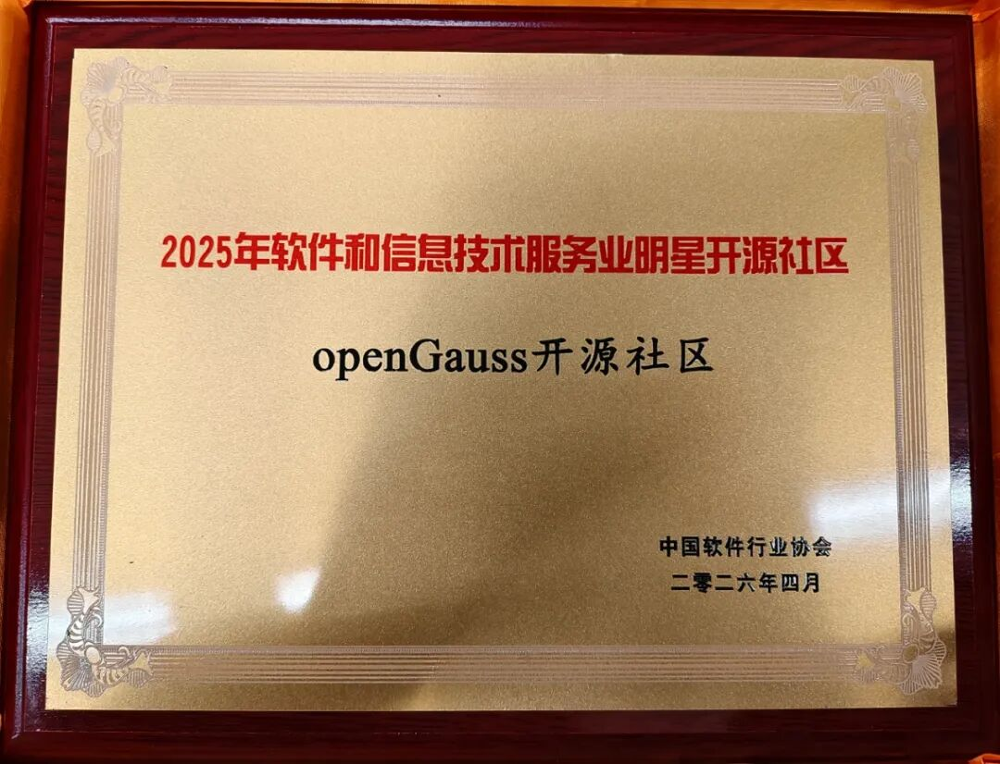
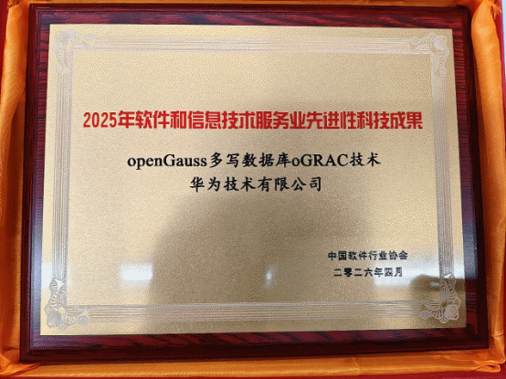

近日，openGauss社区斩获两项行业重磅荣誉——openGauss开源社区获评“2025年软件和信息技术服务业明星开源社区”，自主研发的oGRAC多写数据库技术获评“2025年软件和信息技术服务业先进性科技成果”。两项殊荣的背后，是openGauss在数据库核心技术创新与开源生态建设领域的持续深耕，更是行业对其推动国产数据库自主可控、赋能数字经济高质量发展的高度认可。

## 开源生态繁荣 获评"明星开源社区"

作为企业级开源数据库根社区，openGauss致力于构建高性能、高可靠、高安全的数字基础设施数据底座。社区以开放透明的治理架构、深度的技术合作以及强大的创新支撑机制，吸引了数百家企业和数千名开发者的参与。

在技术创新层面，社区践行“1+2”战略，除oGRAC多写数据库架构外，还推出“四库合一”数据库内核引擎、AI原生多模态数据库底座等行业领先成果，持续增强向量数据引擎DataVec能力，推动AI技术与数据库深度融合。

在人才培养方面，社区构建了全方位的人才培养体系，与高校联合出版3本教科书，举办数据库相关赛事，累计培养约10万名数据库管理员（DBA）。这些举措有效促进了开源文化的传播，并为数字化转型提供了强大的人才支撑。社区组织持续扩容，2025年中国科学院软件研究所加入社区理事会，为社区学术发展注入强劲动力。同时，社区倡导“共建、共享、共治”的开源文化，辅以充足的算力资源，为持续创新提供坚实保障。

## oGRAC技术突破行业瓶颈 获评“先进性科技成果”

此次获评先进性科技成果的oGRAC（开源多写数据库架构），是openGauss社区推出的业界首个开源多写数据库架构，实现了从底层引擎到集群协调机制的全栈创新，彻底打破了传统集中式与分布式数据库的技术局限。

作为业界首个开源多写数据库架构，oGRAC采用共享存储架构，支持多节点并发读写，打破了传统集中式数据库和分布式数据库的局限。通过分布式锁管理、全局缓存一致性等技术，oGRAC能够在多节点环境中实现高效的数据一致性和高可用性，并且能显著提升系统的扩展性和性能，特别是在高并发场景下，2节点部署性能达到350万tpmC。

这一突破为金融、政务、电信等核心行业的高并发、高可用数据库需求提供了解决方案，推动了国产数据库的自主可控进程，减少了对闭源商业数据库的依赖，具有显著的经济和社会效益。

## 结语

此次获得两项行业荣誉，是openGauss发展历程中的重要里程碑，更是行业赋予的责任与使命。未来，openGauss社区将继续坚持长期技术演进路线，深耕数据库核心技术创新，持续完善开源生态布局，推动AI与数据库深度融合，携手全球开发者与产业伙伴，打造高性能、高安全、高可靠的数字基础设施，助力全球数字化转型。

