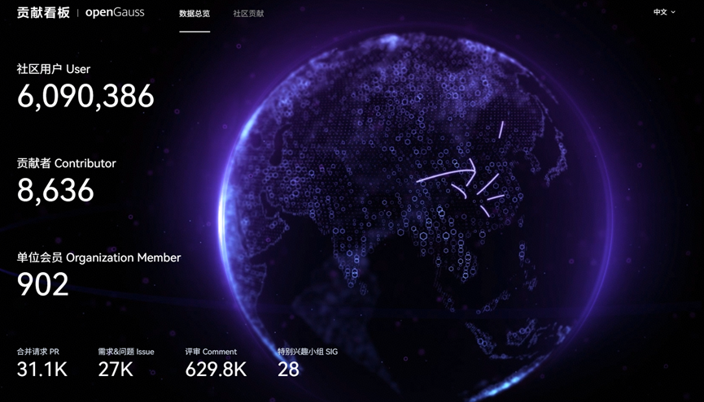
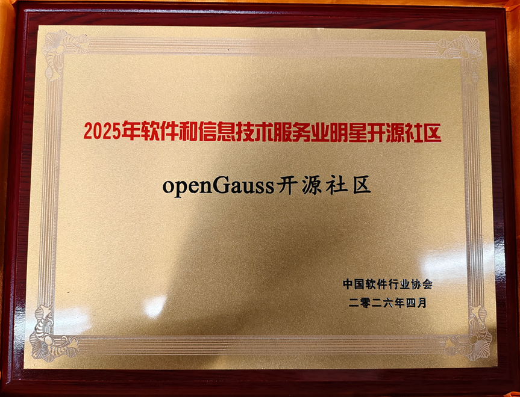
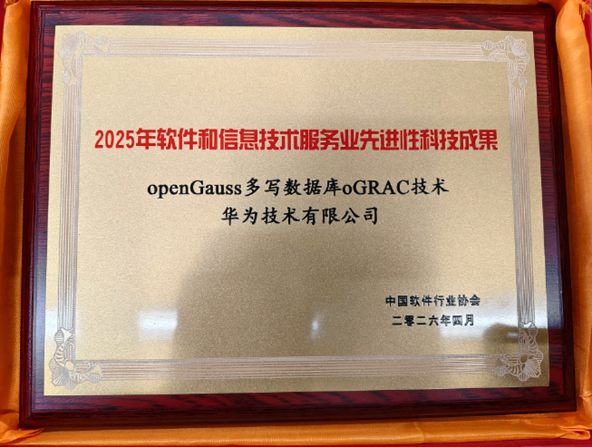

## 概述

2026 年 4 月，openGauss 社区持续推进技术创新、生态建设与产业落地协同发展，社区规模与活跃度稳步提升。截至 4 月底，社区累计用户超过 609 万，开发者贡献、Issue、PR 等核心数据持续增长，社区生态影响力进一步扩大。

在行业影响力与技术创新方面，openGauss 社区荣获“2025年软件和信息技术服务业明星开源社区”称号，oGRAC 多写数据库技术获评“先进性科技成果奖”，充分体现了社区在数据库核心技术创新、开源治理及产业生态建设方面的综合实力。与此同时，基于 openGauss 开发的海量数据库持续赋能医疗健康等关键行业，加速openGauss数据库在核心业务场景中的规模化应用。

在技术演进方面，oGRAC 多写数据库能力体系不断完善；引入BM25 索引空间优化特性，显著提高存储资源利用效率与查询性能；两地三中心跨域容灾方案持续成熟，进一步增强了 openGauss 在高性能、高可靠、高安全场景下的竞争力。

（本月报阅读时长约6分钟）

## 社区规模

截至2026年4月30日，openGauss 社区用户累计超过609万。超过8千名开发者在社区持续贡献。社区累计产生31.1k个PRs、27K条Issues、629.8K条Comment，单位会员达902家。

社区贡献看板（截至2026/04/30）

## 社区事件

### ➣基于openGauss开发的海量数据库护航全民健康

从三甲医院的核心HIS系统，临床诊疗的智慧化应用，再到全民健康信息平台的区域协同……基于openGauss开发的海量数据库以安全高效、自主可控的Vastbase数据底座，深度支撑医疗数智化转型，守护国民健康。

原文阅读：[基于openGauss开发的海量数据库护航全民健康](https://mp.weixin.qq.com/s/b5sbDrnxsa8VXdq41np_BA)

### ➣openGauss社区荣获“2025年软件和信息技术服务业明星开源社区”称号

2026年4月，在以“人工智能与软件变革——AI融合与数智出海新机遇”为主题的第五届中国国际软件发展大会上，openGauss社区凭借在生态建设、技术创新和社区治理等维度的硬核实力，从众多竞争者中脱颖而出，荣获“2025年软件和信息技术服务业明星开源社区”称号。

作为企业级开源数据库根社区，openGauss致力于构建高性能、高可靠、高安全的数字基础设施数据底座。社区以开放透明的治理架构、深度的技术合作以及强大的创新支撑机制，吸引了数百家企业和数千名开发者的参与。

在技术创新层面，社区践行“1+2”战略，除oGRAC多写数据库架构外，还推出“四库合一”数据库内核引擎、AI原生多模态数据库底座等行业领先成果，持续增强向量数据引擎DataVec能力，推动AI技术与数据库深度融合。

在人才培养方面，社区构建了全方位的人才培养体系，与高校联合出版3本教科书，举办数据库相关赛事，累计培养约10万名数据库管理员（DBA）。这些举措有效促进了开源文化的传播，并为数字化转型提供了强大的人才支撑。社区组织持续扩容，2025年中国科学院软件研究所加入社区理事会，为社区学术发展注入强劲动力。同时，社区倡导“共建、共享、共治”的开源文化，辅以充足的算力资源，为持续创新提供坚实保障。

### ➣oGRAC 多写数据库技术荣获“先进性科技成果奖”

2026年4月，在以“人工智能与软件变革——AI融合与数智出海新机遇”为主题的第五届中国国际软件发展大会上，oGRAC 多写数据库技术荣获“2025年软件和信息技术服务业先进科技性成果”。

作为业界首个开源多写数据库架构，oGRAC采用共享存储架构，支持多节点并发读写，打破了传统集中式数据库和分布式数据库的局限。通过分布式锁管理、全局缓存一致性等技术，oGRAC能够在多节点环境中实现高效的数据一致性和高可用性，并且能显著提升系统的扩展性和性能，特别是在高并发场景下，2节点部署性能达到350万tpmC。

这一突破为金融、政务、电信等核心行业的高并发、高可用数据库需求提供了解决方案，，减少了对闭源商业数据库的依赖，具有显著的经济和社会效益。

## 技术进展

### ➣oGRAC 整体技术能力持续完善，构建高兼容、可观测、易迁移、易运维的开源多写数据库能力体系

当前开源多写数据库存在生态兼容适配难、运维可观测性不足、迁移成本高等困境，针对这些产业落地难点，oGRAC 开源发布后持续深耕内核能力迭代，围绕生态兼容、语法适配、运维可观测、底层架构及开展全方位技术演进。

在能力层面，oGRAC 完善多模式兼容框架与各类数据类型、语法特性适配，强化运维可观测诊断能力，统一底层版本基线、简化部署维护；在产业价值上，这些特性有效降低异构数据库改造与迁移成本，提升集群运维管控效率。整体上 oGRAC 实现多维度能力聚合升级，进一步夯实开源多写数据库生态能力。 

相关链接：<https://docs.opengauss.org/zh/docs/latest/ograc/about_ograc/product_description/ograc_overview.html>

### ➣引入BM25 索引空间优化特性，显著提高存储资源利用效率与查询性能

该特性在保持数据库内核 8KB 标准页粒度不变的前提下，引入了一层可变大小块（128–8192 字节）抽象存储层。通过引入 CTID 链表机制，系统将同一逻辑对象在不同可变大小块中的数据片段动态串联，构建出高效的 CTID 链表结构，从而实现了从传统“单条逻辑数据占用完整 8KB 页”到“块级 Item 细粒度管理”的存储范式跃迁。
在标准测试场景下，该优化技术显著提升了存储资源利用效率与查询性能：
索引空间占用降低达 60%，有效缓解了存储膨胀问题；得益于更高效的内存访问与更小的数据扫描范围，检索性能提升 30%。

相关链接：<https://docs.opengauss.org/zh/docs/latest/datavec/bm25_index_implementation.html>

### ➣openGauss两地三中心：架构设计与核心机制

openGauss两地三中心跨域容灾解决方案自3.1.0版本起正式引入，其核心思想是将数据库部署在两个城市的三个数据中心中：同城部署主备两个数据中心，实现高可用与快速切换；异地部署一个灾备数据中心，用于应对极端区域性灾难。

在具体实现上，该方案需要部署两套数据库集群——1套主数据库集群，一套灾备数据库集群。主备集群一般部署在相距较远的两个不同城市，数据库集群之间借助存储介质或直接通过网络实现数据的全量与增量同步。当主集群出现地域性故障、数据完全无法恢复时，可将灾备集群升主，接管全部业务。

这一架构的本质，正是“物理隔离”思想的工程化落地。 同城的两个数据中心提供了低延迟的主备切换能力，异地的灾备中心则确保了即使整个城市遭遇极端灾难，数据仍能安然无恙。三份数据分布在不同的物理位置，彼此独立又相互关联，构筑起一道跨越数百公里的数据安全屏障。

原文阅读：[当数据中心遭受不可抗诉灾难的破坏：物理安全才是数据安全的终极防线](https://mp.weixin.qq.com/s/jUn01VTiIMa6SNgHIbWSVQ)

## 软硬件兼容性测评

截至2026年4月30日，通过openGauss软硬件兼容性测评的产品达3500+款。4月新增北向（ISV）新增58款。

兼容性列表：<https://opengauss.org/zh/compatibility/>

DBV技术测评列表：<https://opengauss.org/zh/certification/>

## 致谢

openGauss社区的成长，从来不是某一个人的努力，而是大家并肩同行、共同创造的结果。每一次提交、每一次讨论、每一次分享，都是社区前行路上的点点星光，汇聚成今天的成果与温度。

也正因为社区持续涌现出丰富的实践与成果，月报内容难免有所疏漏，如有未被记录的亮点与贡献，欢迎随时与我们联系补充，让更多努力被看见、被传递。在此，向为本期月报提供资料支持的各 SIG 组以及开发者朋友们致以诚挚的感谢与敬意。

若您希望在月报中增加您的工作内容，或对内容有任何改进建议，请联系： common@public.opengauss.org