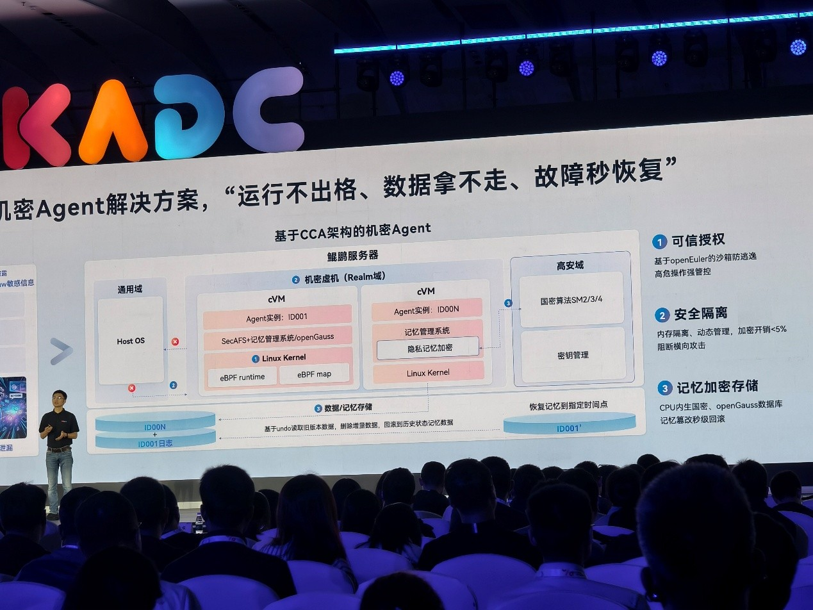
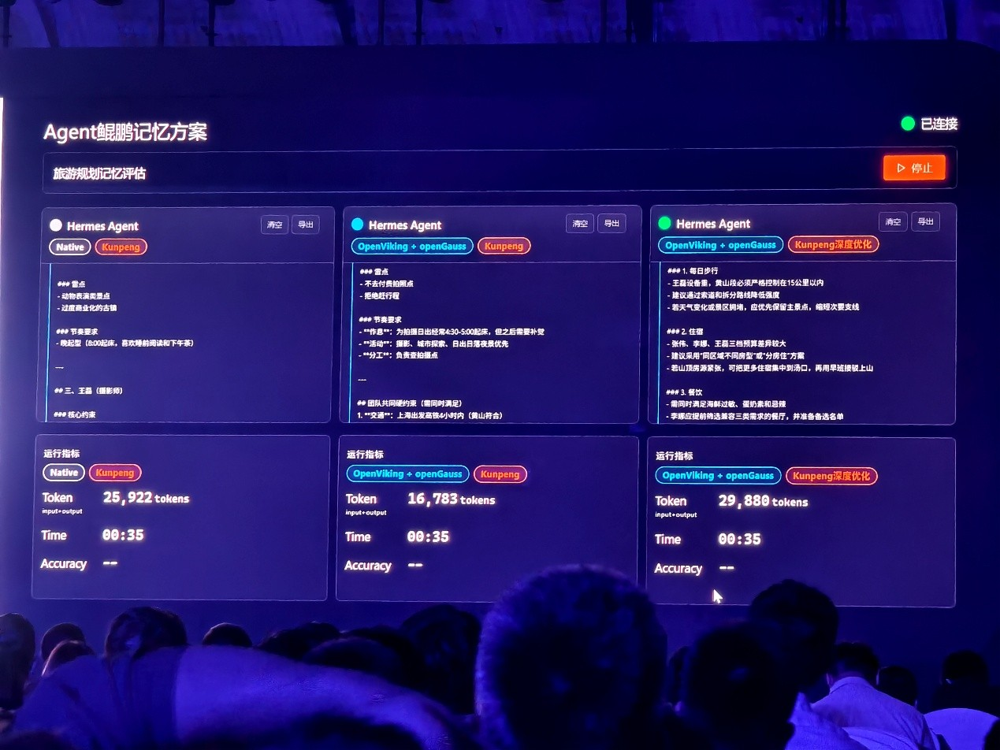
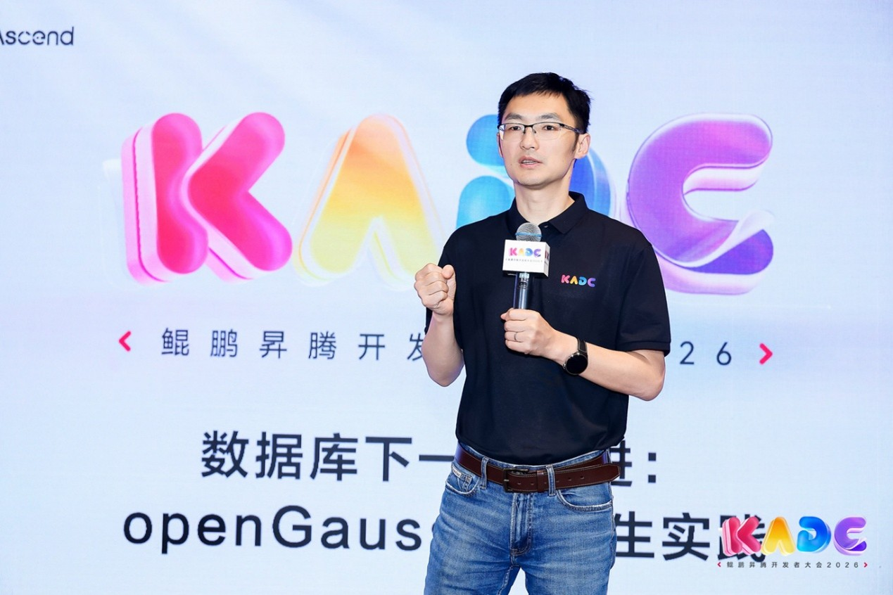
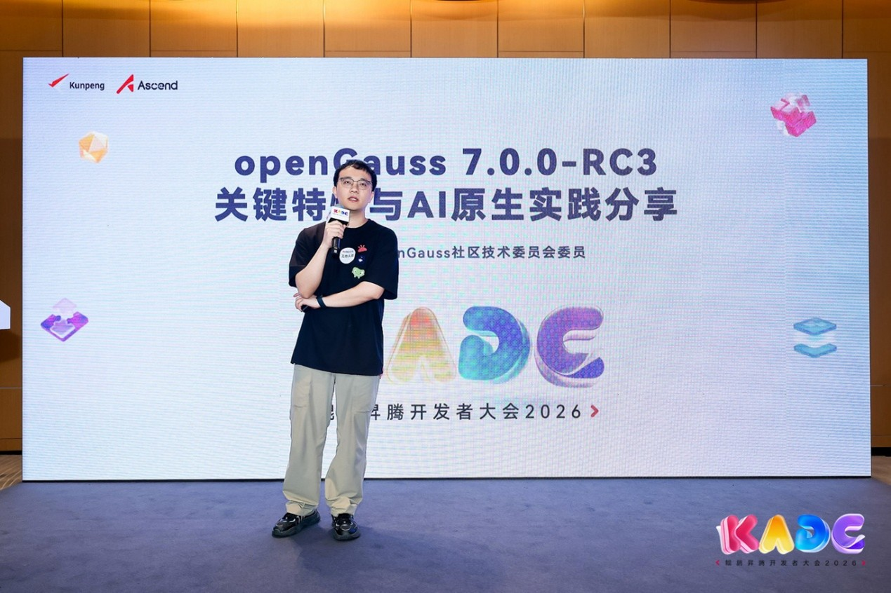
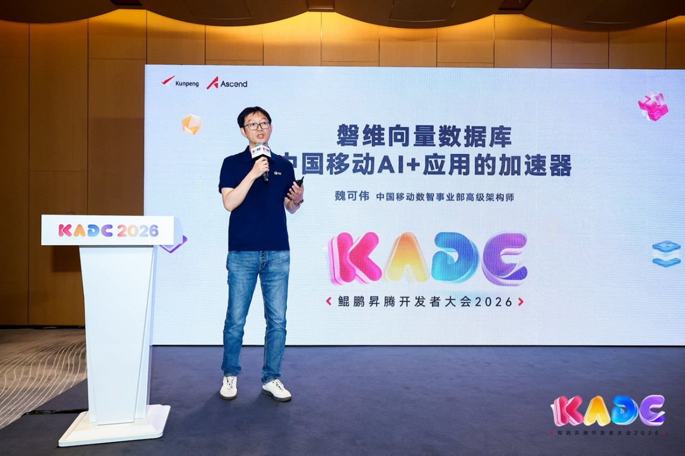
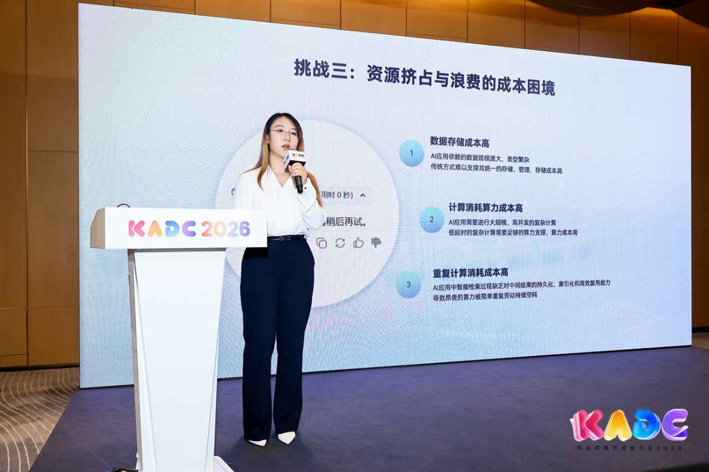
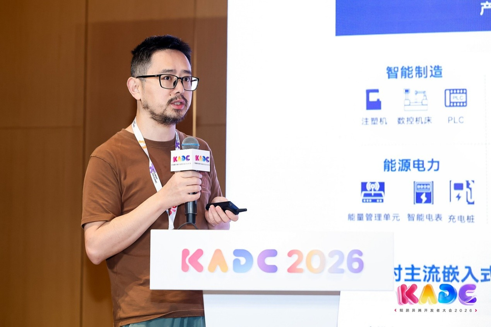
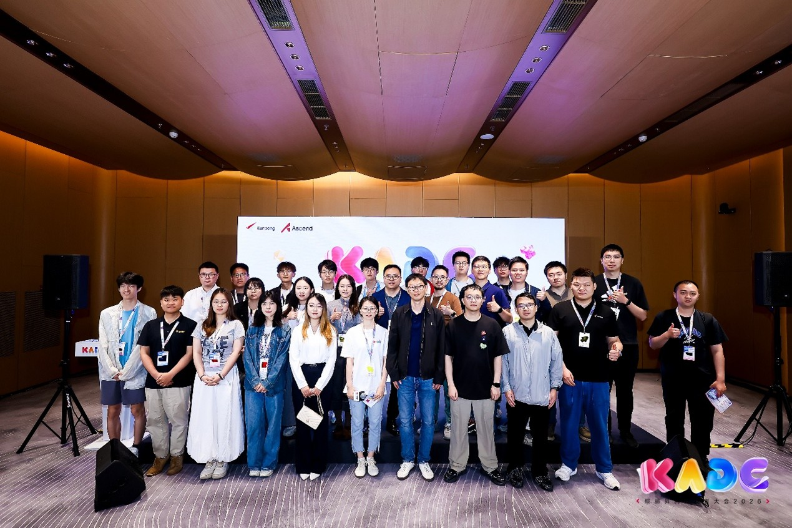
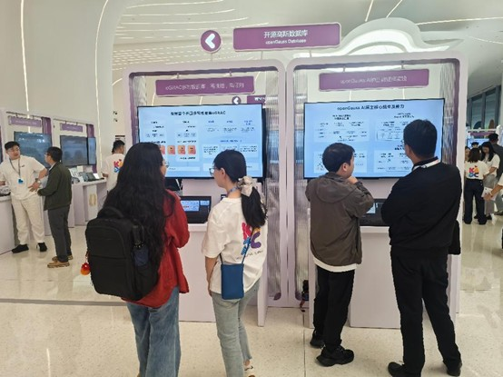
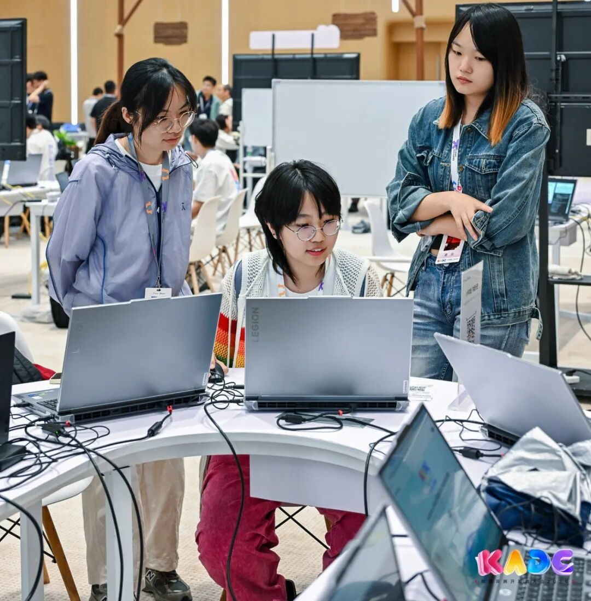

5月22日-23日，面向开发者一年一度的技术盛典——鲲鹏昇腾开发者大会2026（KADC 2026）在北京中关村国际创新中心盛大举办。本届大会延续“心怀挚爱，共绽光芒”主题，汇聚全球开发者、社区大咖、高校科研人员、企业技术专家和工程师，聚焦AI创新实践与生态共建，通过鲲鹏峰会、昇腾峰会、技术论坛、主题展区、CodeLab等多元活动，为全球开发者打造了一场集技术分享、实战实操、生态共创于一体的年度科技盛会。**作为鲲鹏生态的核心基础软件，openGauss在本次大会中深度参与，从鲲鹏峰会到技术分论坛，从创新展区到动手实操，全面展示了其在AI原生时代的技术突破与生态成果。**

## KN峰会重磅亮相：openGauss oGMemory构筑Agent记忆系统

在鲲鹏峰会（KN）主题演讲中，openGauss作为鲲鹏软件的重要组成部分获得重点呈现。随着Agentic AI智能体时代的到来，智能体“健忘”与上下文token爆炸成为行业核心痛点。openGauss创新推出的oGMemory上下文引擎，依托向量引擎实现结构化数据与向量数据的融合存储，有效补齐了智能体上下文膨胀的短板，为AI智能体提供了稳定、高效、低延迟的记忆存储与检索能力。与此同时，oGMemory作为基于openGauss构建的原生向量记忆引擎，已成功适配OpenClaw与Claude Code框架，助力复杂任务自动化落地。这一技术突破标志着openGauss正加速从传统关系型数据库向AI原生数据底座演进，成为Agent时代的核心基础设施。

鲲鹏峰会 Agent鲲鹏记忆方案 演讲

鲲鹏峰会 Agent鲲鹏记忆方案 demo演示

## openGauss分论坛：数据库的下一代演进——openGauss AI原生实践

大会期间，openGauss技术分论坛聚焦AI原生数据库的前沿探索，以“数据库的下一代演进：openGauss AI原生实践”为主题，成功举办。

刘林超 鲲鹏计算产品部部长 开场致辞

openGauss作为数字基础的重要一环，将沿着“1+2”战略持续打磨，做实高质量内核底座、做好原生多主数据库、做厚AI多模数据库，成为国内坚实的开源数据库底座。

阙鸣健 openGauss社区技术委员会委员 发表主题演讲

openGauss社区技术委员会委员阙鸣健分享了openGauss 7.0.0-RC3版本的关键特性以及AI原生实践。他提出社区最新版本围绕内核、多写与AI多模三大方向展示了最新的数据库创新：

- **内核底座**：DPA哈希聚合加速让复杂AP SQL性能提升20%；数据保险柜基于TEE实现安全防护；深度资源调度优化后，8U16G小规格下CPU、内存与IO开销大幅下降，轻量化部署能力显著增强。

- **oGRAC多写**：通过读写负载均衡实现TPCC 370万tpmC；多活架构保障RPO=0且故障节点自动迁移；多节点资源共享可节省至少50%算力与存储，实现性能与成本双向最优。

- **AI多模数据库**：DataVec向量检索性能提升20%、内存占用降低90%；秒级数据分支赋能AI快速迭代；AI Pipeline实现库内实时向量化，部署效率大幅跃升；Agent平台搭配oGMemory记忆系统，进一步提升任务成功率并降低Token消耗，全面夯实AI原生数据库竞争力。

魏可伟 中国移动数智事业部高级架构师

磐维向量数据库基于openGauss自主创新，在磐维关系型数据库的高性能、高安全基础上扩展向量处理能力，支持高维向量与近似最近邻搜索，专为智能知识检索、RAG等场景打造。其具备多模处理、全方位安全、弹性分布式、超高吞吐与极致查询效率五大核心优势。作为中国移动聚智智能体平台的知识底座，已在30余家省专公司落地应用，以存算分离高可用架构承载海量数据，并完全兼容OpenSearch API实现业务平稳迁移，为企业级AI应用规模化落地筑牢全栈数据底座。

黄薇 海量数据解决方案专家

海量数据 Vastbase G100 向量版，基于openGauss原生内核打造，兼具关系数据处理与高性能向量检索能力。可支撑百亿级千维向量数据毫秒级响应查询，检索召回率高达99%以上。产品创新搭载磁盘图索引、向量标量联合索引、多路召回及自适应搜索终止技术，灵活兼顾检索性能与结果精度。目前已落地金智教育、中国篮协等多家标杆单位，广泛赋能知识管理、智能语义检索等核心业务场景。

吕政 大湾区国创中心嵌入式数据库产品CTO

国创灵梭 IntarkDB 嵌入式数据库，聚焦工业机器人智能化升级，深耕多模态数据实时处理技术研发。基于openGauss内核，统一支持关系、时序、向量、键值等模态，一库多用，灵活组装。具备轻量化、高实时、高并发、存取快、高安全、易集成，无损压缩30倍以上等特性，打造端边侧AI数据底座。已在工业具身智能与船舶制造场景落地，助力国产工业智能化升级。

分论坛结束合影

## 展区精彩呈现：开源与使能、AI能力、oGRAC三大主题

在大会创新展区中，openGauss展台以“开源与使能”、“AI能力”、“oGRAC”三大板块吸引了大量开发者驻足交流。

- **开源与使能**：展示openGauss作为开源数据库根社区的生态建设成果与社区共建路径。
- **AI能力**：集中呈现openGauss在AI多模态原生向量数据库等方面的核心能力。
- **oGRAC**：展示业界首个开源多写数据库——oGRAC的架构创新，采用计算池、存储池和内存池三层解耦的多读多写架构，实现RPO=0、RTO<10秒，在鲲鹏两节点部署下TPCC事务处理性能达370万tpmC。

openGauss技术创新展区

## CodeLab动手实操：零距离上手openGauss AI开发

在大会的 CodeLab实战体验区openGauss带来多项硬核动手实操：结合AI Agent，开发者可基于 openGauss MCP Server 快速构建数据库智能体，用自然语言直接与数据库交互——只需描述查询或运维意图，AI 便能自动生成并执行 SQL、辅助性能诊断，让开发与运维流程更高效。现场还开放了 oGRAC多写实操体验，开发者能亲自部署共享存储多主集群，并进行高并发压力测试，直观体验多写下的数据一致性。

CodeLab实战现场

从峰会的前沿分享，到分论坛的深度碰撞，从展区的创新展示，到CodeLab的动手实操，openGauss在KADC 2026上的全方位亮相，充分展现了其作为开源数据库根社区的技术底蕴与生态活力。面向Agentic AI时代的广阔前景，openGauss将以“1+2”战略为指引，持续推进多写oGRAC数据库与AI原生多模态数据库底座的建设，携手全球开发者共拓数据库技术的新边界。
