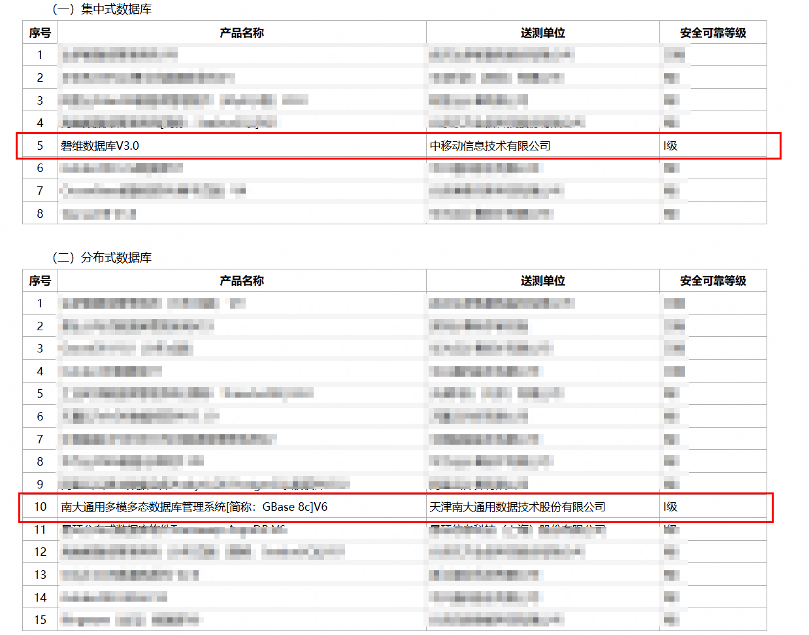

5月26日，由中国信息安全测评中心与国家保密科技测评中心联合组织的数据库安全可靠等级测评结果正式发布。openGauss 开源社区再添佳绩，中移动信息技术有限公司磐维数据库 V3.0、天津南大通用数据技术股份有限公司 GBase 8c V6 两款伙伴产品顺利通过权威测评，分别纳入集中式、分布式数据库目录，充分印证产品过硬的安全与可靠性水平。

▲通过测评名单截图

作为 openGauss 社区的重要生态伙伴，两家企业长期深度参与 openGauss 社区共建，依托社区技术底座持续打磨商用数据库产品，加速推动数据库技术在重点行业与核心场景中的落地应用。

自2020年开源以来，openGauss始终坚守开源初心、稳步攻坚克难，现已发展成为国内核心的开源数据库根社区。社区坚持共建、共治、共享的治理理念，持续吸纳产业链各类主体加入，生态规模持续扩容，生态内多款伙伴商用产品陆续通过国家级权威评测。

生态伙伴接连斩获权威认证，持续彰显 openGauss 社区强劲的技术实力与产业影响力。未来，社区将持续深耕内核技术创新，打造AI原生多模态数据库底座，攻坚多写多读oGRAC技术能力，完善全栈生态体系，携手生态伙伴深耕基础软件赛道，持续驱动国内数据库产业高质量发展。