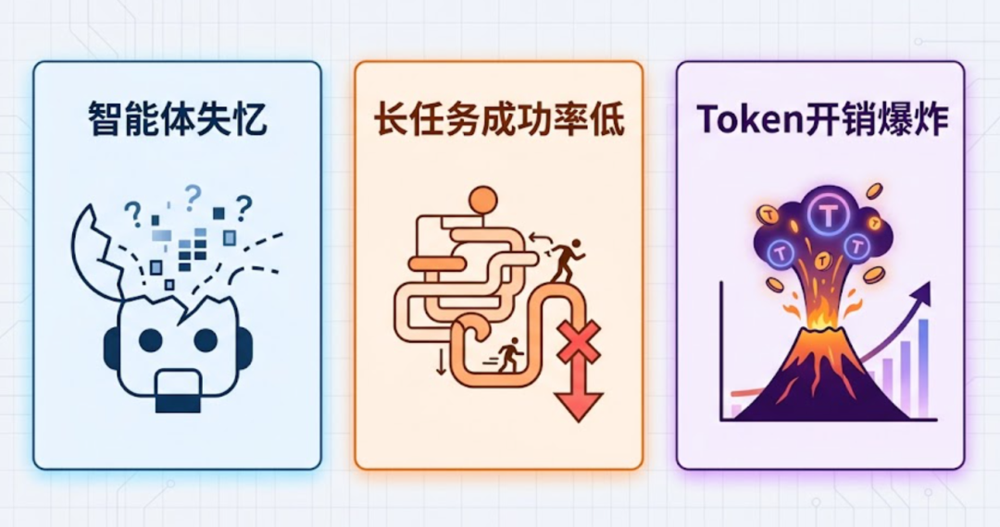
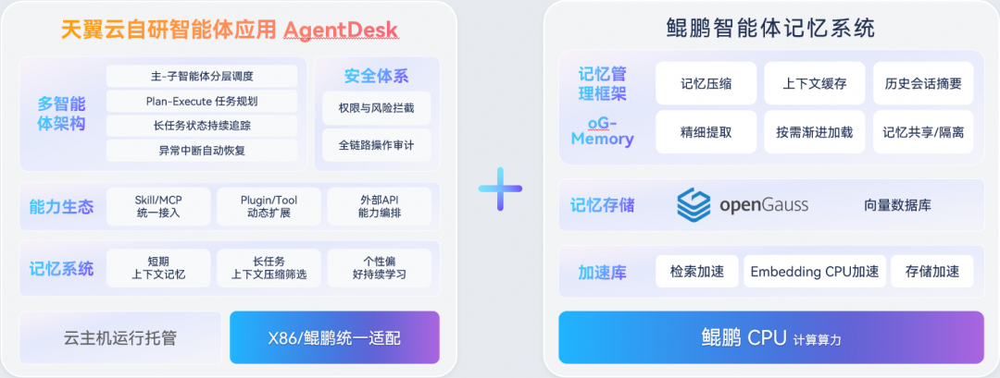
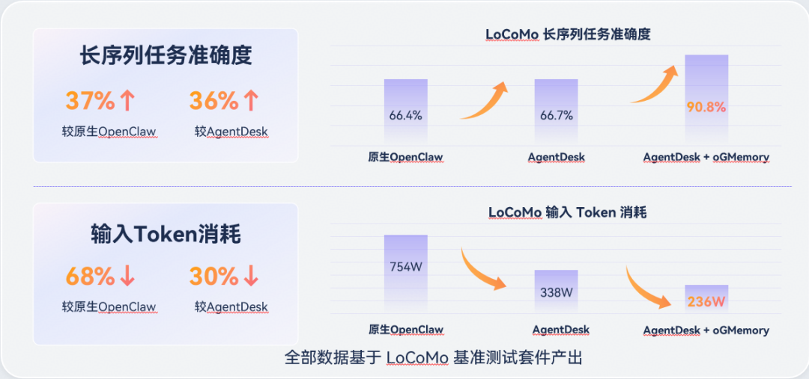

随着AI智能体从简单问答交互，走向企业复杂长周期业务编排、多轮跨角色协同，原生大模型上下文窗口受限、记忆易丢失的短板问题愈发突出。智能体失忆、长任务成功率低、Token开销爆炸，已经成为阻碍企业级Agent规模化落地的共性难题。

面对长序列业务场景的交互痛点，天翼云依托自研AgentDesk智能体应用平台，携手华为鲲鹏与openGauss数据库，共同探索智能体长期记忆能力。

## 一、业务痛点：企业级长任务智能体落地两大核心瓶颈

企业实际业务中，智能体普遍承接流程繁琐、交互轮次多、业务链路复杂的持续性工作，例如分步规划制定、跨层级业务审批、全周期项目统筹等长序列任务。传统智能体架构在这类场景下暴露出两大难以规避的痛点：

### 1、长序列任务准确度较低

多轮对话交互后上下文持续膨胀，大模型会自动截断早期对话内容，导致智能体遗忘初始任务目标、前置关键约束条件；且缺少统一的长期记忆管理机制，无法形成全局任务视角。加上自我修正机制缺乏，执行偏差层层积累，最终直接拉低整体任务成功率。

### 2、上下文无限堆积，Token消耗巨大

传统方案在每一轮推理时都将全部历史对话上下文完整输入大模型，对话轮次越多，Token 开销就越高，既推升了推理算力成本，也拖慢了智能体的响应速度。此外，历史上下文不可压缩，叠加重试失败与冗余路径，进一步抬高了企业落地成本。

## 二、整体解决方案：AgentDesk + 鲲鹏 + openGauss全栈协同架构

本次实践在天翼云AgentDesk智能体应用平台上，结合鲲鹏算力底座与openGauss的向量能力，并引入openGauss推出的oGMemory上下文记忆管理引擎，以全栈技术体系赋能智能体长期记忆。

 
**方案核心思路是：** 对历史信息进行筛选、压缩与长期存储。保留关键记忆，降低推理过程中的 Token 开销。整个过程中会结合openGauss与鲲鹏CPU的软硬协同能力，实现对于检索加速、利用CPU进行向量化Embedding以及存储压缩加速。

因为并非所有历史信息都值得被反复“回顾”。对话中充斥着大量冗余或已完成使命的中间步骤，全量输入不仅成本高昂，更会引入噪声干扰决策。为此，为AgentDesk构建了一套结构化的记忆管理机制：每轮对话后，系统自动评估并提炼上下文，将关键决策、约束条件与阶段性目标沉淀为结构化摘要，精准剔除临时推理与失败重试等冗余路径。后续推理时，输入大模型的不再是膨胀的原始对话，而是一份精炼的“任务记忆档案”，在保留关键信息的同时，显著压缩了推理的Token开销。
记忆的持久化与高效访问，则通过软硬协同实现。在向量化环节，利用鲲鹏CPU的原生计算能力将记忆摘要实时转化为向量嵌入，无需额外加速硬件，有效降低了部署门槛。转化后的长期记忆存入openGauss数据库，借助其向量索引实现高速检索；鲲鹏CPU在压缩存储与查询方面的特性，也进一步提升了记忆读写效率。整套方案并非追求单点突破，而是通过工程化的软硬协同，在通用算力平台上达成了记忆的快速存取与成本可控。

## 三：实测验证：基于LoCoMo标准长序列数据集对比测试

本次测试采用行业通用LoCoMo长序列任务标准数据集，统一输入内容、统一大模型参数，设置三组对照组方案，客观衡量记忆增强方案的实际收益：

对照组1：原生OpenClaw 

对照组2：天翼云AgentDesk

实验组：AgentDesk + oGMemory 

### 3.1 核心测试结果

#### 1、任务执行准确率显著提升

相较于原生OpenClaw方案，AgentDesk+oGMemory方案，长序列任务整体准确率提升37%，有效缓解多轮对话关键信息丢失、任务中途偏离目标的问题。

#### 2、Token消耗大幅下降，降本成效突出

对比原生OpenClaw：输入Token消耗降低**68%**

对比单独使用AgentDesk：输入Token消耗降低**30%**

 
### 3.2 结果解读
外置长期记忆系统配合软硬协同优化，一方面通过摘要过滤冗余会话信息，严控入参Token总量；另一方面依靠底层算力 + 数据库加速记忆检索，在不丢失关键业务信息的前提下，兼顾智能体回答精准度与推理成本，实现效果与成本双向最优。

## 四、总结：智能体竞争，早已不止大模型本身

本次实践表明，下一代企业级智能体的核心竞争力，已不再单纯依赖大模型的参数与算法迭代。Runtime运行时环境、Memory长期记忆系统、以及底层基础设施的协同适配，正变得越来越重要，它们将共同决定智能体落地的最终效果与成本边界。

对于面向复杂企业场景的 Agent 而言，大模型是基础，而配套的记忆体系、软硬协同基础设施，才是实现长流程、高稳定、低成本规模化落地的核心抓手。天翼云联合鲲鹏、openGauss 打造的智能体长期记忆方案，也为行业提供了可复用、可落地的全栈协同实践范本。

未来，openGauss也将持续推进向量能力与AI基础设施建设，为智能体应用提供更加高效、安全、可靠的长期记忆底座，助力企业级 Agent 规模化落地。
