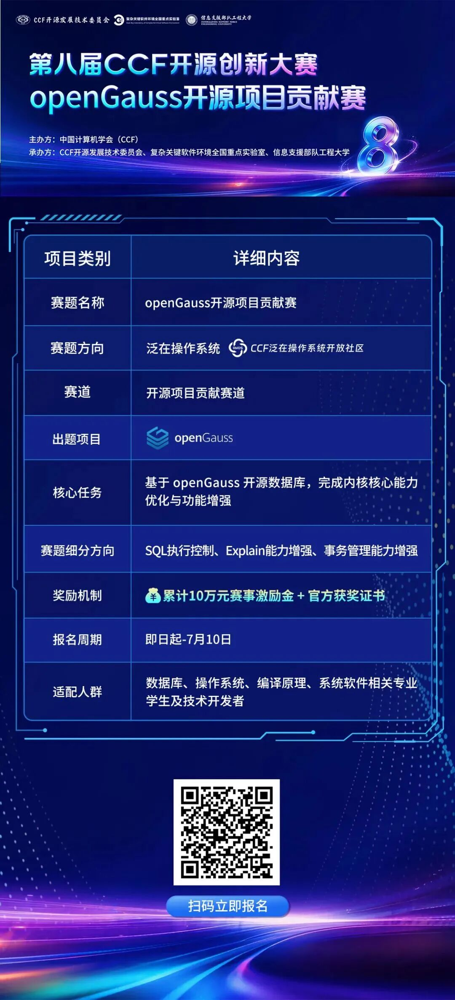
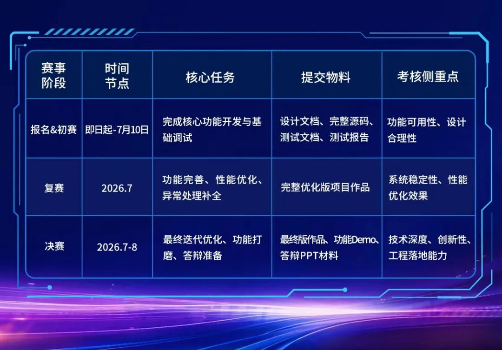
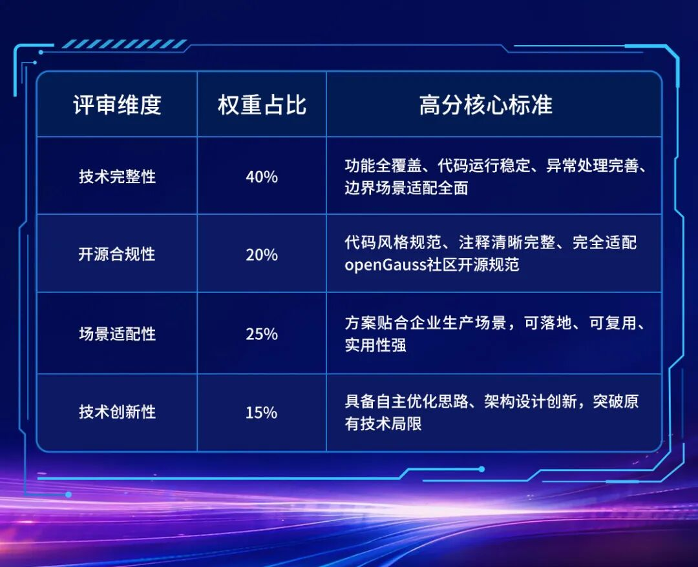
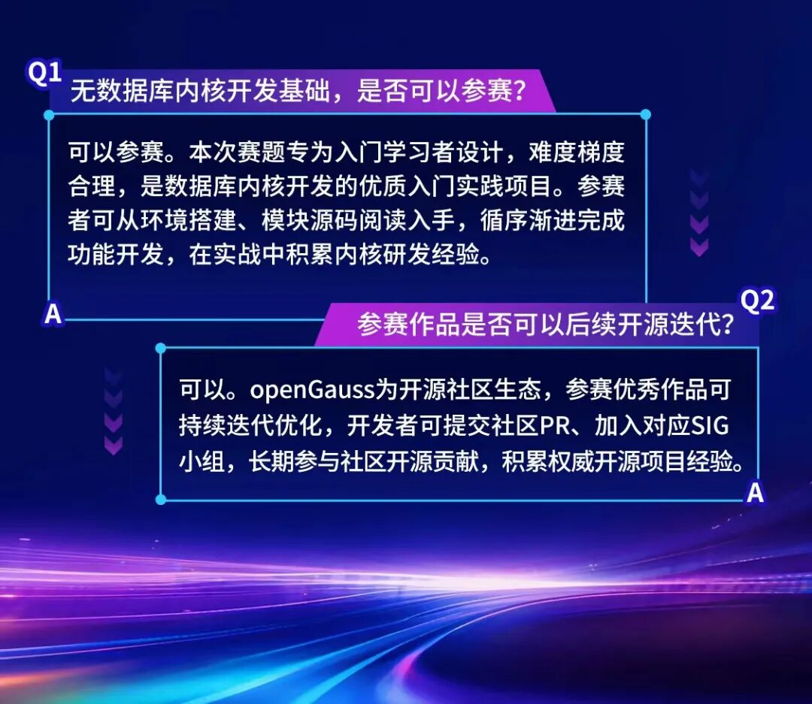

## 导语

企业数据库运维常遇SQL查询耗时失控、归一化SQL执行计划解析不准、线上事务故障溯源难等核心难题，均为数据库内核研发与运维的实战痛点。

第八届CCF开源创新大赛openGauss赛题，紧扣企业级数据库真实场景设置内核研发挑战，参赛者可完整参与内核开发全流程，适配数据库、系统软件方向学习者与开发者，是深耕核心技术、共建开源生态的优质实践平台。

## 一、赛题核心信息速览



- 报名链接：<https://www.gitlink.org.cn/competitions/track1_2026openGauss>

## 二、赛题激励


扫码加入赛题交流群

## 三、赛题设计背景与核心痛点

解读企业级开源数据库的核心竞争力，不在于基础的数据存储能力，而在于执行稳定性、计划透明性、事务可追溯性、高并发可靠性四大核心能力。openGauss作为高性能、高可靠的企业级关系型开源数据库，持续深耕内核能力迭代。本次三道赛题，均源自真实生产环境的高频痛点，针对性解决数据库运维、调优、故障排查难题。

### 3.1 痛点一：失控慢SQL引发数据库整体性能雪崩

开源项目维护者每天面对大量重复性工作：Issue 需要分类打标签、PR 需要 Review 和测试、Release Notes 需要手动整理、新贡献者需要引导……这些工作占据了维护者大量时间，却很少有工具能系统性地解决。

### 3.2 痛点二：参数化归一化SQL执行计划无法解析

为提升执行计划缓存命中率，现代数据库普遍采用归一化参数化SQL写法（如 SELECT * FROM user WHERE id = ?）。该模式虽能优化缓存效率，但存在明显缺陷：开发者无法直接查看通用执行计划（generic plan），难以完成SQL调优、故障诊断与执行计划分析工作，极大增加了数据库运维难度。本方向赛题旨在补齐openGauss参数化SQL的Explain解析能力，支撑常态化数据库优化工作。

### 3.3 痛点三：线上事务故障难以追溯定位

事务系统是数据库的核心基石，线上多数数据库故障均与长事务、事务异常提交相关。传统数据库仅能记录事务ID（XID），无法反向追溯事务准确提交时间，导致故障排查无依据、长事务问题难以定位、业务异常无法溯源。本方向赛题聚焦数据库可观测性建设，构建事务ID与提交时间的映射机制，完善事务全链路追溯能力。

## 四、赛题详细任务要求

### 4.1 子赛题一：SQL执行时间限制能力增强

本次赛事设置三道独立子赛题，参赛团队可任选其一完成参赛，无需全部作答。各赛题均设置基础必做目标与进阶拔高挑战，适配不同技术基础的参赛者。

#### 核心目标：

搭建多维度SQL执行超时管控体系，自动终止超时查询，杜绝慢SQL拖垮数据库的问题，保障系统运行稳定。

#### 基础实现目标（必完成）：

搭建三级超时管控机制，分别实现数据库全局级别、用户会话（Session）级别、SQL语句Hint级别的执行时间阈值设置与自动中止能力。

#### 进阶优化目标（高分冲刺）：

优化超时检测算法，降低检测机制带来的性能损耗；精准识别异常SQL，避免误杀正常业务语句；优化高并发场景下的超时调度逻辑，提升系统稳定性。

#### 核心技术关键词：

SQL执行器、线程中断机制、GUC参数配置、SQL查询生命周期管理


### 4.2 子赛题二：归一化SQL Explain能力增强

#### 核心目标：

补齐参数化SQL的执行计划解析能力，支持归一化SQL正常输出通用执行计划，支撑SQL调优与故障诊断。

#### 基础实现目标（必完成）：

兼容 ?、$n 两类参数化符号，实现归一化SQL的generic plan完整解析与打印，支持常规参数化语句的Explain分析。

#### 进阶优化目标（高分冲刺）：

优化执行计划展示格式，提升可读性；精简Explain执行逻辑，降低性能开销；拓展适配场景，兼容更多类型的归一化SQL语句。

#### 核心技术关键词：

语法解析器、优化器、执行计划、Explain框架

### 4.3 子赛题三：事务ID反查提交时间能力实现

#### 核心目标：

构建事务ID与提交时间的映射体系，实现事务提交时间可追溯、可查询，完善数据库可观测性能力。

#### 基础实现目标（必完成）：

搭建XID与事务提交时间的映射关系；配置GUC开关实现功能启停；设计稳定的映射数据记录与存储机制。

#### 进阶优化目标（高分冲刺）：

优化数据存储逻辑，降低额外IO开销；优化查询算法，提升事务时间反查效率；设计高可靠存储方案，保障映射数据持久化、不丢失；高效的数据回收管理机制。

#### 核心技术关键词：

事务管理器、WAL日志、提交日志、存储引擎

### 4.4 赛事阶段规划与提交物要求

赛事分为报名、初赛、复赛、决赛四个阶段，各阶段任务明确、考核重点清晰，具体要求如下：



## 五、官方解题思路与入门指引

### 5.1 基础入门：搭建本地开发环境

CCF所有参赛者需优先完成环境搭建，熟悉openGauss基础操作：编译源码、启动数据库、SQL基础调试、核心模块源码阅读。重点熟悉四大核心模块：SQL执行流程、GUC参数配置系统、执行器（Executor）、事务管理模块。

#### 基础环境验证指令：

```
Plain Text
gs_ctl start
gsql -d postgres
```

成功启动数据库并执行基础SQL语句，即完成前期环境准备工作。

### 5.2 分赛题核心源码模块聚焦

针对不同子赛题，精准定位核心研发模块，降低学习成本：

#### 子赛题一（SQL执行控制）：

核心聚焦执行器、SQL查询生命周期、线程中断检测机制。核心难点为安全终止异常SQL、隔离线程资源，避免影响数据库整体运行。

#### 子赛题二（Explain能力增强）：

核心聚焦语法解析器、优化器、Explain框架与执行计划生成模块。核心难点为参数化SQL语义解析、通用执行计划精准获取。

#### 子赛题三（事务追溯）：

核心聚焦事务管理器、提交日志、WAL日志、存储引擎。核心难点为提交时间持久化存储、性能与数据可靠性平衡。

## 5.3 核心重点：全方位测试验证

CCF数据库内核开发中，测试能力是核心考核指标。所有参赛作品需覆盖常规场景、异常场景、边界场景、高并发场景、大数据量场景五大测试维度，确保功能稳定可用。

### 各赛题核心测试重点：

- SQL执行控制：验证超时中止有效性、资源释放完整性、跨会话无干扰性、性能影响；

- Explain能力增强：验证参数化SQL解析准确性、执行计划稳定性；

- 事务时间追溯：验证XID映射准确性、重启后数据恢复可靠性、查询性能、对事务提交的性能影响。

## 六、官方评审标准与高分技巧



## 七、官方学习资源与技术支持

openGauss社区提供全方位官方学习资源，助力参赛者高效备赛，全程提供技术支撑。

- openGauss官方社区：<https://opengauss.org/zh/>

- 官方技术直播课程：<https://opengauss.org/zh/video/?id=1>

- Bilibili技术回放合集：<https://space.bilibili.com/543286270/lists>

- 内核源码解析专栏：<https://www.zhihu.com/column/c_1358363246349635584>

- 作品提交与开源示例平台：<https://gitcode.com/opengauss/examples>

## 八、常见参赛问题FAQ



## 九、结语

本次openGauss赛题以产业真实难题为赛题，为开发者提供数据库内核实战与开源贡献平台。无论有无基础，均可通过赛事深耕底层技术、积累工业级项目经验，个人成果可赋能国产开源数据库生态。
