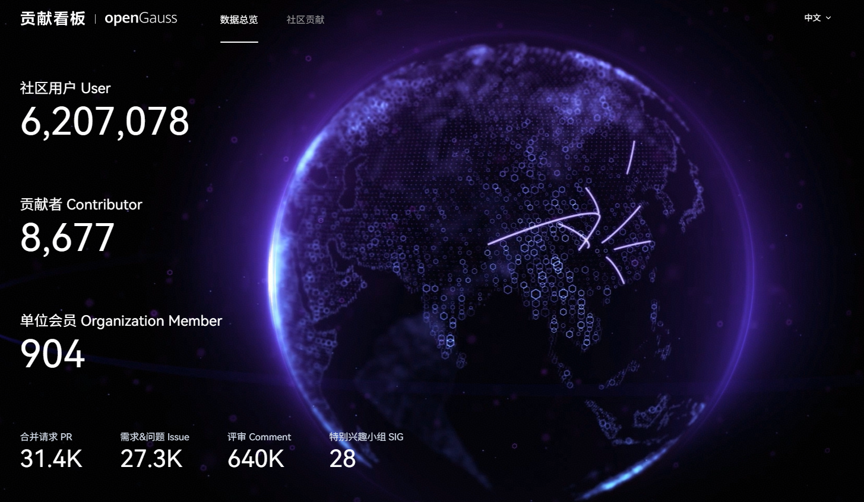
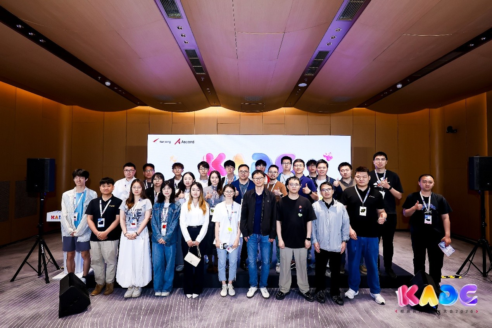
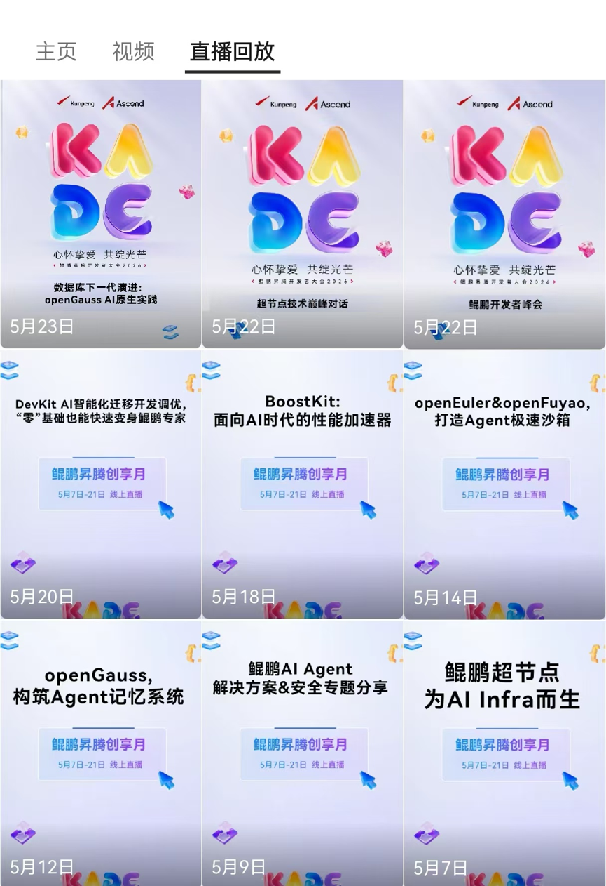
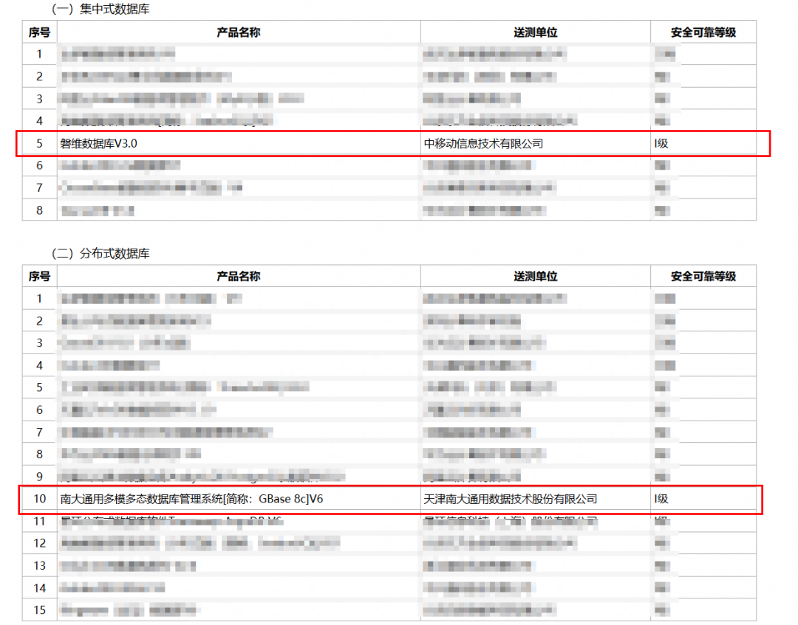

## 一、概述
2026年5月，openGauss 社区持续推进技术创新与生态建设，在社区发展、产业合作和 AI 原生数据库演进方面取得积极进展。截至5月底，社区累计用户超过620万，开发者超过8600名，社区生态规模持续扩大。社区深度参与鲲鹏昇腾开发者大会2026（KADC 2026），通过峰会、技术论坛、创新展区及系列直播活动，全方位展示 openGauss 在 AI 原生时代的技术突破与生态成果，携手产业伙伴共同探索数据库下一代演进路径。
同时，社区生态建设再获新成果，又两家基于 openGauss 的数据库产品顺利通过国家安全可靠测评，进一步彰显 openGauss 技术路线的成熟度与产业价值。此外，社区持续完善兼容性生态建设，截至5月底累计完成3500余款产品兼容性测评，为行业数字化转型提供坚实支撑。

（本月报阅读时长约6分钟）

## 二、社区规模

截至2026年5月31日，openGauss 社区用户累计超过**620万**，单位会员达**904家**，SIG 组**28个**，超过**8.6千**名开发者在社区持续贡献。社区累计产生**31.4K**个PR、**27.3K**条Issue、**640K**条Comment。

社区贡献看板（截止2026/05/31）

## 三、社区事件

### openGauss全方位亮相 KADC 2026，引领数据库AI原生演进新范式

5月22日-23日，面向开发者一年一度的技术盛典——鲲鹏昇腾开发者大会2026在北京中关村国际创新中心盛大举办。本届大会延续“心怀挚爱，共绽光芒”主题，汇聚全球开发者、社区大咖、高校科研人员、企业技术专家和工程师，聚焦AI创新实践与生态共建，通过鲲鹏峰会、昇腾峰会、技术论坛、主题展区、CodeLab等多元活动，为全球开发者打造了一场集技术分享、实战实操、生态共创于一体的年度科技盛会。作为鲲鹏生态的核心基础软件，openGauss在本次大会中深度参与，从鲲鹏峰会到技术分论坛，从创新展区到动手实操，全面展示了其在AI原生时代的技术突破与生态成果。

阅读原文：[openGauss全方位亮相 KADC 2026，引领数据库AI原生演进新范式](https://mp.weixin.qq.com/s/0Rqen_rdNx3OasPjblqiEQ)

### openGauss数据库视频号开展9场KADC 

2026鲲鹏专题直播围绕 KADC 2026 鲲鹏昇腾创享月，openGauss 数据库视频号持续开展系列技术直播活动。5月7日至20日期间，累计举办6场鲲鹏专题技术直播；5月22日至23日大会期间，同步直播鲲鹏开发者峰会、超节点技术巅峰对话及 openGauss 技术分论坛等3场重磅活动。通过线上线下联动的形式，持续向开发者传递前沿技术成果与产业实践经验。系列直播累计观看人次超2100次，收获点赞超2700次，进一步扩大了 openGauss 社区影响力，提升了开发者参与度与生态关注度。

5月直播回放截图

### openGauss又添两家社区伙伴数据库产品通过国家安全可靠测评

5月26日，由中国信息安全测评中心与国家保密科技测评中心联合组织的数据库安全可靠等级测评结果正式发布。openGauss 开源社区再添佳绩，中移动信息技术有限公司磐维数据库 V3.0、天津南大通用数据技术股份有限公司 GBase 8c V6 两款伙伴产品顺利通过权威测评，分别纳入集中式、分布式数据库目录，充分印证产品过硬的安全与可靠性水平。

作为 openGauss 社区的重要生态伙伴，两家企业长期深度参与 openGauss 社区共建，依托社区技术底座持续打磨商用数据库产品，加速推动数据库技术在重点行业与核心场景中的落地应用。

阅读原文：[openGauss又添两家社区伙伴数据库产品通过国家安全可靠测评](https://mp.weixin.qq.com/s/PFPPwUdPh7t3NCMUJ4ljxQ)

## 四、软硬件兼容性测评

截至2026年5月31日，通过openGauss软硬件兼容性测评的产品达3500+款。5月新增北向（ISV）新增25款。

- 兼容性列表：<https://opengauss.org/zh/compatibility/>

- DBV技术测评列表：<https://opengauss.org/zh/certification/>

## 五、致谢

openGauss社区的成长，从来不是某一个人的努力，而是大家并肩同行、共同创造的结果。每一次提交、每一次讨论、每一次分享，都是社区前行路上的点点星光，汇聚成今天的成果与温度。

也正因为社区持续涌现出丰富的实践与成果，月报内容难免有所疏漏，如有未被记录的亮点与贡献，欢迎随时与我们联系补充，让更多努力被看见、被传递。在此，向为本期月报提供资料支持的各 SIG 组以及开发者朋友们致以诚挚的感谢与敬意。

若您希望在月报中增加您的工作内容，或对内容有任何改进建议，请联系： common@public.opengauss.org
