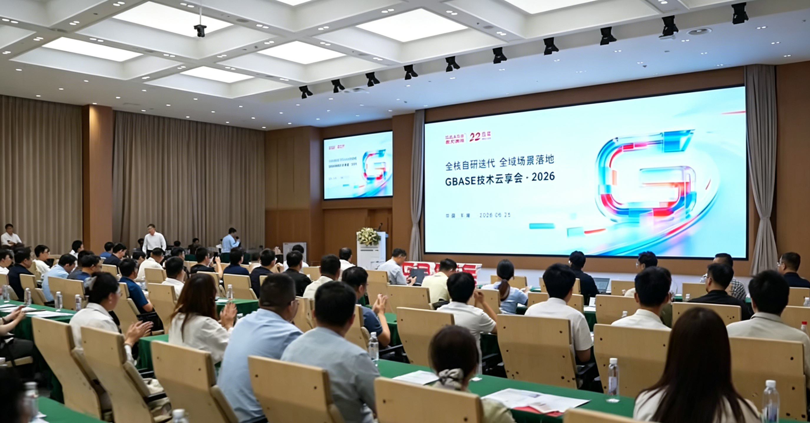
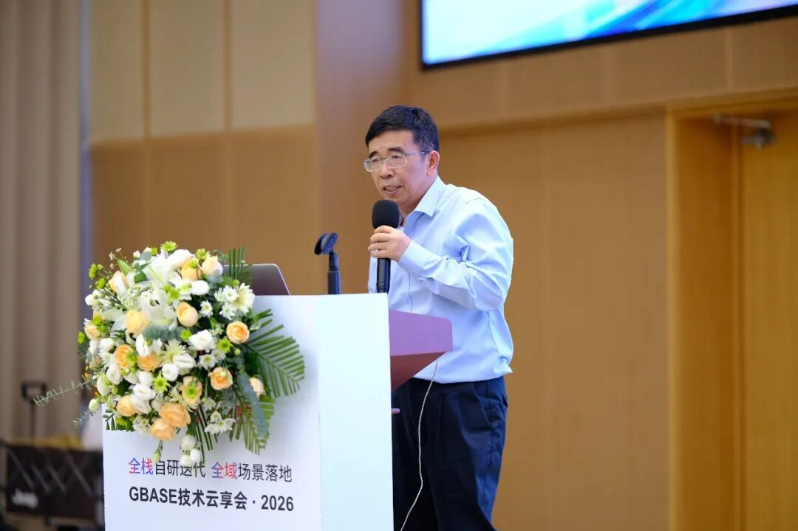
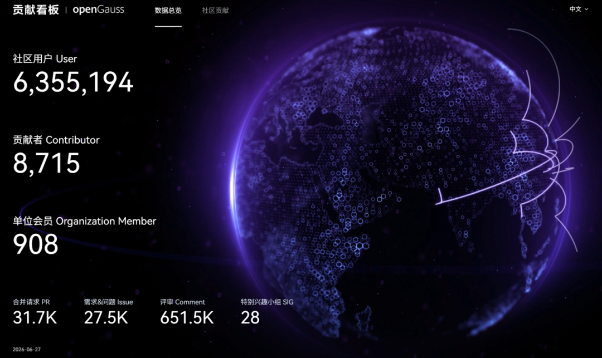
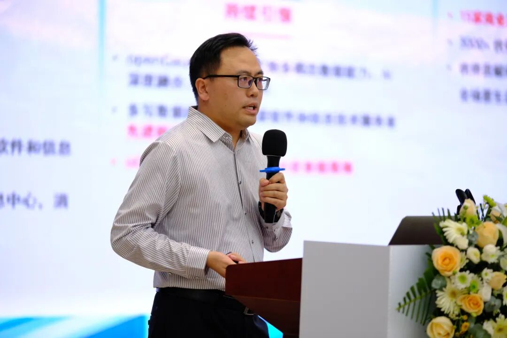

6月25日，以“全栈自研迭代 全域场景落地”为主题的2026 GBASE南大通用技术云享会在天津天开园报告厅成功举办。本次大会汇聚行业权威专家、生态合作伙伴及产业从业者，聚焦信创数据库发展趋势、AI原生数据库能力、全栈产品迭代与开源生态共建等核心议题，共同探索数据库技术赋能千行百业数智化转型的创新路径。openGauss社区受邀参会，社区秘书长、openGauss领域总经理蔡亚杰发表《openGauss构建开放共赢的开源数据库根社区》主题演讲，全方位分享社区生态建设成果、前沿技术布局与未来发展战略，与行业同仁共话国产开源数据库开放共赢新生态。

分享会现场

本次大会阵容权威、内容详实、干货满满。南大通用董事长丁明峰担任大会主持人并发表开场致辞。他在会上强调，国产数据库发展无捷径，唯有深耕底层、打磨硬核产品、夯实服务口碑，才能持续筑牢国产化数字底座。

南大通用董事长丁明峰

会上，多位行业技术专家带来前沿干货分享，解锁数据库产业发展新趋势。中国信通院人工智能研究所专家深度解读国内数据库产业整体发展态势，系统剖析HTAP架构迭代升级逻辑与AI原生技术落地应用趋势；佰展智算技术负责人围绕“DB for AI、DB for DATA”核心理念，前瞻性阐述数据库智能化演进的发展方向与应用前景；南大通用核心技术团队逐一详解GBase 8c、GBase 8a、GBase 8s全系核心产品的内核升级亮点、AI原生创新能力及各行业落地实践案例，全面展现企业国产数据库全场景适配、规模化落地的硬核实力。

作为国内标杆级开源数据库根社区，openGauss自2020年正式开源，历经六年深耕，已建成技术、伙伴、产业三位一体的成熟生态体系。目前社区总下载量突破620万，汇聚超900家企业成员、8700余名开发者协同共建，超30家厂商推出基于openGauss的商业发行版。2025年，社区获评“软件和信息技术服务业明星开源社区”，凭借开源多写数据库技术斩获行业先进科技奖。市场表现持续领跑，openGauss线下集中式关系型数据库新增市场份额超35%，连续三年位居细分赛道第一，已规模化落地电信、医疗、能源、政务等关键行业核心系统。

社区贡献看板截图

南大通用作为openGauss核心生态伙伴，自2021年加入社区以来，始终深度参与社区共建共创，累计贡献代码超13万行，贡献社区首个向量数据库版本，在数据迁移工具、向量核心能力等领域持续输出技术成果。同时，企业积极参与社区各类生态共建活动，是社区认证oGSP服务伙伴，旗下GBase 8c产品顺利通过国家安全可靠测评，基于openGauss内核打磨成熟商用产品，成为开源生态伙伴协同创新、互利共赢的典型范例。

分享环节中，蔡亚杰重点阐释openGauss“做实高质量内核底座、做好原生多主数据库、做厚AI多模数据库”的1+2核心战略，全面披露社区技术迭代成果与未来规划。在内核底座层面，openGauss依托鲲鹏DPA硬件加速，实现复杂AP聚合SQL性能提升20%，通过全链路资源优化大幅降低轻量化部署资源开销。同时，社区创新打造数据保险柜解决方案，依托TEE机密计算、WORM存储、RDMA高速传输技术，构建全链路安全防护体系，实现RPO趋近于零，兼顾高安全、高可靠与高性能，全方位适配企业核心数据安全场景。

openGauss社区秘书长、openGauss领域总经理蔡亚杰

在前沿技术创新领域，社区自研oGRAC多主数据库，打破传统主备架构瓶颈，实现多节点同时读写、负载均衡，TPCC性能达470万tpmC，可节省50%以上算力与存储资源。据悉，openGauss 7.0.0 LTS版本将于9月正式发布，上线可商用版oGRAC能力，后续将持续优化故障恢复能力，并布局超节点数据库技术，通过硬件资源池化突破单机性能上限。在AI多模方向，openGauss打造全栈AI原生能力，DataVec向量引擎在高召回精度下实现性能提升、内存大幅优化；Data Branching秒级数据分支、oGMemory记忆管理引擎，解决AI智能体“健忘”与Token消耗痛点、一站式AI Pipeline库内向量化能力，全方位解决AI应用部署成本高、运维复杂、敏感数据泄露等痛点，为AI Agent与智能知识库搭建提供极简高效的数据底座。

目前，openGauss已形成社区开源版、商业发行版、用户自用版三类产品形态，全面覆盖不同研发与商用场景需求。未来，openGauss社区将持续秉持“共建、共享、共治”的开源理念，深耕1+2技术战略，持续迭代内核、多主架构与AI原生核心能力，持续深化与南大通用等生态伙伴的协同联创，完善产学研用创新体系，持续夯实国产开源数据库根社区，以持续的技术创新与生态共建能力，助力国产数据库产业高质量发展，赋能各行业数字化转型与信创产业建设。
