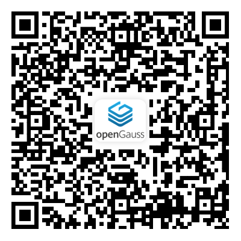

随着 AI 原生应用、智能体系统和企业级数据基础设施不断走向真实业务，数据库能力正在面对新的挑战。一方面，企业希望数据底座在复杂场景下具备更高的可用性、稳定性和弹性；另一方面，Agentic AI 正在进入研发协同、知识管理、运维诊断和流程自动化等场景，智能体不再只是完成一次问答，而是需要在长会话、多轮协作和跨会话任务中持续理解任务背景、调用工具、沉淀经验。

本次众测希望邀请高校开发者、社区开发者和生态伙伴，一起围绕 **oGRAC** 与 **oGMemory** 两个产品开展真实体验。我们希望感知产品在开发者手中是否容易理解、部署、接入，也希望收集功能、文档、流程、稳定性和场景适配方面的真实反馈，便于后续产品持续演进，为开发者带来更好的体验。

## 01 众测目标

本次众测不是一次简单的功能试用，而是一次面向真实开发者体验的意见征集。本次活动将通过问卷招募与筛选，组织符合条件的用户在指定周期内按照社区提供的任务书完成测试任务，并提交操作记录、问卷反馈、问题建议、截图或录屏等材料。

后续 openGauss 社区会对反馈进行分类、评估和复盘，将高价值问题纳入产品优化路径，并对高贡献开发者给予奖励。

## 02 产品介绍

### 一、oGRAC ：多写数据库

oGRAC 是 openGauss 面向多主数据库架构推出的全新产品，可以在实际业务中，不再只依赖单个主节点承担读写，而是让集群里的多个数据库实例都能参与读写，同时保持事务、缓存和数据的一致性。

在 oGRAC 架构中，多个数据库实例共享同一份数据存储。节点之间通过共享内存服务来协调事务、页面缓存和锁资源，保证不同节点同时读写时，数据仍然是实时一致的，可以在不牺牲一致性的前提下，提高集群的读写吞吐、扩展能力和高可用能力。多写架构适合对数据库连续性和并发处理能力要求很高的场景，例如金融、电信、政务等核心业务系统。

**oGRAC 具有三大核心能力：**

- **多读多写**：oGRAC 通过分布式资源目录、分布式缓存服务、分布式锁服务和分布式存储服务，协调集群内页面、锁、缓存和底层存储访问，让多个节点可以同时处理读写请求。

- **全局一致性**：系统通过全局事务 ID、分布式 MVCC、SCN 同步等机制，处理跨节点查询、事务提交顺序和可见性问题，避免多节点读写带来的数据混乱。

- **集群管理和故障恢复**：集群管理服务会监控成员状态和资源状态；当节点出现故障时，系统需要完成资源重分布、REDO/UNDO 处理和未提交事务回滚，让集群恢复到一致状态。

### 二、oGMemory：记忆系统

Agentic AI 走向复杂任务后，也遇到了另一个问题：Agent 不能只靠当前这一次上下文工作。一个 Agent 如果要长期协作，就需要记住用户偏好、任务进展和工具使用经验。否则会反复问同样的问题，也容易在长会话里丢掉前面的关键信息。

oGMemory 就是面向这个场景设计的长期记忆与上下文生命周期管理系统。它不改变大模型本身，而是在 Agent 和记忆数据之间加上一层记忆管理能力。

用户提问前，oGMemory 可以先找回相关历史信息，让 Agent 带着背景回答；一轮对话结束后，它会把值得保留的用户偏好、关键事实、任务进展和工具经验沉淀下来。会话变长时，它也可以对上下文进行压缩归档，尽量保留有效信息，减少无关内容继续占用窗口。

从使用链路看，oGMemory 关注的是上下文的完整生命周期：采集、抽取、写入、索引、召回、压缩和归档。这样，Agent 的每一次交互就不再是"用完即丢"的聊天记录，而是可以变成后续任务继续使用的记忆材料。对开发者和企业级 Agent 应用来说，oGMemory 的价值不只是"记住用户说过什么"，而是让 Agent 在持续协作中少重复、少遗忘，能把过去的经验用到下一次任务里。

## 03 报名与评分标准

本次众测面向高校开发者、社区开发者与生态伙伴开放。我们希望参与者不只是"点一点功能"，而是能按照任务书完整体验产品，反馈真实感受、问题现象和改进建议。

### 一、报名对象

本次众测面向以下人群：

- **高校开发者**：数据库、计算机、人工智能等相关方向的学生、实习生或实验室成员。我们希望从新手和学习者视角，了解产品文档是否容易看懂，任务是否容易完成，关键概念是否容易理解。

- **社区开发者**：openGauss 用户、数据库开发者、历史提单用户或社区活跃参与者。我们希望从真实开发者视角，了解产品接入成本、部署体验、问题定位方式和社区协作流程。

- **生态伙伴**：数据库生态、行业解决方案等方向的伙伴团队。我们希望从产业落地视角，收集产品适配价值、合作诉求和后续版本演进建议。

### 二、基础要求

参与者建议具备 openGauss、MySQL、PostgreSQL 或其他数据库相关使用经验，能够理解基础数据库概念，并按照任务书完成安装、配置、运行、观察和反馈。

同时，参与者需要在测试周期内投入一定时间，按要求提交操作记录、问卷反馈、问题建议、截图或录屏等材料。无法按时参与正式众测，或无法提交有效操作记录的报名，可能不会进入正式测试名单。

### 三、优先条件

具备以下经验的开发者将优先考虑：

- 有数据库开发、运维、测试或课程实验经验。
- 有 openGauss 使用、提单、社区贡献或生态适配经验。
- 有 Agent、AI 应用、RAG、工具调用或企业知识管理相关实践经验。

### 四、参与激励与评分标准

对于所有参与本次众测活动、完成任务并反馈意见的参与者均有小礼品赠送，感谢各位开发者的支持。同时根据上述评分标准，本次活动将对所有参与者进行排名，对于高价值反馈意见，激励设置如下：

| 激励等级 | 奖品内容 | 数量设置 |
| --- | --- | --- |
| 一等奖 | 华为FreeArc耳挂耳机 | 1 |
| 二等奖 | 华为11Pro NFC手环 | 2 |
| 三等奖 | 华为12000mAh 66w充电宝 | 3 |

本次众测将由社区专家团队评分，用于评估总体排名，评分细则项如下：

- **任务完成度（占 30%）**：参与者是否按要求完成 oGRAC / oGMemory 测试任务，是否提交了完整、可信的操作记录，测试过程是否能够证明任务确实被执行。

- **问题有效性（占 30%）**：提交的问题是否真实、清楚、可复现，是否包含必要的日志、截图、录屏或操作步骤，是否对产品质量、用户体验或版本演进有参考价值。

- **反馈质量（占 40%）**：问卷反馈和改进建议是否具体，是否能说清楚"哪里不好用、为什么不好用、希望怎么改"，而不是只给出笼统评价。

其中，报告、问卷反馈质量可按照价值分类：

- **高价值反馈**：问题能够稳定复现，影响核心流程，证据充分，建议具体，对产品优化有明显帮助。
- **中价值反馈**：复现条件较明确，建议具备一定参考意义。此类反馈会进入问题池，结合优先级安排后续处理。
- **一般价值反馈**：偶发现象、体验建议或影响较小的问题，也会记录归档，作为后续体验优化参考。

如果反馈缺少复现路径、描述不清、与测试范围无关，或没有必要证据支撑，可能无法计入有效评分。最终评分将作为优秀反馈和激励发放的重要依据。

## 04 本次众测参与流程

### 一、报名阶段

本次众测将通过 openGauss 社区、微信群、论坛活动帖、高校合作渠道以及生态伙伴定向邀请等方式发布报名入口。开发者填写报名问卷后，社区会根据报名信息进行筛选，优先邀请具备数据库使用经验、开发经验、社区参与经验或伙伴适配经验的用户参与测试。本次报名采集以问卷形式采集，可扫描下述二维码进行报名：

报名时间为 **2026年7月3日至2026年7月25日**。有意参与的开发者建议尽早提交报名信息，便于后续接收测试任务、环境说明和操作指引。报名成功后，将会有社区工作人员加联系方式接洽。

### 二、体验阶段

报名通过后，社区将联系开发者并提供任务书，后续开发者将按照任务书开展测试。

测试过程中，参与者需要保留关键操作步骤、截图或录屏。如果遇到异常现象，建议记录清楚复现路径、实际结果、预期结果和相关日志，方便后续社区问题定位。正式测试时间为 **2026年7月5日至2026年8月5日**。

### 三、反馈提交

完成测试后，参与者需要向社区接口人提交操作报告、问卷反馈和问题反馈。操作报告主要用于说明测试过程是否完整；问卷反馈用于收集整体体验和改进建议；问题反馈则需要尽量写清楚问题现象、复现步骤、影响范围和证据材料。

反馈提交截止时间为 **2026年8月5日24:00**。超过截止时间提交的内容，将无法计入本次众测评分和激励评估。

### 四、结果评审

社区将在测试结束后对反馈进行整理和评估，重点查看任务完成度、问题有效性、反馈质量和参与配合度。能够稳定复现、影响核心流程、证据充分、建议具体的问题，将优先进入重点改进项。

反馈整理与评审时间为 **2026年8月5日至2026年8月20日**。

### 五、公告发布

本次众测结果公告和激励名单预计在 **2026年8月20日** 发布。公告内容将包括活动整体情况、优秀反馈结果、奖励发放安排以及后续产品优化方向。