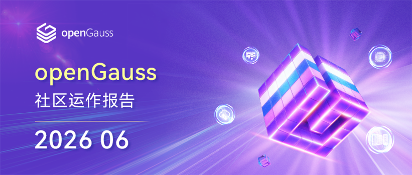
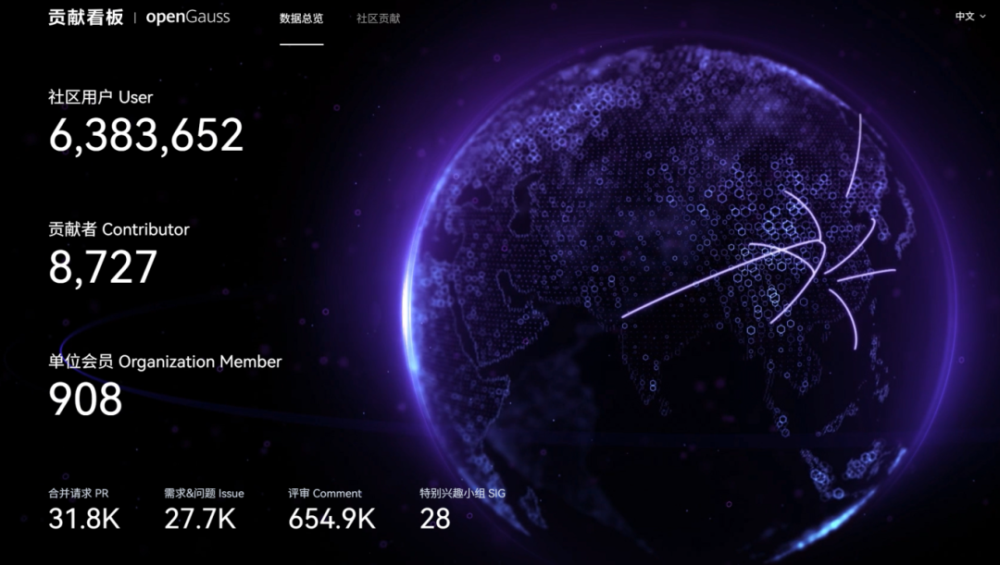
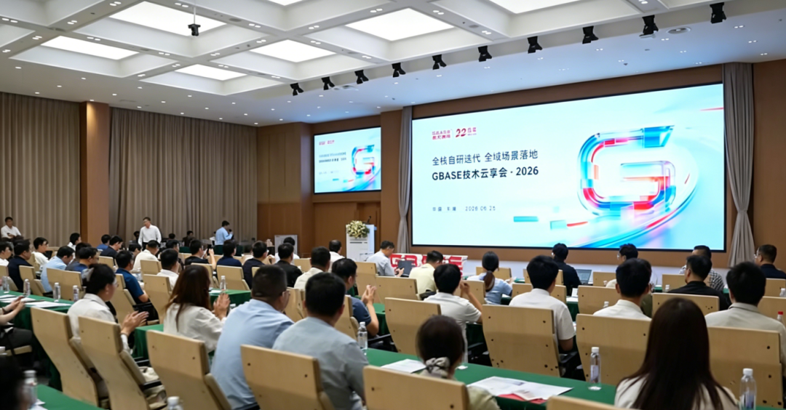
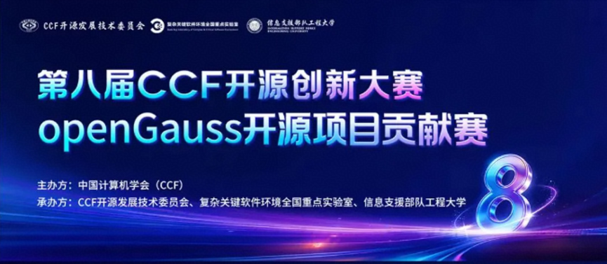
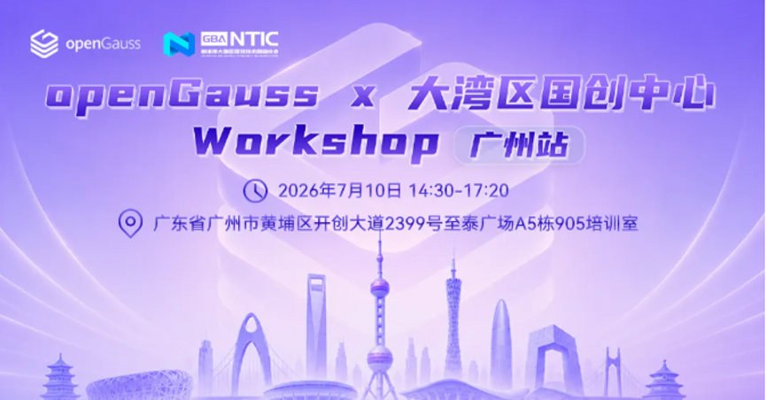
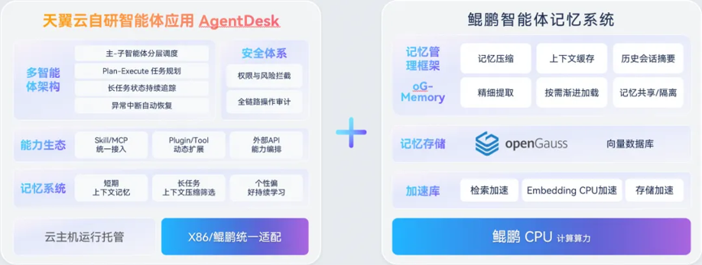
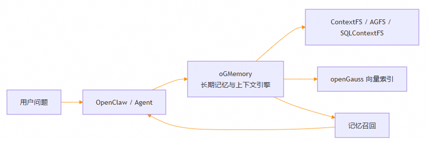

## 1. 概述

2026年6月，openGauss 社区持续推进技术创新与生态建设，在社区规模发展、产业合作、技术演进和生态完善等方面取得积极进展。截至6月底，社区累计用户超过638万，单位会员达908家，开发者规模持续增长，社区生态活力不断提升。社区积极参与产业交流与生态共建，受邀参加南大通用技术云享会，围绕开源数据库生态建设、技术创新与产业实践展开深入交流；同时，第八届CCF开源创新大赛 openGauss 开源项目贡献赛及oGRAC实战演练&专项培训启动，为开发者参与数据库内核创新、共建开源生态提供实践平台。在技术演进方面，社区持续聚焦AI原生数据库、高可用架构等前沿方向，围绕智能体长期记忆系统、高可用能力优化等场景展开探索，推动数据库技术向智能化、企业级应用方向演进。此外，社区持续完善兼容性生态建设，截至6月底累计完成3600余款产品兼容性测评，为产业数字化转型提供坚实支撑。

（本月报阅读时长约5分钟）

## 2. 社区规模

截至 2026 年 6 月 30 日，openGauss 社区用户累计超过 **638 万**，单位会员达 **908 家**，SIG 组 **28 个**，超过 **8.7K 名开发者**在社区持续贡献。社区累计产生 **31.8k 个 PR**、**27.7K 条 Issue**、**654.9K 条 Comment**。

> 社区贡献看板（截止 2026/06/30）

## 3. 社区事件

### openGauss 出席南大通用技术云享会，共话开源数据库开放共赢生态

6 月 25 日，以“全栈自研迭代 全域场景落地”为主题的 2026 GBASE 南大通用技术云享会在天津天开园报告厅成功举办。本次大会汇聚行业权威专家、生态合作伙伴及产业从业者，聚焦信创数据库发展趋势、AI 原生数据库能力、全栈产品迭代与开源生态共建等核心议题，共同探索数据库技术赋能千行百业数智化转型的创新路径。

openGauss 社区受邀参会，社区秘书长、openGauss 领域总经理蔡亚杰发表《openGauss 构建开放共赢的开源数据库根社区》主题演讲，全方位分享社区生态建设成果、前沿技术布局与未来发展战略，与行业同仁共话国产开源数据库开放共赢新生态。

原文阅读：[openGauss 出席南大通用技术云享会，共话开源数据库开放共赢生态](https://mp.weixin.qq.com/s/7GeEVGgEYIp6gS5TX8tytg)

### 第八届 CCF 开源创新大赛 openGauss 开源项目贡献赛启动

企业数据库运维常遇 SQL 查询耗时失控、归一化 SQL 执行计划解析不准、线上事务故障溯源难等核心难题，均为数据库内核研发与运维的实战痛点。

第八届 CCF 开源创新大赛 openGauss 赛题，紧扣企业级数据库真实场景设置内核研发挑战，参赛者可完整参与内核开发全流程，适配数据库、系统软件方向学习者与开发者，是深耕核心技术、共建开源生态的优质实践平台。

原文阅读：[赛题解读｜openGauss x CCF开源创新大赛:10w激励金，开启数据库核心能力挑战！](https://mp.weixin.qq.com/s/1y2hPExrQZmkw_O8uYAsxg)

### openGauss oGRAC 实战演练 & 专项培训招募启动！

openGauss 社区联合大湾区国创中心开展 oGRAC 专项技术培训，采用议题分享 + 3 项实操 Lab 相结合的形式：通过专题讲解梳理 oGRAC 架构与核心技术，帮助开发者夯实理论基础；配套实操演练，让大家上手完成基础操作与性能实测，进一步深化技术理解与实操能力。

原文阅读：[大湾区开发者集结！openGauss oGRAC实战演练&专项培训招募启动！](https://mp.weixin.qq.com/s/108J-2Cql7RyTloBz-iDVw)

## 4. 技术进展

### 天翼云联合鲲鹏、openGauss 打造智能体长期记忆方案，准确率提升 37%，Token 消耗降低 68%

随着 AI 智能体从简单问答交互，走向企业复杂长周期业务编排、多轮跨角色协同，原生大模型上下文窗口受限、记忆易丢失的短板问题愈发突出。智能体失忆、长任务成功率低、Token 开销爆炸，已经成为阻碍企业级 Agent 规模化落地的共性难题。

面对长序列业务场景的交互痛点，天翼云依托自研 AgentDesk 智能体应用平台，携手华为鲲鹏与 openGauss 数据库，共同探索智能体长期记忆能力。

本次实践在天翼云 AgentDesk 智能体应用平台上，结合鲲鹏算力底座与 openGauss 的向量能力，并引入 openGauss 推出的 oGMemory 上下文记忆管理引擎，以全栈技术体系赋能智能体长期记忆。

原文阅读：[天翼云联合鲲鹏、openGauss 打造智能体长期记忆方案，准确率提升 37%，Token 消耗降低 68%](https://mp.weixin.qq.com/s/w02P48tR78cQMdUwqf1rDg)

### openGauss 围绕资源池化 failover 适配在线 reform 完成方案设计

针对主写备读场景下旧备机业务线程、辅助线程可能卡在页面读 retry，导致 FailoverCleanBackends 长时间等待甚至 failover 超时的问题，本方案引入 page-read cancel 机制。线程识别 failover 后，不再持续重试，而是按“谁申请谁释放”原则逐层清理 IO、pin、锁、read hint、segment head buffer 等资源，并退到安全边界退出。该能力可推动在线 reform 持续执行，降低页面资源残留和一致性风险，提升资源池化集群故障切换的可靠性与可用性。

### oGMemory：为 AI Agent 打造可演进的长期记忆系统

随着 Agentic AI 从单轮问答走向复杂任务执行，Agent 不再只是“回答一个问题”，而是需要持续理解用户目标、记住历史偏好、复用工具经验，并在长会话、多轮协作、跨会话任务中保持稳定表现。传统 Agent 主要依赖上下文窗口维持状态，一旦窗口接近上限，就容易出现早期信息遗忘、重复犯错、Token 成本上升、历史经验无法复用等问题。

这不是单纯扩大模型上下文窗口就能解决的问题，而是 Agent 应用缺少一套面向运行过程的长期记忆基础设施。oGMemory 正是面向这一场景构建的 Agent 长期记忆与上下文生命周期管理系统。它把 Agent 运行过程中的对话、工具调用、任务状态和经验沉淀为可持久化、可索引、可召回、可压缩、可观测的记忆资产，帮助 Agent 从“临时对话”走向“持续认知”。

原文阅读：[oGMemory：为 AI Agent 打造可演进的长期记忆系统](https://mp.weixin.qq.com/s/gy_0qFegPSMJarqZByCo4g)

### oGRAC 持续完善高可用能力，RBP 特性加速故障恢复

在故障恢复层面，oGRAC 引入 RBP 恢复加速机制。该机制通过在系统运行期间维护可用于恢复的数据页状态，在节点故障后帮助集群快速定位一致性恢复边界，并以页面级快速恢复结合增量日志补齐的方式，减少传统恢复过程中对大规模日志回放的依赖，从而缩短故障切换后的恢复时间。

在保证事务一致性和数据可靠性的前提下，RBP 将恢复过程由单一日志追赶模式优化为“页面快速回填、日志增量补齐、事务一致性处理”的协同恢复模式。当前，在鲲鹏 920 机器上单节点压测 50 万 tpmC 负载下达到 **RTO < 10s**；在产业价值上，该特性有效降低故障恢复时长，提升数据库高可用能力与业务连续性保障水平。整体上，oGRAC 实现 RTO 能力的持续完善，进一步夯实开源多写数据库生态能力。

## 5. 软硬件兼容性测评

截至 2026 年 6 月 30 日，通过 openGauss 软硬件兼容性测评的产品达 **3500+ 款**。2026 年 6 月新增 **58 款**，其中北向（ISV）新增 58 款。

- 兼容性列表：

<https://opengauss.org/zh/compatibility/>

- DBV 技术测评列表：

<https://opengauss.org/zh/certification/>

## 6. 致谢

openGauss 社区的成长，从来不是某一个人的努力，而是大家并肩同行、共同创造的结果。每一次提交、每一次讨论、每一次分享，都是社区前行路上的点点星光，汇聚成今天的成果与温度。

也正因为社区持续涌现出丰富的实践与成果，月报内容难免有所疏漏，如有未被记录的亮点与贡献，欢迎随时与我们联系补充，让更多努力被看见、被传递。在此，向为本期月报提供资料支持的各 SIG 组以及广大开发者朋友们致以诚挚的感谢与敬意。

若您希望在月报中增加您的工作内容，或对内容有任何改进建议，请联系：  
**common@public.opengauss.org**
