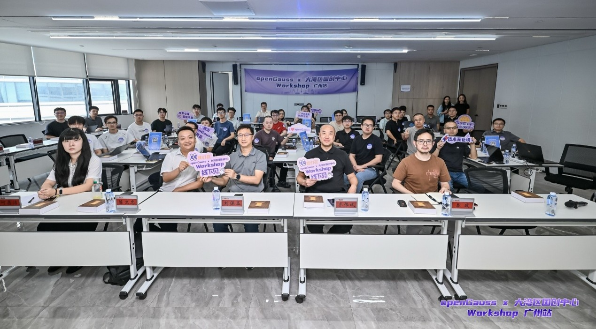
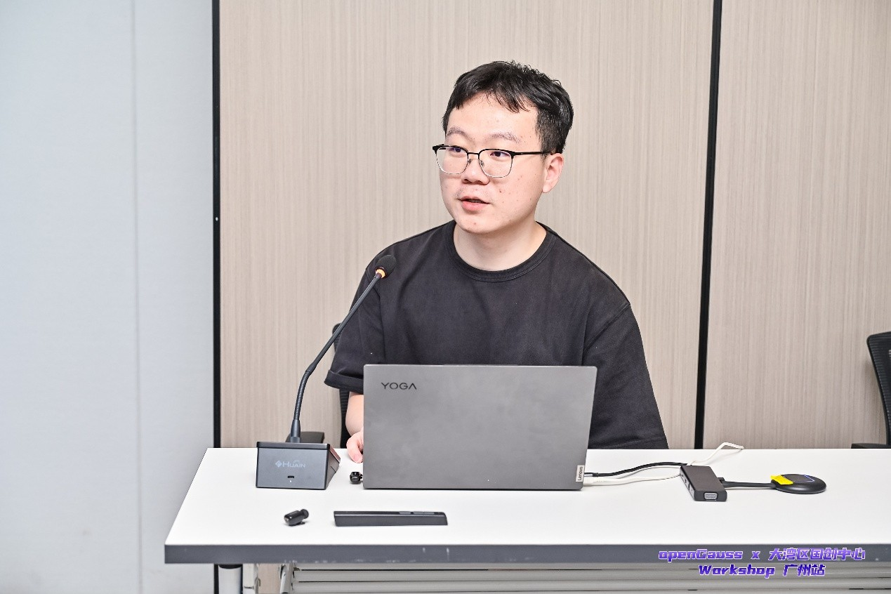
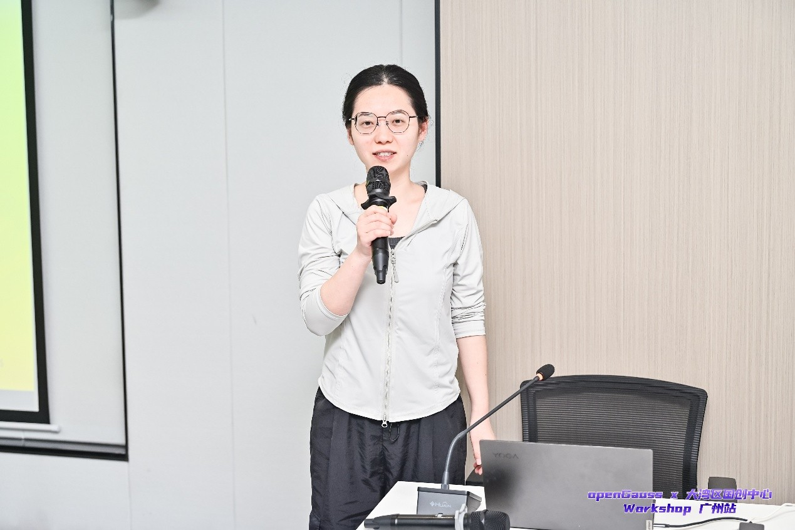
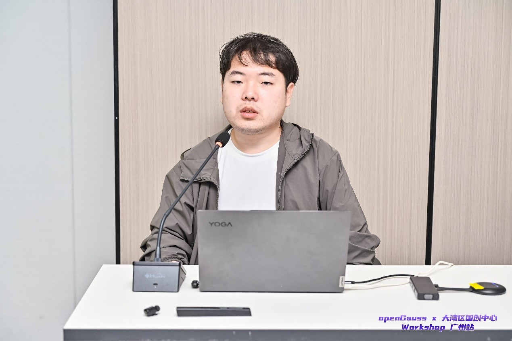
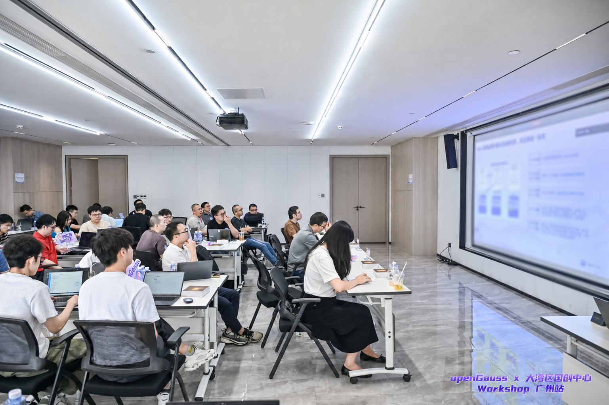
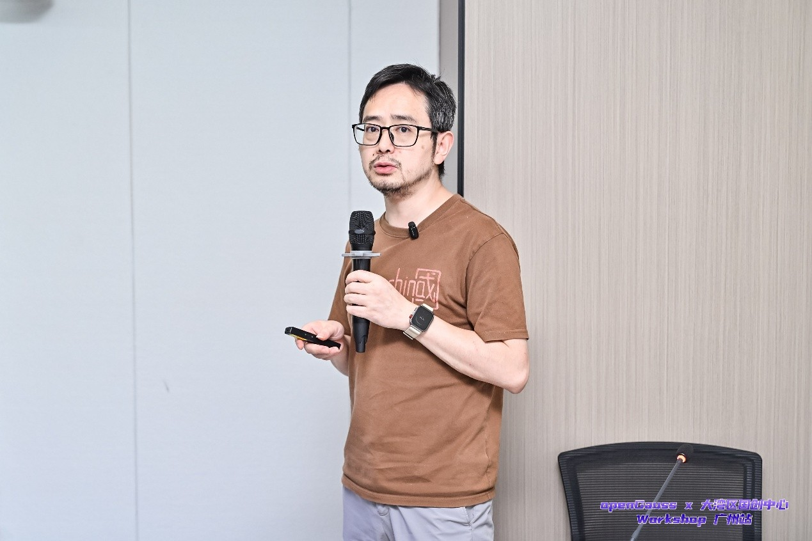
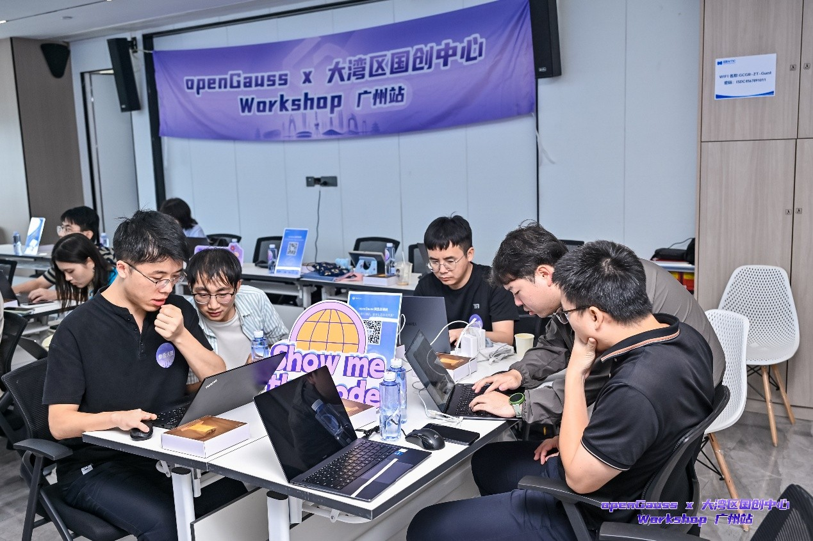
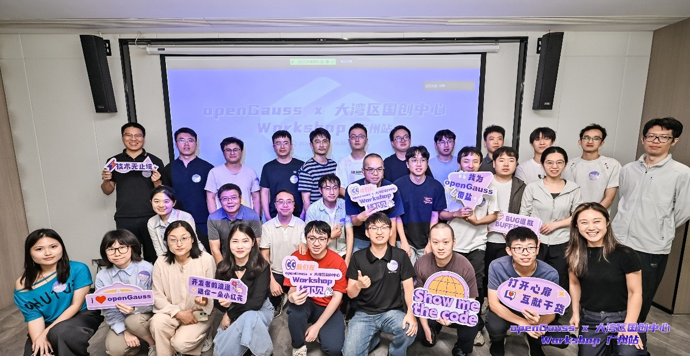

2026年7月10日下午，由广东软件行业协会、广东信创联盟作为指导单位，openGauss 社区、大湾区国创中心、广州 “鲲鹏 + 昇腾” 生态创新中心联合主办的技术 Workshop 广州站成功举办。活动以「技术分享 + 动手实操」的形式，聚焦国产数据库云侧与端侧前沿技术，吸引众多企业开发者、产业伙伴到场参与交流。

华为广东产业发展与生态部部长齐伟斌，创新中心产业发展总监陈文忠、大湾区国创中心嵌入式数据库产品部总经理刘保玉、CTO 吕政，以及广东软件行业协会、省信创产业联盟相关负责人出席本次活动。

## 开源聚力，共拓产业新生态

活动开场，齐伟斌总发表讲话并表示，数据库是数字产业核心基石，openGauss 正坚定从 “做大” 向 “做强” 迈进：2025 年线下集中式关系型数据库新增市场份额达 35.02%，实现三连冠；商业发行版技术路线占比 29.4%，稳居国内主流开源数据库第一梯队。未来 openGauss 将携手大湾区国创中心等伙伴，打通技术落地全链路，共建数据库产业生态。

## 五大议题干货齐发，解码核心技术

本次技术分享设置五大核心议题，从产业支撑体系到数据库内核技术，全面覆盖云侧多写架构与端侧嵌入式能力：

### 1. 行业实验室介绍：筑牢产业技术支撑底座

➢分享嘉宾：适配技术专家 刘凌志

➢议题核心：议题围绕鲲鹏与开源数据库产业实验室的能力定位展开，覆盖行业实验室的适配验证、方案孵化与人才培养体系，展现面向企业的全流程技术支撑能力。

### 2. oGRAC 架构介绍与使用：开源多写数据库的核心突破

➢分享嘉宾：oGRAC 技术专家 郑雪

➢议题核心：议题深度拆解 openGauss 7.0.0-RC3 版本三层解耦多写架构，讲解部署方法与典型场景，呈现鲲鹏平台下的性能突破。

### 3. oGRAC RTO 技术介绍与使用：极致高可用的故障恢复能力

➢分享嘉宾：oGRAC 技术专家 刘凯

➢议题核心：议题聚焦数据库高可用核心指标，深度解析故障快速检测、服务无缝切换的全流程机制，展示极低时延下的数据一致性与业务高可用能力。

### 4. oGRAC 超节点架构介绍：面向大规模场景的技术演进

➢分享嘉宾：oGRAC 技术专家 郑雪

➢议题核心：议题面向数据库未来扩展性需求，解读了 oGRAC 超节点架构的设计理念与演进方向，同时披露社区后续的技术迭代路线，展现 oGRAC 面向企业级核心场景持续进化的技术潜力。

### 5. 国创灵梭：嵌入式数据库向量与图引擎技术解析

➢分享嘉宾：大湾区国创中心嵌入式数据库产品部 CTO 吕政

➢议题核心：议题聚焦端边侧嵌入式数据库赛道，深度解析了国创灵梭 IntarkDB 的向量引擎与图引擎核心技术。分享结合工业机器人、5G 基站、智能装备等典型工业场景，展示了 IntarkDB 在轻量化部署、多模态数据融合存储、工业级实时计算上的差异化优势，为端边侧数据处理与 AI 落地提供了全新的技术思路。

## 实操实训，手把手落地技术

开发者分为两组轮换体验两大实训任务：一组深度体验 oGRAC 技术；另一组基于 IntarkDB 搭建 RAG 知识库问答系统，实战探索 AI 与数据库深度融合的智能检索应用。

现场技术专家全程驻场，实时解答操作疑问，帮助开发者顺利完成实训。

## 生态协同深化，共推规模化落地

本次 Workshop 是开源社区与产业端协同的重要实践。后续双方将持续深化合作，打通「开源内核 + 端侧底座 + 行业落地」全链路。未来 openGauss 社区将持续推出更多技术沙龙与实训活动，汇聚开发者力量，推动数据库技术创新与产业落地，为数字经济筑牢数据底座。

