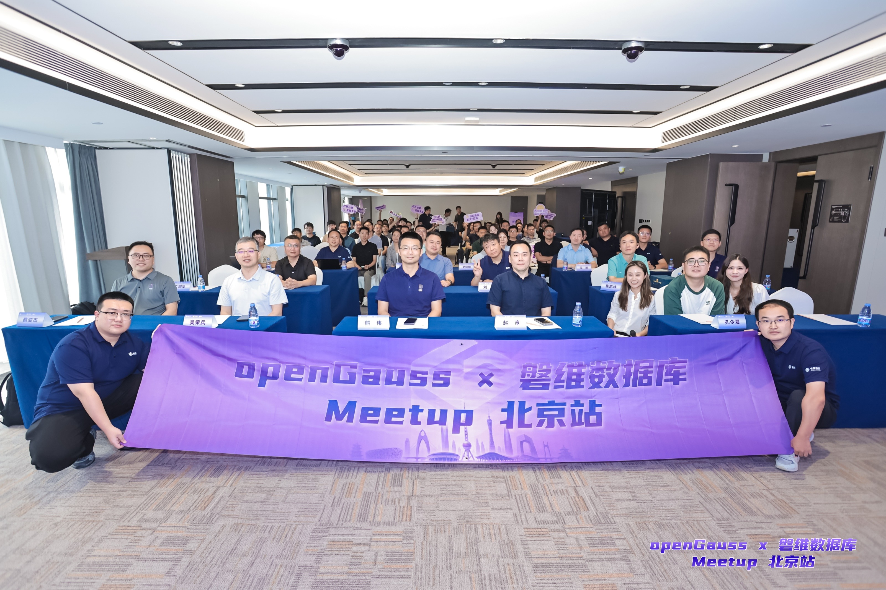
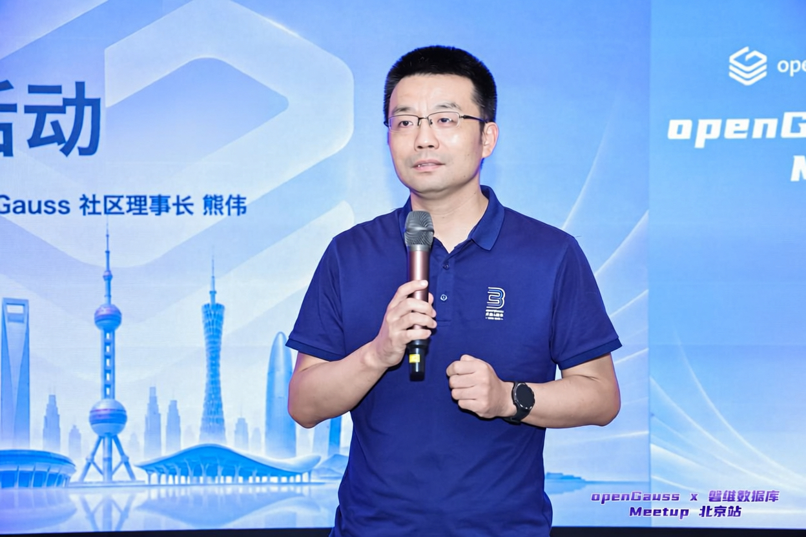
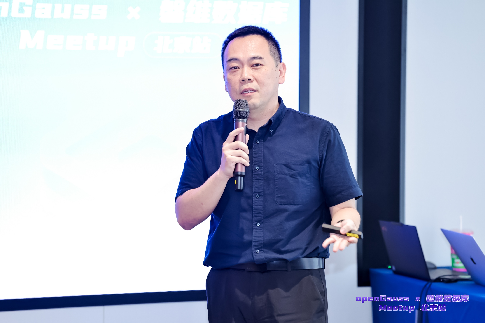
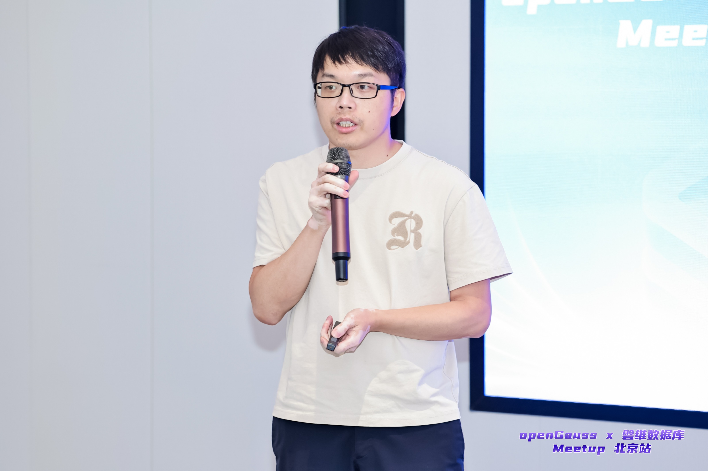
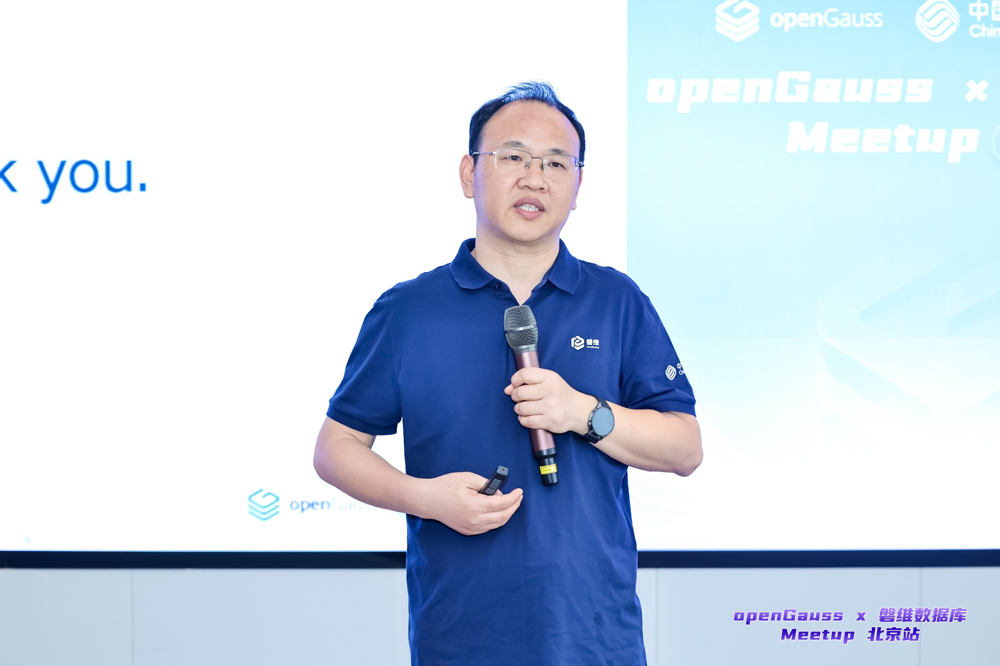
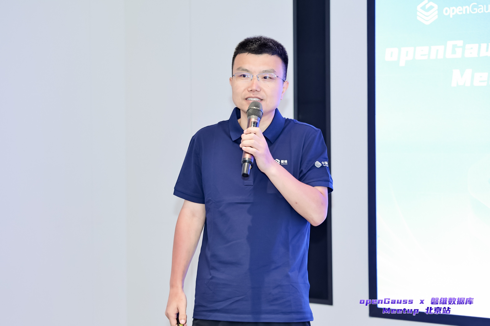
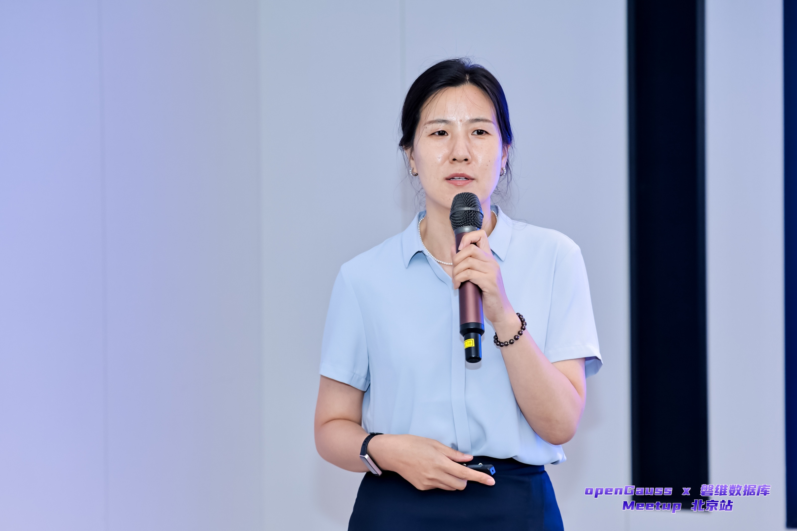
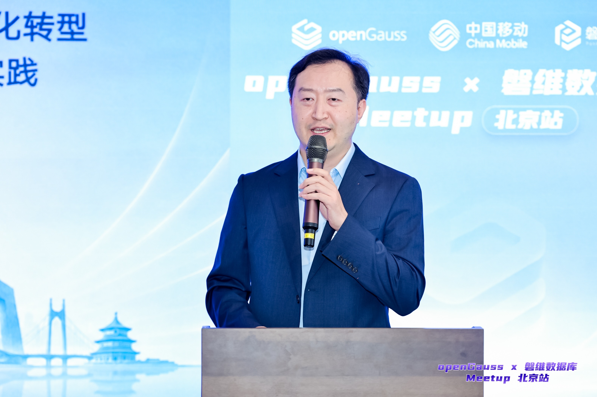
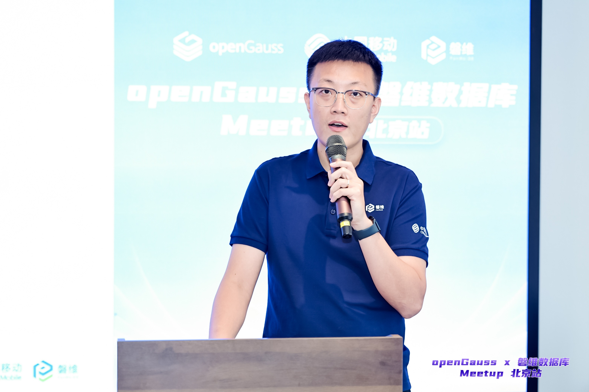

7月23日，由 openGauss 社区与磐维数据库联合举办的 openGauss x 磐维数据库 Meetup 在北京圆满举办。本次活动以“AI 时代的数据库技术演进与生态协同”为核心主题，聚焦当下数据库的技术热点与行业痛点，汇聚 openGauss 社区、磐维数据库以及运营商核心业务的技术专家，围绕数据库与鲲鹏超节点协同、核心系统替换工程、AI 原生数据库演进、规模落地实践等方向展开深入分享，吸引线上线下众多开发者参与。

活动伊始，openGauss 社区理事长熊伟、中国移动通信集团有限公司数智事业部数据库研发中心副总经理赵淳先后为本次活动作开场发言。

▲openGauss 社区理事长熊伟

熊伟首先祝贺磐维数据库通过国家安全可靠测评，表示这一成果标志着磐维数据库迈上新的发展阶段，具有重要的里程碑意义。接着他表示，开源不是目的，将开源产品由技术创新到产业应用落地完整闭环才是关键。磐维数据库在中国移动核心业务中的规模化实践，正是开源技术落地价值的体现，也为社区发展提供了来自产业一线的真实需求牵引。面向未来，熊伟介绍了openGauss“1+2”发展战略：“1”是持续夯实传统TP数据库能力，聚焦性能、稳定、可靠三大关键维度；“2”是推进oGRAC多读多写架构和AI原生数据库两大方向。他指出，AI时代数据库将在数据管理、知识构建和智能应用中发挥更加重要的作用。openGauss将携手产业伙伴，把技术优势转化为产业价值，推动开源数据库生态持续发展。

▲中国移动通信集团有限公司数智事业部数据库研发中心副总经理赵淳

赵淳结合磐维数据库的建设与推广，分享了对国产数据库发展的思考。他认为，当前国产数据库仍处于攻坚阶段，需要产业链各方齐心协力、共同推进；面对“国产数据库能力不足”的声音，不应自我设限，而应联合产品团队、技术专家与用户，正视并攻克事务并发控制、共享集群读写、内核与 SQL 优化等关键难关，逐步缩小与国际先进水平的差距。回顾磐维伴随一次次国测“从无到有、由弱到强”的历程，他表示这背后靠的是领导与用户的支持、团队的坚持、社区的协同，以及在实践中不断沉淀的体系化能力。在他看来，本次活动的意义不止于一家企业的实践，更在于共同探索把国产数据库做强做好；并以“一个人可以走得很快，但一群人才能走得更远”寄语行业，呼吁国产数据库同仁开放协作、共建生态。

## openGauss 基于鲲鹏超节点的最佳实践

▲openGauss 数据库架构师熊小军

openGauss 数据库架构师熊小军分享了 openGauss 基于鲲鹏超节点的最佳实践。鲲鹏超节点基于灵衢（UB）总线打破了传统服务器的边界，构建起以数据为中心的全互联架构，具备大带宽、低时延与内存统一编址、内存借用、内存共享等能力。出于性能扩展和节点可靠性考虑，数据库天然需要频繁的跨节点交互，openGauss 在资源池化一写多读、oGRAC 多写多读与传统主备等场景下，借助内存语义加速数据页面、事务状态、锁资源与日志的同步，并通过内存借用实现 SQL 算子的全内存化运算、减少落盘开销；同时协同 openEuler sysSentry 从硬件层感知节点故障，大幅提升故障检测与恢复效率，让底层算例优势真正转化为数据库的性能与可靠性，真正带来数据库性能和可靠性的提升。

## 从“可用”到“核心可用”：磐维数据库核心系统替换工程实践

▲磐维数据库产品经理洪建辉

磐维数据库产品经理洪建辉分享了磐维数据库从“可用”到“核心可用”的核心系统替换工程实践。依托蓬勃发展的 openGauss 生态与国测资质，磐维数据库已在中国移动大规模完成核心系统替换，合规门槛也从“拦路虎”变为“护城河”。面向核心系统“不能停、不能丢、不能慢”的硬约束与安全合规要求，磐维沉淀出“调研评估—方案设计—数据迁移—压测调优—模拟割接—上线重保”的六步闭环方法论，把数据库迁移从项目交付变为可复用的标准动作。作为一款兼具安全可靠、极致性能与AI原生能力的企业级数据库，磐维已全面具备支撑核心系统的能力。产品侧以多兼容模式与 DTP 迁移工具链降低改造成本，并支持不停服的内核滚动升级；在甘肃移动 BOSS 系统割接过程中，通过旁路流量录制回放提前暴露并治理慢 SQL，实现一次割接成功。质量层面，磐维将以持续积累的回归用例、安全左移机制，以及巡检与问题诊断等工具沉淀筑牢可靠性，并把一线经验回流到 openGauss 生态。

## 磐维数据库能力跃迁与生产实战

▲磐维数据库架构师李龙飞

磐维数据库架构师李龙飞分享了磐维数据库的能力跃迁与生产实战。随着核心系统上线规模的不断扩大，磐维在最新版本中集中开展了大量需求实现与缺陷修复，覆盖计算引擎、存储引擎、系统对象、高可用与安全等内核模块及周边工具。计算引擎方面，系统函数与视图持续丰富、可观测与诊断能力增强，优化器在执行计划、并行处理与计划绑定等方向深度调优，并持续完善对主流数据库的兼容，力求“形神兼备”；存储与高可用方面，WDR 快照分级、表压缩、UStore 打磨、Build 并行与备机回放优化协同提升系统能力。针对生产一线暴露的子事务管理、Hash 索引回放、存储过程对象控制等关键缺陷，团队深挖根因、逐一修复，把每一次生产问题都转化为产品可靠性与稳定性的提升。

## 磐维向量数据库——打造 AI 时代的统一数据引擎

▲磐维向量数据库研发负责人赵晓敏

磐维向量数据库研发负责人赵晓敏分享了磐维向量数据库的建设思路与实践。从 PC、互联网、云计算到智能体时代，数据库形态持续演进，AI 原生数据库并非替代传统数据库，而是在可信内核上承载知识、记忆、沙箱与认知接口。区别于插件式方案，磐维向量数据库在关系型内核层深度融合向量、全文、图与 AI 能力，形成原生融合架构，支持标量、向量、全文的多路召回与大模型重排。技术上，在主流图索引与倒排索引之外，引入面向大数据量与内存受限场景的索引类型及量化压缩方案，并在分布式方案中补齐全局词频统计与软硬协同加速；对标业界主流向量数据库，磐维在检索精度与性能上展现出竞争力。落地方面，磐维已实现对主流开源向量方案的生态兼容，业务仅需少量改造搭配磐维的自研配套迁移方案即可平滑切换；面向未来，团队将围绕长期记忆、数据沙箱与 MCP 服务演进，推动向量数据库走向 AI 时代的统一数据引擎。

## 筑牢自主创新底座，加速全域数智化转型——北京移动磐维数据库应用实践

▲北京移动数智化部数据库专家侯鹏

北京移动数智化部数据库专家侯鹏分享了北京移动磐维数据库应用实践。作为最早参与磐维试点的单位之一，北京移动以信息生命周期管理系统为起点，逐步建成超大规模分布式磐维集群并完成核心系统切换，进而全面开展全域自主创新替换，2026年更推进向量能力与业务场景的深度融合。目前，磐维数据库已在北京移动大量业务系统中长期稳定运行，成为支撑北京移动通信业务的自主创新数据底座。本次分享通过多个案例展开：ILM 系统一期、二期验证了兼容性、超大规模分布式支撑与“双平面”平滑迁移，并开创数据底层浇筑模式；产商品中心采用一主两备架构实现秒级自动切换，依托 DTP 反向回流机制强化应急逃生，并提供分钟级应急响应保障；星火管家以磐维向量数据库构建智能营销客服的知识库底座。此外，北京移动还依托磐维能力推进中粮 E 云等政企自主创新项目，推动磐维走向更广阔的行业市场。

## 磐维赋能数智转型：天津移动 OLTP 与向量数据库实践之路

▲天津移动数智化部技术总监徐子安

天津移动数智化部技术总监徐子安分享了天津移动以磐维“双擎驱动”的数智转型之路。面对数据跃升为核心生产要素的时代背景，天津移动提出降本增效、安全可靠、产业融合三大诉求，并直面 AI 转型阵痛与数据治理滞后的双重挑战。在 OLTP 实践中，天津移动选取核心稽核中心，在磐维原生分布式能力基础上扩展分库、数据路由、连接管理与应用封装，支撑海量话单处理与刚性月结时效，并完成异地双中心高可用升级。在向量数据库实践中，磐维赋能一系列 AI 场景：文旅“和小棠”数智导游在五大道海棠花节落地，提供智能导览与一站式信息服务；医疗场景携手天津医科大学总医院上线智能体检报告，显著提升诊断效率与服务智能化水平；招投标审计以大小模型协同完成海量、跨年度的合同审查；政务“和小智”数智社工平台在多个社区落地，实现群众民生咨询的一键响应。面向未来，天津移动将持续深化 AI 与数据库融合，并把成熟实践产品化，向政企行业输出可持续的增值能力。

本次活动成果丰硕、成效显著。围绕 openGauss"1+2"发展战略，社区与磐维数据库进一步凝聚共识、明确协同方向。作为重要共建者，磐维数据库持续将运营商核心场景的工程经验回馈 openGauss 社区，以产业真实需求反哺开源、牵引内核演进。openGauss 社区与磐维数据库将持续深化协同共建，携手广大开发者共同推动中国开源数据库的技术创新与生态繁荣。