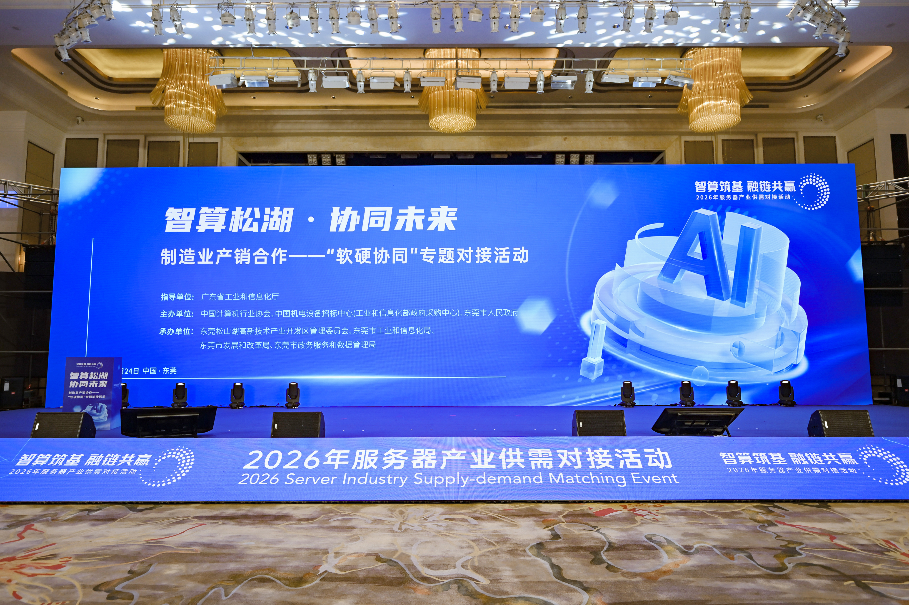
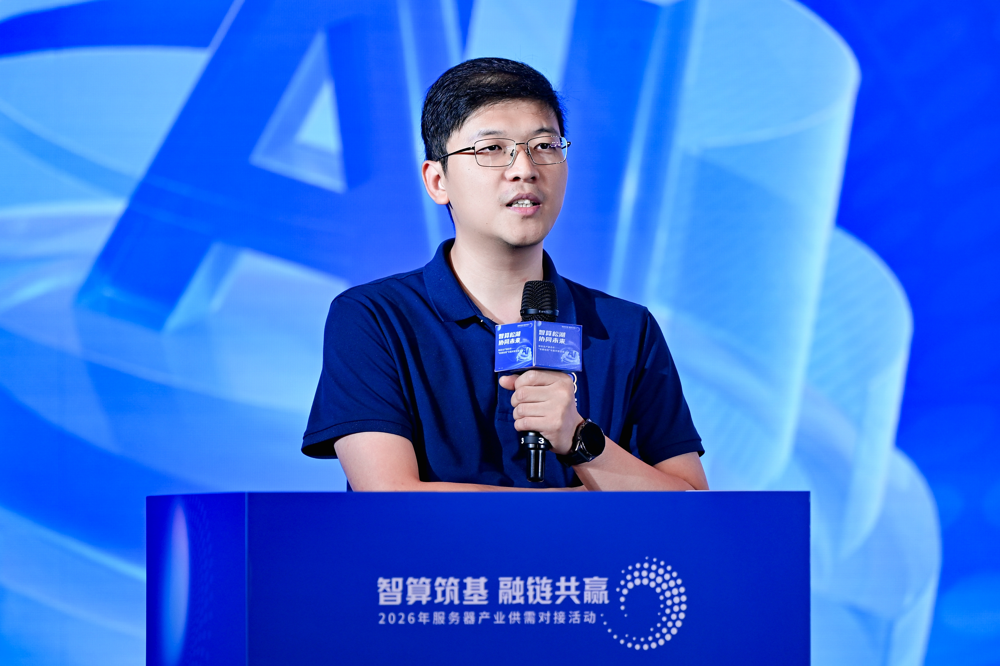
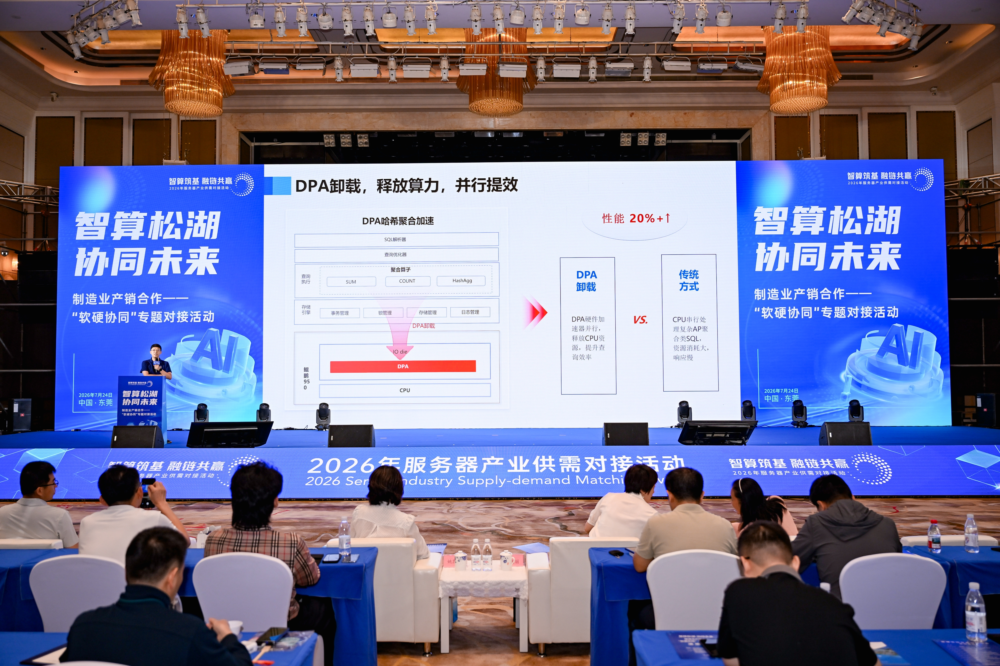
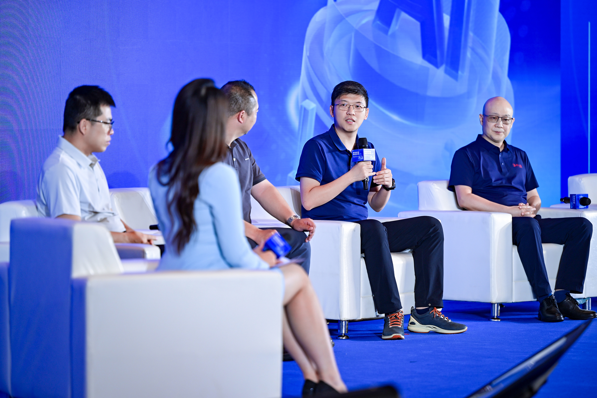

7 月 24 日，“智算松湖・协同未来 —— 软硬协同专题对接活动” 在东莞松山湖圆满举办。本次活动是 2026 服务器产业供需对接系列核心专场，汇聚政府领导、科研院所专家、算力产业链龙头企业代表百余人，围绕 AI 服务器软硬协同创新、国产算力标准共建、算力场景落地赋能等核心议题深度交流，探寻国产算力产业高质量发展路径。

松山湖党工委委员、党工委、管委会总工程师韩志祥在活动开场致辞中指出，当前 AI 服务器产业竞争格局已然转变：行业发展不再单纯比拼硬件堆砌能力，核心赛道转向软硬件一体化协同创新。硬件构筑算力发展的基础下限，软件决定算力释放效能的发展上限，唯有推动软硬件深度融合协同，方能实现算力资源高效利用，切实解决行业普遍存在的 “纸面算力” 空置浪费难题。松山湖高新区将秉持开放合作理念，联动芯片、整机服务器、数据库、算力基础设施等全产业链合作伙伴，聚力共建完善、自主创新的国产算力产业生态。

openGauss 社区技术委员会委员，华为计算 openGauss 数据库研发总监熊钦受邀出席本次专场，发表《openGauss 开源数据库：软硬深度协同，释放极致算力》主题演讲，并参与高端产业链圆桌对话，分享 openGauss 在软硬件联合调优的技术突破与产业落地实践。

## 打破软硬件技术壁垒，软硬协同将纸面算力转化为产业实效

熊钦在演讲中指出，数据库是算力体系承上启下的核心枢纽，绝非依附硬件运行的基础软件；算力价值释放的核心逻辑，是数据库向下深度适配芯片、服务器底层硬件架构，向上高效支撑工业、AI、政务等多元业务场景，通过软硬件联合优化，最大化释放硬件算力潜能。

作为国产开源数据库根社区，openGauss 长期深耕软硬件协同联合调优，多项核心技术实现行业突破：

1.鲲鹏 DPA 硬件卸载、NUMA优化深度协同依托鲲鹏专属 DPA 算力卸载硬件，分担数据库复杂计算负载，AP 场景聚合 SQL 查询性能提升 20%；针对服务器 NUMA 多核架构完成内核级深度优化，单机 TPCC 性能最高可达 150 万 tpmC，充分释放多路服务器多核算力。

2.机密计算安全软硬协同基于 virtCCA 可信硬件打造机密数据库，业务系统无需改造即可部署，整体性能损耗控制在 20% 以内；创新数据库保险柜方案，融合 TEE 机密硬件、WORM 防篡改存储、RDMA 高速传输硬件，构建端到端数据安全防护体系，实现关键业务数据零丢失。

3.多写数据库与超节点架构融合社区自研 oGRAC 三层资源池化多写分布式架构，兼顾集群高可靠与高性能，2节点标准环境 TPCC 性能可达 470 万 tpmC，集群读写吞吐横向扩展比超0.82；目前正在深度适配鲲鹏超节点整机硬件，集群算力将实现跨越式提升。

4.AI 场景专属软硬协同底座面向大模型、AI 智能体、知识库创新赛道，打通鲲鹏超节点算力硬件与 openGauss 原生向量检索能力，依托自研 oGMemory 记忆管理引擎打造高性价比 AI 数据底座，可将大模型Token开销降低 50%，高效支撑制造业智能、政务大模型等本地场景落地。

## 全域适配多样性算力底座，共建国产自主算力融合生态

本次圆桌对话汇聚中国电子技术标准化研究院、龙芯中科、openGauss社区、东方通、易事特等产业链权威专家，各方围绕国产软硬件协同标准制定、算力产业链联合验证平台搭建、制造业算力落地难点破解展开深度研讨。与会嘉宾达成共识：算力生态成熟离不开芯片、服务器、操作系统、数据库、中间件全栈伙伴联合调优，需要政企产学研协同建立统一适配验证标准，降低产业链企业软硬件适配成本。

openGauss融合了多核并行、NUMA调度与全密态计算等企业级特性，可灵活适配鲲鹏、通用x86 等架构的各类硬件底座，为运营商、政务、制造、能源等关键行业提供统一、稳定、高效的数据库支撑，补齐国产算力软件生态短板。

## 社区寄语

历经六年开源深耕，openGauss 已建成覆盖芯片厂商、服务器整机、操作系统、行业集成商、终端制造企业的成熟开源产业生态，凭借软硬件一体化协同优化能力、稳定可靠的企业级性能，持续领跑国产开源数据库赛道，已在运营商、能源、政务、高端制造、公共安全等关键行业核心业务系统规模化落地，成为各行各业数智化转型的国产化核心数据底座。

软硬协同与多样性算力适配是 openGauss “1+2” 战略核心中 “1” 的核心内容之一，社区将持续联动芯片、服务器、算力平台、工业软件上下游企业协同创新，夯实国产数据库根基。