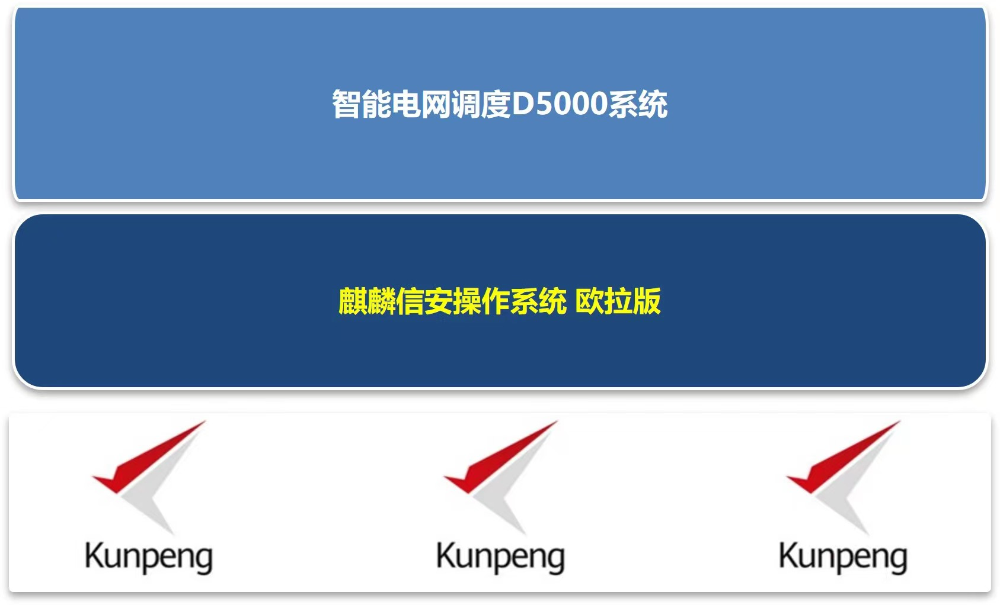

## 应用场景

电力系统是国家的重要设施，其稳定运行关乎国计民生。电力调度系统属国家信息安全等级保护四级的系统，一旦出现任何闪失将严重威胁国家和人民的生命财产安全，造成无可挽回的巨大损失。国家电网公司 2009 年启动《电网信息安全等级保护纵深防御示范工程》信息安全专项工作，提出智能电网发展规划，目标是全面建成统一的“坚强智能电网”，把握国家“中枢神经系统”。
国家电网 D5000 调度系统软件运行平台从 2009 年开始进行操作系统的迁移工作，本着可用、高效、安全的原则，选择了安全等级高、使用便捷的操作系统——麒麟信安操作系统，作为其“调度系统”的软件运行平台，陆续完成了 x86 平台上的操作系统迁移。从 2019 年开始向华为鲲鹏服务器平台迁移，操作系统选用麒麟信安操作系统（欧拉版），逐渐实现核心调度系统软件的基础软硬件平台的安全创新。

## 解决方案

- 操作系统：麒麟信安操作系统（欧拉版）
- 硬件平台：TaiShan 200 鲲鹏 920 服务器
- 业务系统：智能电网调度 D5000 系统
- 核心指标：安全身份认证、三权分立、安全
- 探针、定制化裁剪、集群 HA、存储多路径

## 客户价值

- 完成智能电网调度 D5000 系统，从原有操作系统到麒麟系统操作系统（欧拉版）的迁移。
- 实现了基于的鲲鹏服务器和麒麟信安操作系统（欧拉版）的业务系统高效运行。
- 为后续 D5000 系统运行的基础软硬件全面迁移进行充分的技术验证和准备工作。

## 伙伴

