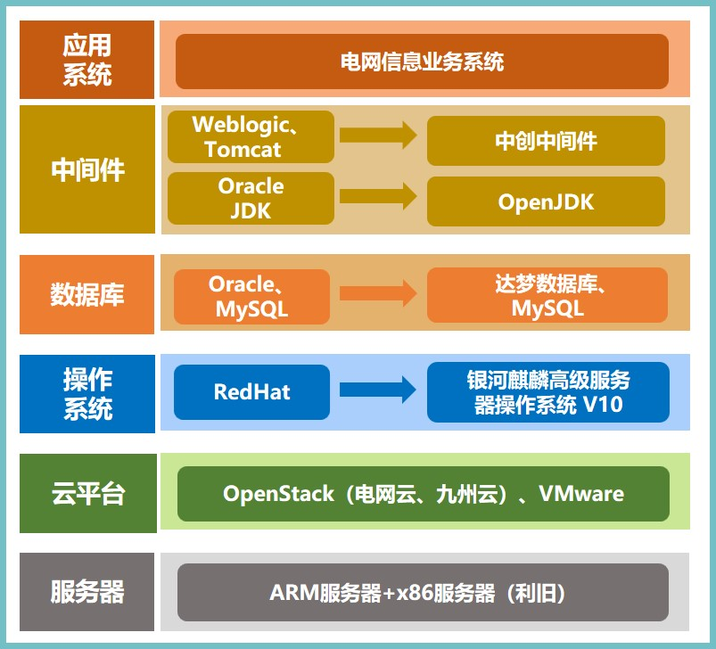

## 应用场景

南方电网公司业务覆盖地域广，信息化需求大，信息系统不计其数，维护成本高居不下。同时作为国计民生的重要基础设施，对 IT 设施安全创新有极高的要求。如何在保证信息化建设和运维质量的同时尽可能降低信息化成本，确保安全底线，成为公司必须解决的重大问题。 南方电网计划逐步实施服务器系统的创新建设，开展基于创新的安全服务器操作系统的应用实施，提升业务系统可靠性、安全性和稳定性。

## 解决方案

- 客户原有的大部分业务系统运行在 x86 服务器和部分 Power 及安腾小型机上；

- 软件环境以 Redhat+Oracle+Weblogic 为主，部分使用开源软件 MySql+Tomcat，以“银河麒麟高级服务器操作系统 V10+达梦数据库+中创中间件”进行升级，并使用 OpenJDK 升级 Oracle JDK；

- 项目针对不同虚拟化环境进行了整体适配优化，并基于银河麒麟高级服务器操作系统 V10 内生安全进行了安全加固。

## 客户价值

- 项目实施范围包含南方五省分子公司和超高压输电公司、调峰调频发电公司、广州供电局、深圳供电局，总计近 2000 套系统。项目实现服务器系统完全安全可靠，系统性能与迁移前相当。

## 伙伴

