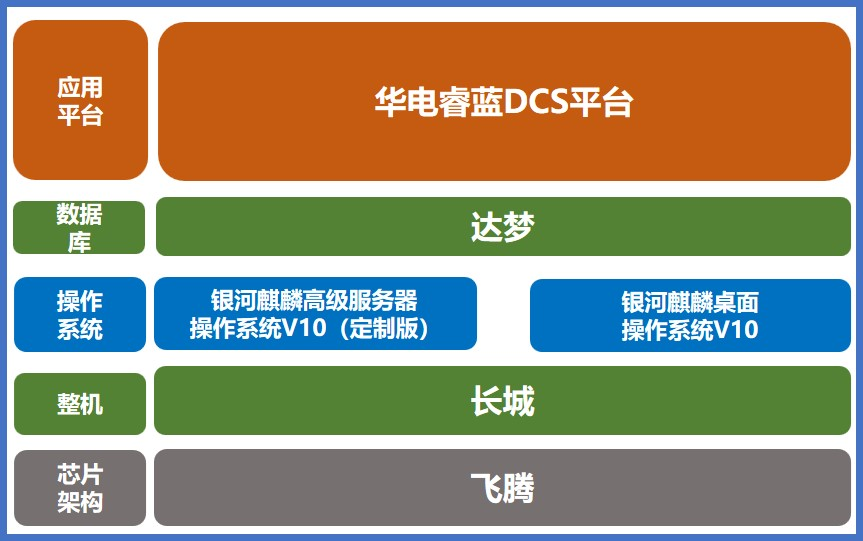

## 应用场景

中国华电集团聚焦工控领域核心信息基础设施安全防护，前瞻性谋划并推进发电领域关键核心技术攻关，集中优势科研资源开展新一代 DCS 系统建设工作，成功研制出 DCS——“华电睿蓝”智能分散控制系统，并成功在华电旗下的华电芜湖电厂实现示范应用。

## 解决方案

- 项目中使用飞腾处理器、中国长城服务器以及银河麒麟高级服务器操作系统 V10（工作站版）；
- 搭载达梦数据库+华电睿蓝 DCS 平台软件。

## 客户价值

- **战略合作：** 国电南自 DCS 项目是中国电子信息产业集团和华电集团的合作示范工程项目，加深了双方的战略合作；
- **行业标杆：** 该项目是国内首个创新型的高参数、大容量发电领域核心控制系统；
- **标准体系：** 针对工控生产领域要求的统一技术路线的需求，形成了银河麒麟高级服务器操作系统 V10（工作站版），为电力行业工控生产领域提供了针对性的标准系统版本。

## 伙伴

