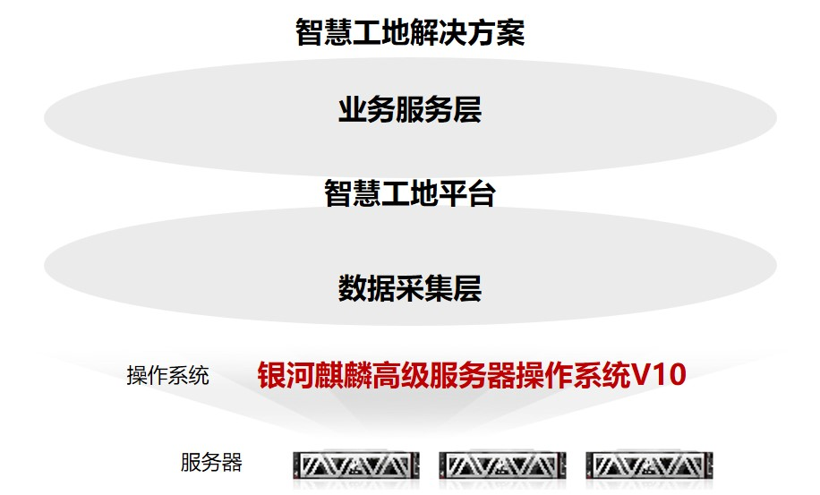

## 应用场景

博微智慧工地平台在“河北 110 千伏裕翔城市智慧标杆站”项目中已稳定运行半年有余，平台属于典型+创新的智慧工地。智慧工地平台包括业务管理平台与物联感知平台两大平台，其中业务管理平台贯穿项目前期、工程前期、工程建设、投运总结工程建设全生命周期，覆盖安全、质量、进度、队伍、物资、BIM 六大专业；物联感知平台囊括人员通道、体温监测、人员定位等多达 23 种的硬件接入和相关的服务应用。

## 解决方案

- 麒麟与博微携手，历时 2 个月时间，将智慧工地解决方案整体迁移到银河麒麟高级服务器操作系统 V10 上，并于近期在“河北 110 千伏裕翔城市智慧标杆站”项目上实现升级上线 。

## 客户价值

- **示范标杆效应：** 作为河北省移动政务云创新产品应用项目，具有示范引领效应；
- **大物智移：** 大数据、视频体温检测、行为识别、5G 均在方案中得到应用；
- **BIM：** 博微研发的 BIM 完成了银河麒麟高级操作系统 V10 的适配，在工程领域有极大的市场空间。

## 伙伴

