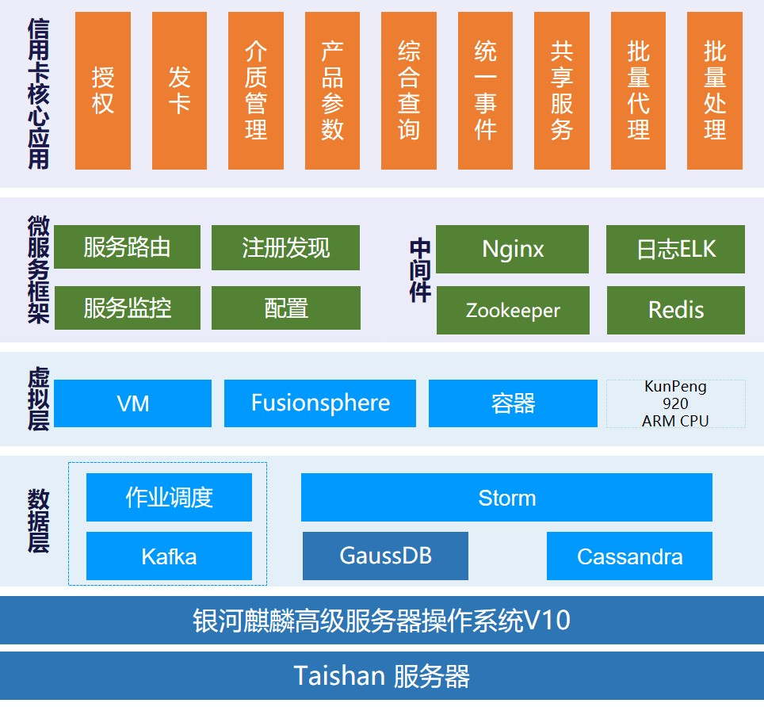

## 应用场景

作为国有大行，建行的信用卡核心业务系统具有“客户数量和信贷规模等四项核心业务指标同业第一”的特点，客户基数庞大，样本多样性强，业务形态复杂，对业务一致性的要求非常高，对系统运行的稳定性要求也很高。除此之外，银行 IT 系统要在高可用、高可靠的前提下，实现弹性扩展、敏捷交付。同时，金融行业面临着关键信息基础设施安全可靠的问题，在基础设施升级的同时需要兼顾安全与数字化发展的问题。

## 解决方案

- 基于银河麒麟高级服务器操作系统 V10 ， GaussDB 作为数据底座，TaiShan 200 服务器作为算力底座，对原有基础设施（x86+Redhat+Oracle）升级；

- 通过银河麒麟高级服务器操作系统 V10 底层深度适配调优，构建分布式信用卡核心业务系统，完成主机系统到分布式系统的数据迁移，并完成 ARM 和 x86 异构平台双轨运行，支撑应用层基于微服务的敏捷处理框架、数据层分布式作业海量数据处理平台。

## 客户价值

- 基于鲲鹏服务器和银河麒麟高级服务器操作系统 V10，实现了对建行现有信用卡核心系统的创新；

- 案例有成本低、快速响应业务需求、可扩展性强、处理效率高及容错能力强等优势；

- 在安全可靠方面，基于银河麒麟高级服务器操作系统 V10 内生安全框架为客户提供提供从内核、服务、应用等多层安全防护体系。

## 伙伴

