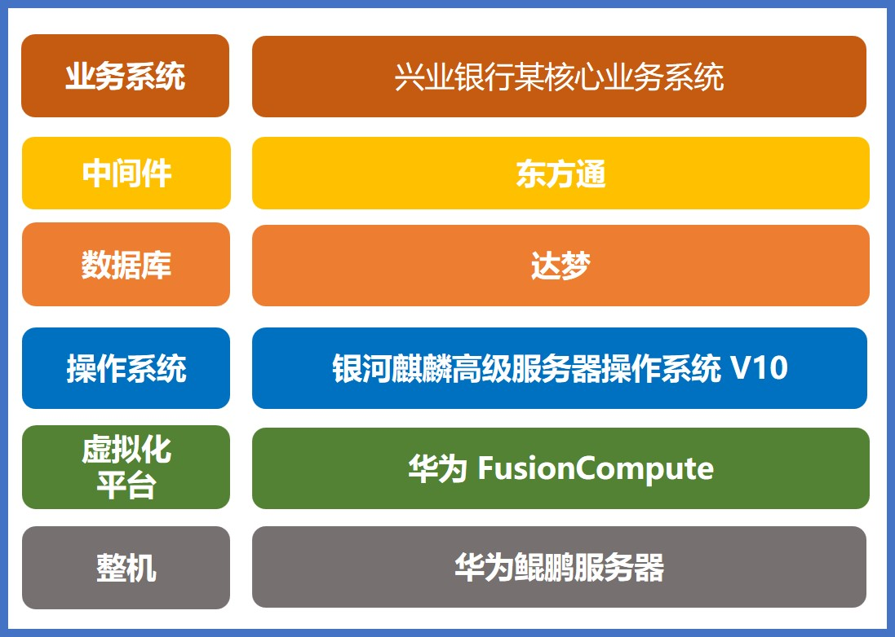

## 应用场景

兴业银行作为自主创新金融行业建设单位之一，为响应加强安全创新、实现自主创新的市场需求，进行自主产品应用系统创新建设项目，业务系统向自主创新平台迁移，初步创建网信产业生态。全栈自主创新平台在性能、安全性、功能等方面均需满足某核心业务系统需求。

## 解决方案

- **整机：** 华为鲲鹏服务器
- **操作系统：** 银河麒麟高级服务器操作系统 V10
- **中间件：** 东方通
- **数据库：** 达梦
- **虚拟化平台：** 华为 FusionCompute
- **业务系统：** 兴业银行某核心业务系统

## 客户价值

- **全栈国产化：** 采用自主、安全、创新的全栈国产化产品支撑起金融行业总行级核心业务系统运行。
- **高安全：** 基于银河麒麟高级服务器操作系统 V10，全面兼容主流虚拟化平台、中间件、数据库等各类软硬件平台环境，降低网络数据安全建设成本。

## 伙伴

