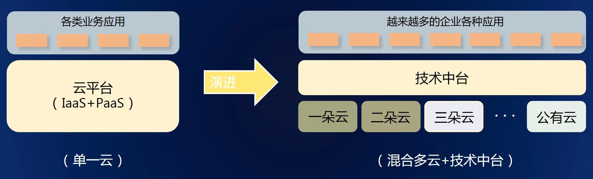

## 应用场景

利用原有服务器硬件资源，使用华三云虚拟创建 200 套统信操作系统虚机，为后期业务系统迁移改造提供有利环境。基于新购买硬件 NF2180M、鲲鹏 S920X00K 服务器，创建信创云 263 套统信操作系统虚机服务器，为 OA 系统迁移改造提供资源。在整个方案设计邮政集团基于现有技术力量，并依托自有技术团队与外包服务商，选取当前流行且稳定的技术架构，规划 CCE 容器云的管控面与业务面分离，基于“1+N”架构，实现单个数据中心一套管理集群集中管理，多套业务集群分别部署在不同网络分区，满足业务安全、合规、隔离等要求。

## 解决方案

统信服务器操作系统，具备同源异构能力，完美支持主流云架构 Openstack 多种版本、提供云原生、高可用、易维护等组件和解决方案，提供迁移工具，完整迁移原业务数据。组建专业的技术服务团队，对生产环境所涉及的软件、硬件予以可用性、兼容性、稳定性等适配。

## 客户价值

2021 年 10 月，邮政集团顺利完成信创云平台、OA 业务系统与统信服务器操作系统 V20 服务器的适配迁移工作，全面升级为统信服务器操作系统 V20，充分验证集团内核心 OA 系统可以平滑迁移和运行在统信服务器操作系统上，这是国有大型集团首家试点，通过熟悉创新的统信软硬件产品性能，积累实施经验，评估后续改造迁移所需工作量、经费数额、工期和技术路线等，奠定了良好基础。

## 伙伴

