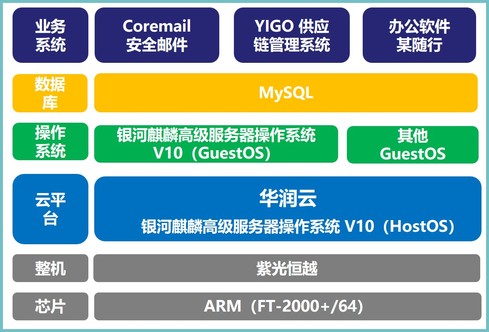

## 应用场景

为了深入贯彻落实党中央、国务院、国资委有关决策部署，加大自主知识产权的新技术在现有信息技术体系中的创新应用，本项目遵照相关部门的工作要求，完成应用试点项目软硬件设备采购，实现全栈自主创新基础平台部署，保障业务系统稳定运行。

## 解决方案

- **芯片：** ARM（FT-2000+/64）
- **整机：** 紫光恒越服务器
- **操作系统：** 银河麒麟高级服务器操作系统 V10
- **云平台：** 华润云
- **数据库：** MySQL
- **业务系统：** Coremail 安全邮件、YIGO 供应链管理系统、办公软件某随行

## 客户价值

- **行业标杆：** 该项目是华润集团的第一个自主创新试点项目，通过该项目，华润集团完成了华润云、业务系统及终端应用的迁移适配，积累了丰富的自主创新技术和运维经验，为集团后续大规模使用银河麒麟操作系统等自主产品奠定良好基础。

## 伙伴

