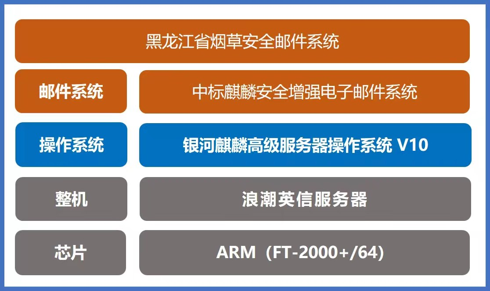

## 应用场景

为加强安全防护意识、提高往来邮件的安全性、过滤垃圾邮件、病毒邮件，保障邮件系统的安全性、稳定性。黑龙江省烟草公司在服务器上部署中标麒麟安全增强电子邮件系统 V6.0，通过安全邮件 web 端和客户端传输邮件，满足用户邮件传输及保存需求。

## 解决方案

- **芯片：** ARM（FT-2000+/64）
- **整机：** 浪潮英信服务器
- **操作系统：** 银河麒麟高级服务器操作系统 V10
- **业务系统：** 黑龙江省烟草安全邮件系统

## 客户价值

- **行业标杆：** 此次中标麒麟安全邮件软件的顺利实施，创造该省安全邮件首次部署并稳定运行的先例，并且超过 7,000 用户规模，为以后用户大规模应用的实施积累经验。
- **安全可靠：** 中标麒麟安全增强邮件系统使用代理方式将内网区和其他区域隔离部署，保障往来邮件的高安全性。

## 伙伴

