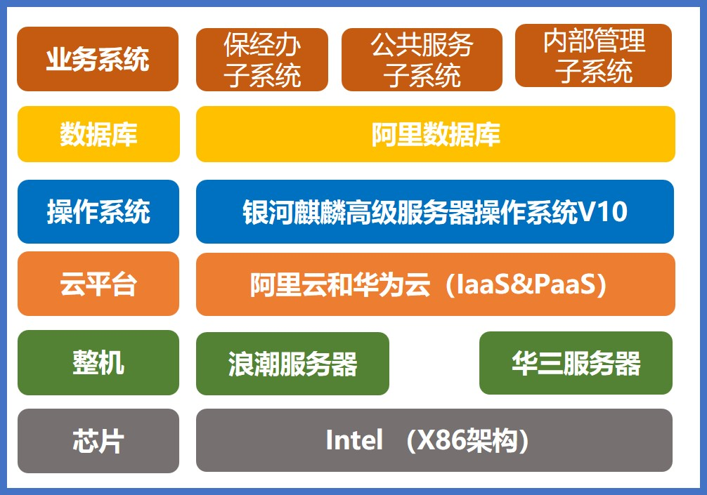

## 应用场景

国家医疗保障局在国家发改委总立项，国家局下发全国各省 100 亿的医保信息平台建设资金,加快形成自上而下医疗保障信息化“一盘棋”格局。根据江西省医保局云平台的建设实际需求，在满足业务系统可以正常运行的前提下，在阿里云和华为云上使用银河麒麟高级服务器操作系统 V10 保障基础软件层的国产化要求，提高自主创新能力。

## 解决方案

- **芯片：** Intel（X86 架构）
- **整机：** 浪潮/华三服务器
- **云平台：** 阿里云和华为云（IaaS&PaaS）
- **操作系统：** 银河麒麟高级服务器操作系统 V10
- **数据库：** 阿里数据库
- **业务系统：** 保经办子系统、公共服务子系统、内部管理子系统等

## 客户价值

- **推进国产化改造进度：** 江西省医保局云平台项目共采购 1000 台服务器，部署银河麒麟高级服务器操作系统 V10，支撑保经办子系统、公共服务子系统等医保相关业务系统的稳定运行，作为行业应用和大数据、云计算和分布式存储的基础软硬件的系统级支撑平台，支撑医保云国产化改造和医疗行业应用国产化的重要战略目标，让我国医疗行业迈出了全面国产化的一大步。

## 伙伴

